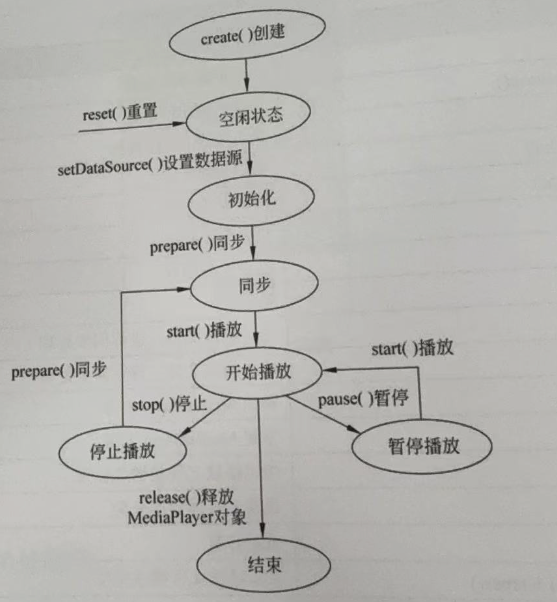
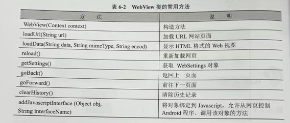

---
markmap:
    maxWidth: 500
---

<style>
/* 初始化各级计数器 */
body { counter-reset: h1; }
h1 { counter-reset: h2; }
h2 { counter-reset: h3; }
h3 { counter-reset: h4; }
h4 { counter-reset: h5; }
h5 { counter-reset: h6; }

/* 每碰到一个标题，就累加对应计数器 */
h1 { counter-increment: h1; }
h2 { counter-increment: h2; }
h3 { counter-increment: h3; }
h4 { counter-increment: h4; }
h5 { counter-increment: h5; }
h6 { counter-increment: h6; }

/* 在标题前插入数字，如 2.3.1 */
h2::before { content: counter(h2) " "; }
h3::before { content: counter(h2) "." counter(h3) " "; }
/* …依次类推到 h6 */
</style>
# Android 开发笔记

## 安卓系统及其开发过程<!-- markmap: fold -->

### Android 的系统架构

- 应用程序层
    - 电话拨号程序
    - 短信程序
    - 日历
    - 音乐播放器
    - 浏览器
    - 联系人管理程序
- 应用程序框架层
    - 活动页管理
    - 窗口管理
    - 内容供应
    - 视图系统
    - 包管理
    - 电话管理
    - 资源管理
    - 位置管理
    - 通知管理
- 系统运行库层
    - 程序库
    - Android 运行时库
        - 该核心库提供了 Java 编程语言核心库的大多数功能，Android 系统的 Dalvik 虚拟机也包含在该运行时库中
- Linux 核心层

### Android 开发分类

- 系统移植开发
- Android 应用程序开发

### Android 应用程序开发过程

- 在 Android Studio 集成环境中生成应用项目框架
- 修改或编写 XML 源程序
- 修改或编写 Java 源程序
- 调用模拟器运行应用程序

### Android 项目结构

- mainfests
    - mainfest：XML 文件的根节点，包含了 package 中的所有内容
    - xmlns:android：命名空间声明
    - package：应用的包名
    - uses-sdk：应用的目标 SDK 版本
    - application：声明一些全局属性，如标签、图标、必要的权限等
    - android:icon：应用的图标
    - android:label：应用的名称
    - activity：与用户交互的图形界面
    - android:name：默认启动的 Activity
    - intent-filter：声明一组组件支持的 intent 值
    - action：声明目标组件执行的 intent 动作
    - category：指定目标组件支持的 intent 类别
- java：源代码、测试代码
- res：资源目录，存储所有的资源
    - drawable：存放图片资源
    - layout：存放界面 XML 布局文件
    - mipmap：存放系统的图片资源
    - values：存放字符串、颜色、尺寸、数组、主题、类型等资源
    - raw：任意类型的文件，一般是音频、视频、图片、文档
    - assets：任意类型，与 raw 相比，**不会在 R 类中生成 id**
- values：存储 app 引用的信息
    - colors.xml：颜色定义
    - strings.xml：字符串定义
    - dimens.xml：存储了一些公用的 dip 值
    - styles.xml：样式定义
- Gradle Scripts：build.gradle 为项目的 gradle 配置文件

## Android 用户界面设计<!-- markmap: fold -->

### 用户界面设计和 View 类

- 应用界面由 **View** 类和 **ViewGroup** 对象构建
- ViewGroup 对象都是 View 类的子类
- View 类是所有可视化组件的共同父类
- View 类的常用属性和方法：
    - android:background、setBackgroundColor：设置背景颜色
    - android:id、setId：设置 View 的 id
    - android:alpha、setAlpha：设置 View 的透明度，取值范围为 0～1
    - android:view、findViewById：通过 id 获取 View 对象
    - android:visibility、setVisibility：设置组件的可见性
    - android:clickable、setClickable：设置组件是否可以点击

### Android 布局管理

- ContraintLayout
- LinearLayout
- FrameLayout。将组件放到左上角的位置，当添加多个组件时，**后面的组件将遮盖之前的组件**
- TableLayout
    - `android:shrinkColumns` 属性设置表格的 *列数*
    - `<TableRow>` 标签设置表格的 *行数*
    - `android:layout_column` 设置组件属于 *哪一列*
- GridLayout。Android 4.0 引入的布局
    - `alignmentMode` ：指定组件的 *对齐方式*
    - `columnCount` ：指定 *列数*
    - `rowCount` ：指定 *行数*
    - `layout_columnSpan` ：设置组件 *占据列数*
    - `layout_rowSpan` ：设置组件 *占据行数*

### 布局文件的重要属性

- 设置组件大小的单位
    - px：屏幕上的发光点
    - dp：设备独立像素，支持多分辨率的抽象单位
    - sp：比例像素

### Button

- java 的类都是 Object 类的子类，View 类也继承自 Object 类，TextView 类继承自 View 类，Button 类继承自 TextView 类

### 文本编辑框也继承自 View 类

- 

### 列表组件类

- 
- android.R.layout.simple_list_item_1：单一文本项
- android.R.layout.simple_list_item_2：一行 title，一行 text
- android.R.layout.simple_list_item_single_choice：单选列表项
- android.R.layout.simple_list_item_multiple_choice：多选列表项

## 多个用户界面的程序设计<!-- markmap: fold -->

### 显/隐式意图

- 根据“目标组件是否明确指定”，可分为两大类：显示式意图（Explicit Intent）和隐式意图（Implicit Intent）
    - 显式意图：开发者在 Intent 中直接 指明目标组件的完整名称（包名 + 类名），或通过 setClass() / setComponent() / setClassName() 等方法将目标 Activity / Service 明确指定。
    - 隐式意图：不指明具体组件，而是 描述要执行的“动作 + 数据 + 类别 + 额外信息”

### 页面切换与传递参数值

- Intent 的属性
    - 动作（Action）
    - 数据（Data）
    - 类别（Category）
    - 类型（Type）
    - 组件（Component）
    - 扩展数据（Extra）

### 在 Activity 之间传递数据

- Bundle 的方法
    - `putString`
    - `remove`
    - `getString`
- Intent 操作 Bundle 组件的方法
    - `getExtras`
    - `putExtras`

### 菜单设计

- 选项菜单
- 上下文菜单
- 子菜单

## 图形与多媒体处理<!-- markmap: fold -->

### 绘制几何图形

- Canvas
- Paint
- Path

### 简单的触摸屏事件

- MotionEvent.ACTION_DOWN：在屏幕上点击
- MOtionEvent.ACTION_UP：松开手指
- MotionEvent.ACTION_MOVE：移动手指

### 多媒体处理播放器

- MediaPlayer 
    - 常用方法
        - create() ：创建多媒体播放器
        - prepare() ：准备多媒体资源，进行同步处理
        - prepareAsync() ：准备多媒体资源，进行异步处理
        - release() ：释放资源
        - reset() ：重置播放器
        - seekTo() ：调整播放位置
        - setDataSource() ：设置多媒体资源路径
        - setOnCompletionListener() ：设置播放完成监听器
        - stop() ：停止播放
        - start() ：开始播放
        - pause() ：暂停播放
    - 生命周期
        - 

## 后台服务与系统服务<!-- markmap: fold -->

### 后台服务

- 后台服务（Service）是一种类似于 Activity 的组件，但 Service 没有用户操作界面，也不能自己启动，主要作用是提供后台服务调用，即使用户关闭应用界面，Service 也不会停止。
- Service 的生命周期
    - onCreate()：创建 Service
    - onStartCommand()：启动 Service
    - onDestroy()：销毁 Service
- 常用方法
    - 
- 一个服务只能创建一次、销毁一次，但可以开始多次
- 设置一个后合服务的应用程序大致有以下几个步骤
    - 创建 Service 的子类
        - 编写 onCreate 方法，创建后台服务:
        - 编写 onStartCommand 方法，启动后台服务:
        - 编写 onDestoy 方法，终止后台服务，并删除所有调用。
    - 创建启动和控制 Service 的 Activity：
        - 创建 Intent 对象，建立 Activity 与 Service 的关联:
        - 调用 Activity 的 startService(Intent)方法启动 Service 后台服务:
        - 调用 Activity 的 stopService(Intent)方法关闭 Service 后台服务、
    - 修改配置文件 AndroidManifest.xml。在配置文件 AndroidManifest.xml 的<application>标签中添加以下代码:`<service android:enabled=""true" android:name=".Audiosry" />`
- `onStartCommand()` 方法的返回值
    - 如果希望 Service 一直存活并且保留上次启动它的 intent 的数据，那么 return START_REDELIVER_INTENT；
    - 如果只希望 Service 一直存活不需要 intent 中的数据，那么return START_STICKY；
    - 如果希望 Service 执行完指定的任务后销毁，那么 return START_NOT_STICKY；
    - 如果没有什么要求那么直接 return super.onStartCommand ；


## 网络通信<!-- markmap: fold -->

### Web 视图

- WebView 的常用方法
    - 
- 记得要设置：`android:usesCleartextTraffic="true"`

## 复习<!-- markmap: fold -->

### 老师给的重点逐字词分析

- ImageView 图片属性 资源路径；
    - 图片属性
        - | 属性 | 对应方法 | 说明 |  
            | --- | --- | --- |  
            | android:maxHeight | setMaxHeight(int) | 为显示图像提供最大高度的可选参数 |  
            | android:maxWidth | setMaxWidth(int) | 为显示图像提供最大宽度的可选参数 |  
            | android:scaleType | setScaleType(ImageView.ScaleType) | 控制图像适合 ImageView 大小的显示方式 (见表 2-13) |  
            | android:src | setImageResource(int) | 获取图像文件的路径 |
            - 其中 scaleType 的属性
                - | 属性值常量 | 值 | 说明 |  
                    | :--- | :-: | :--- |  
                    | matrix | 0 | 用矩阵来绘图 |  
                    | fitXY | 1 | 拉伸图像（不按宽高比例）以填充 View 的宽高 |  
                    | fitStart | 2 | 按比例拉伸图像，拉伸后图像的高度为 View 的高度，且显示在 View 的左边 |  
                    | fitCenter | 3 | 按比例拉伸图像，拉伸后图像的高度为 View 的高度，且显示在 View 的中间 |  
                    | fitEnd | 4 | 按比例拉伸图像，拉伸后图像的高度为 View 的高度，且显示在 View 的右边 |  
                    | center | 5 | 按原图大小显示图像，当图像宽高大于 View 的宽高时，截取图像中间部分显示 |  
                    | centerCrop | 6 | 按比例放大原图直至等于某边 View 的宽高显示 |  
                    | centerInside | 7 | 当原图宽高等于 View 的宽高时，按原图大小居中显示；否则，将原图缩放至 View 的宽高居中显示 |
    - 资源路径
        - 如何设置：通过设置图像组件的 `srcCompat` 属性设置图片资源路径，设置为形如：`@drawable/image_name`
        - 图片资源存在于哪里：`res\drawable`
- 注意各种功能实现的类的类名，各种组件基本用法，各种布局的特性用法等，各章节都要注意；
    - 布局特性用法
        - ContraintLayout

        - LinearLayout
        - FrameLayout。将组件放到左上角的位置，当添加多个组件时，**后面的组件将遮盖之前的组件**
        - TableLayout
            - `android:shrinkColumns` 属性设置表格的 *列数*。如 `android:shrinkColumns="1, 2, 3"` 表示表格有 3 列，编号为 1、2、3 列 
            - `<TableRow>` 标签设置表格的 *行数*
            - `android:layout_column` 设置组件属于 *哪一列*
        - GridLayout。Android 4.0 引入的布局
            - `alignmentMode` ：指定组件的 *对齐方式*
            - `columnCount` ：指定 *列数*
            - `rowCount` ：指定 *行数*
            - `layout_columnSpan` ：设置组件 *占据列数*
            - `layout_rowSpan` ：设置组件 *占据行数*
- 布局类型 看布局文件写界面；
- 菜单，对话框，消息提示，后台服务类用法，数据库等等
    - 菜单
        - 选项菜单
            - 要重写的两个方法：onCreateOptionMenu 和 onOptionsItemSelected
                - 所有可以重写的方法
                    - | 方法 | 说明 |  
                        | :--- | :--- |  
                        | onCreateOptionsMenu(Menu menu) | 用于初始化菜单，menu 为 Menu 对象实例 |  
                        | onPrepareOptionsMenu(Menu menu) | 改变菜单状态，在菜单显示前调用 |  
                        | onOptionsMenuClosed(Menu menu) | 菜单被关闭时调用 |  
                        | onOptionsItemSelected(MenuItem item) | 菜单项被点击时调用，即菜单项的监听方法 |
            - 设计菜单项要用 Menu、MenuItem，一个 Menu 代表一个菜单，在 Menu 对象中可以添加菜单项 MenuItem 对象，也可以添加子菜单
            - 添加菜单项 MenuItem 的方法：add()
                - groupId，组别，不分组写 Menu.NONE；
                - itemId，必须写，像资源 id 一样的
                - order，哪个菜单项在前面由这个参数的大小决定
                - title，菜单项的显示文本
        - 上下文菜单
            - 上下文菜单最常见的是用于 ListView 的 item
            - 要重写的两个方法：onCreateContextMenu 和 onContextItemSelected
            - 要为视图注册上下文菜单：registerForContextMenu(View view)
    - 对话框
        - AlertDialog 对话框是应用程序设计最常用的对话框
        - 常用方法
            - | 方法 | 说明 |  
                | :--- | :--- |  
                | AlertDialog.Builder(Context) | 对话框 Builder 对象的构造方法 |  
                | create(); | 创建 AlertDialog 对象 |  
                | setTitle(); | 设置对话框标题 |  
                | setIcon(); | 设置对话框图标 |  
                | setMessage(); | 设置对话框的提示信息 |  
                | setItems(); | 设置对话框要显示的一个 list |  
                | setPositiveButton(); | 在对话框中添加 yes 按钮 |  
                | setNegativeButton(); | 在对话框中添加 no 按钮 |  
                | show(); | 显示对话框 |  
                | dismiss(); | 关闭对话框 |
            - 创建对话框：
                ```java
                Builder builder = new AlertDialog.Builder(this);
                builder.setTitle("标题");
                builder.setMessage("提示信息");
                builder.setPositiveButton("确定", new DialogInterface.OnClickListener() {
                    @Override
                    public void onClick(DialogInterface dialog, int which) {
                        // 点击确定按钮的监听
                    }
                });
                builder.setNegativeButton("取消", new DialogInterface.OnClickListener() {
                    @Override
                    public void onClick(DialogInterface dialog, int which) {
                        // 点击取消按钮的监听
                    }
                });
                builder.create();
                builder.show();
                ```
            - 使用 XML 文件作为对话框的布局时，要注意 `login = (LinearLayout)getLayoutInflater().inflate(R.layout.login, null);`。
            这里 inflate() 是将组件从一个 XML 中定义的布局找出来。在一个 Activity 中如果直接用 findViewById()，对应的是 setConentView() 中的那个 Layout 中的组件。如果 Activity 中用到其他 Layout 布局，比如对话框上的 Layout，还要设置对话框上的 Layout 中的组件(像图片 ImageView、文字 TextView)上的内容，这就必须用 inflate() 先将对话框上的 Layout 找出来，然后再用这个 Layout 对象找到它上面的组件
            - 其他常用对话框
                - 进度条对话框
                - 日期对话框
                - 时间对话框
    - 消息提示
        - 消息提示类不获得焦点
        - makeText() 之后必须要 show() 才能显示
        - | 方法 | 说明 |  
            | :--- | :--- |  
            | `Toast(Context context)` | Toast 的构造方法，构造一个空的 Toast 对象 |  
            | `makeText(Context context, CharSequence text, int duration)` | 以特定时长显示文本内容，参数 text 为显示的文本，参数 duration 为显示的时间，较长时间取值 `LENGTH_LONG`，较短时间取值 `LENGTH_SHORT` |  
            | `setDuration(int duration)` | 设置存续时间 |  
            | `setView(View view)` | 设置要显示的视图 |  
            | `setGravity(int gravity, int xOffset, int yOffset)` | 设置提示信息在屏幕上的显示位置 |  
            | `setText(int resId)` | 更新 `makeText()` 方法所设置的文本内容 |  
            | `show()` | 显示提示信息 |  
            | `LENGTH_LONG` | 提示信息显示较长时间的常量 |  
            | `LENGTH_SHORT` | 提示信息显示较短时间的常量 |
    - 后台服务类用法
        - Service 的生命周期
            - onCreate()：创建 Service
            - onStartCommand()：启动 Service
            - onDestroy()：销毁 Service
        - 常用方法
            - | 方法 | 说明 |  
                | :--- | :--- |  
                | `onCreate()` | 创建后台服务 |  
                | `onStartCommand(Intent intent, int flags, int startId)` | 启动后台服务 |  
                | `onDestroy()` | 销毁后台服务，并删除所有调用 |  
                | `sendBroadcast(Intent intent)` | 继承父类 Context 的 sendBroadcast()方法，实现发送广播机制的消息 |  
                | `onBind(Intent intent)` | 与服务通信的信道进行绑定，服务程序必须实现该方法 |  
                | `onUnbind(Intent intent)` | 撤销与服务信道的绑定 |
        - 用法：
            1. 创建 Service 的子类，重写 onCreate()、onStartCommand()、onDestroy() 方法
            2. 在 AndroidManifest.xml 文件中注册 Service：`<service android:name=".MyService" />`
            3. 启动 Service：`Intent intent = new Intent(this, MyService.class); startService(intent);`
            4. 停止 Service：`Intent intent = new Intent(this, MyService.class); stopService(intent);`
        - 一个服务个服务只能创建一次、销毁一次，但可以开始多次
        - `onStartCommand()` 方法的返回值
            - 如果希望 Service 一直存活并且保留上次启动它的 intent 的数据，那么 return START_REDELIVER_INTENT；
            - 如果只希望 Service 一直存活不需要 intent 中的数据，那么return START_STICKY；
            - 如果希望 Service 执行完指定的任务后销毁，那么 return START_NOT_STICKY；
            - 如果没有什么要求那么直接 return super.onStartCommand ；
    - 数据库
        - 内部存储空间和外部存储空间
            - 示意图：<br/>
            - 外部存储空间可以通过插入 SD 卡来扩展容量
            - 内部存储空间
                - 根目录：data\data
                - 应用程序数据目录为：data\data\包名。SQLite 数据库、保存在应用程序中的资源文件以及 SharedPreferences 文件都在这里
            - 外部存储空间
                - 根目录：storage\emulated\0。其下有一些特定类型的子目录，可以通过 Environment.getExternalStorageDirectory(String type) 函数获取。如警报铃声、相机拍摄的图片/视频等
                - 若插入 SD 卡的话，则 SD 卡的根目录为：storage\emulated\1
        - SQLite 数据库
            - SQLiteDatabase 类。主要类，主要由此类执行增删改查操作
                - 常用方法
                    - | 方法 | 说明 |  
                        | :--- | :--- |  
                        | `openOrCreateDatabase(String path, SQLiteDatabase.CursorFactory factory)` | 打开或创建数据库 |  
                        | `openDatabase(String path, SQLiteDatabase.CursorFactory factory, int flags)` | 打开指定的数据库 |  
                        | `insert(String table, String nullColumnHack, ContentValues values)` | 新增一条记录 |  
                        | `delete(String table, String whereClause, String[] whereArgs)` | 删除一条记录 |  
                        | `query(String table, String[] columns, String selection, String[] selectionArgs, String groupBy, String having, String orderBy)` | 查询一条记录 |  
                        | `update(String table, ContentValues values, String whereClause, String[] whereArgs)` | 修改一条记录 |  
                        | `execSQL(String sql)` | 执行一条 SQL 语句 |  
                        | `close()` | 关闭数据库 |
            - SQLiteOpenHelper 类。辅助类，主要用于创建数据库、管理数据库版本
                - 常用方法
                    - | 方法 | 说明 |  
                        | :--- | :--- |  
                        | `onCreate(SQLiteDatabase)` | 首次生成数据库时调用该方法 |  
                        | `onOpen(SQLiteDatabase)` | 调用已经打开的数据库 |  
                        | `onUpgrade(SQLiteDatabase, int, int)` | 升级数据库时调用 |  
                        | `getWritableDatabase()` | 以读/写方式创建或打开数据库 |  
                        | `getReadableDatabase()` | 创建或打开数据库 |
        - 对数据库操作
            - 创建数据库
                - 方法一：SQLiteDatabase 对象 openDatabase() 方法或 openOrCreateDatabase() 方法
                - 方法二：SQLiteHelper 的子类
                - 方法三：使用 Activity 继承于父类 android.content.Context 创建数据库的方法 openOrCreateDatabase()
                - openOrCreateDatabase(name, mode, factory) 中
                    - name 为数据库名称
                    - mode 为打开的模式
                        - MODE_PRIVATE：只可访问或调用模式，默认模式
                        - MODE_WORLD_READABLE：只读模式
                        - MODE_WORLD_WRITEABLE：只写模式
                    - factory 为数据库创建工厂，一般为 null
            - 删除数据库：`MainActivity.this.deleteDatabase("mydatabase.db");`
        - 对数据表操作
            - 创建数据表
                1. 编写创建表 SQL 语句
                2. 调用 SQLiteDatabase 的 execSQL() 执行 SQL 语句
            - 删除数据表
                1. 编写删除表 SQL 语句
                2. 调用 SQLiteDatabase 的 execSQL() 执行 SQL 语句
        - 对记录操作
            - 方法一：使用 SQL 语句进行操作
            - 方法二：使用 SQLiteDatabase 对象的相应方法
                - 增
                    - SQLiteDatabase 的 insert(String table, String nullColumnHack, ContentValues values) 方法。
                        - table，增加记录的数据表
                        - nullColumnHack，空列的默认值，一般为 null
                        - values，ContentValues 对象
                    - ContentValues 类。用于存储一组键值对数据，可以用于向数据库插入数据
                    - 示例
                        ```java
                        ContentValues values = new ContentValues();
                        values.put("name", "Tom");
                        values.put("age", 20);
                        db.insert("person", null, values);
                    ```
                - 删
                    - SQLiteDatabase 的 `delete(String table, String whereClause, String[] whereArgs)` 方法
                    - 示例
                        ```java
                        db.delete("person", "name=?", new String[] {"Tom"});
                    ```
                - 改
                    - SQLiteDatabase 的 `update(String table, ContentValues values, String whereClause, String[] whereArgs)` 方法。
                        - whereClause，修改条件
                        - whereArgs，修改条件的参数
                    - 示例
                        ```java
                        ContentValues values = new ContentValues();
                        values.put("age", 25);
                        db.update("person", values, "name=?", new String[] {"Tom"});
                - 查
                    - SQLiteDatabase 的 `query(String table, String[] columns, String selection, String[] selectionArgs, String groupBy, String having, String orderBy)` 方法。
                        - columns，查询的列名
                        - selection，查询条件
                        - selectionArgs，查询条件的参数
                        - groupBy，分组条件
                        - having，过滤条件
                        - orderBy，排序条件
                    - 示例
                        ```java
                        Cursor cursor = db.query("person", null);
                        while (cursor.moveToNext()) {
                            String name = cursor.getString(cursor.getColumnIndex("name"));
                            int age = cursor.getInt(cursor.getColumnIndex("age"));
                            // do something with name and age
                        }
                        cursor.close();
                        ```
                    - 对查询结果进行处理
                        - query 查询的数据会封装到 Cursor 对象中，Cursor 常用方法如下
                            - moveToFirst()：移动到第一条记录
                            - moveToLast()：移动到最后一条记录
                            - moveToNext()：移动到下一条记录
                            - moveToPosition(int position)：移动到指定位置的记录
                            - moveToPrevious()：移动到上一条记录
                            - moveToNext()：移动到下一条记录
                            - isBeforeFirst()：是否位于第一条记录之前
                            - isAfterLast()：是否位于最后一条记录之后
        
        
                


### Android 复习 Workflow

1. 做实验 x2hours
1. 做题 x40mins
    1. 涂答案 3 页
    1. 做 3 页
    1. 对答案
    1. 整理错题
    1. 返回 1
1. 看导图 x20mins
1. 返回 1

### 错题

- 语言
    - 想让软件支持简体中文、美式英语两种环境，需要在 res 目录下新建两个 values 文件夹，分别命名为 *values-zh-rCH* 和 *values-en-rUS*，并在其中分别创建 strings.xml 文件，然后分别在文件中定义字符串资源
- 配置
    - Minimum Required SDK 代表 *程序最低兼容的版本*
    - SDKManager 是 Android SDK 的管理工具，双击它可以看到所有可下载的额 Android SDK 版本
    - 用于给 Activity 指定主题的属性是 `theme`
    - 用于给控件指定主题的属性是 `style`
    - 设置 Activity 的 `android:theme` 属性可以指定主题样式
    - 样式文件是在 `styles` 目录下创建的
    - 通常使用 *主题* 定义一个界面/整个软件的风格，使用 *样式* 定义控件的风格
    - 在 Activity 代码中也可以引用自定义主题，只需要在 `onCreate` 方法内添加 `setTheme` 即可
    - ❌样式的标签是用来声明属性值的。
        - 解析：在 Android 的 `styles.xml` 中，属性值真正是通过 `<item name="属性名">值</item>` 来声明的；`<style>` 标签本身只是用来定义一个样式并对这些 `<item>` 进行分组，而不是直接用来声明单独的属性值。因此说“样式的标签是用来声明属性值的”并不准确。
    - Android 有自己的国际化规范和方法，布局文件中的所有文字资源只有通过 `R.string.<string_name>` 引用才能起到效果
    - 设置 Activity 的启动模式：android:launchMode
    
- 布局
    - 在相对布局文件中，把控件显示在另外一个控件的右侧使用的属性是 `layout_toRightOf`
    - 放入绝对布局的控件需要通过 `android:layout_x` 和 `android:layout_y` 属性来设置它的位置
- 其他
    - gen 目录是自动生成的， *不允许* 用户修改
    - Android 使用 *任务栈* 的方式来管理 Activity 的实例
    - Intent 传递类对象时，该对象需要实现 Serializable 或 Parcelable 接口
    - Map 类型不能使用 Intent 传递
    - 启动系统相机使用的 action 是 IMAGE_CAPTUR
    - Activity 的生命周期
        - 运行状态。处于屏幕最前段，可见、有焦点，可以与用户交互
        - 暂停状态。
        - 停止状态。
    - Activity 获取焦点执行的方法是 `onResume()`
    - 当 Activity 处于运行状态时，Android 会尽可能地保持它的运行，即使出现内存不足的情况，Android 也会先杀死栈底部的 Activity，来确保可见的 Activity 正常运行
    - Activity 默认的启动模式是 standard，在不指定启动模式的情况下，Acticity 使用的都是 standard 模式
    - 当 Acticity 处于销毁状态时，将被清理出内存
    - 关闭 Activity 的界面时，将会执行 onPause、onStop、onDestroy 方法
    - 从 Activity 启动到完全出现在用户面前会执行 onCreate、onStart、onResume 三个方法
    - intent 的作用是激活组件和传递参数

    