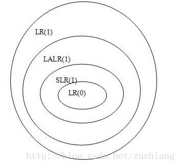
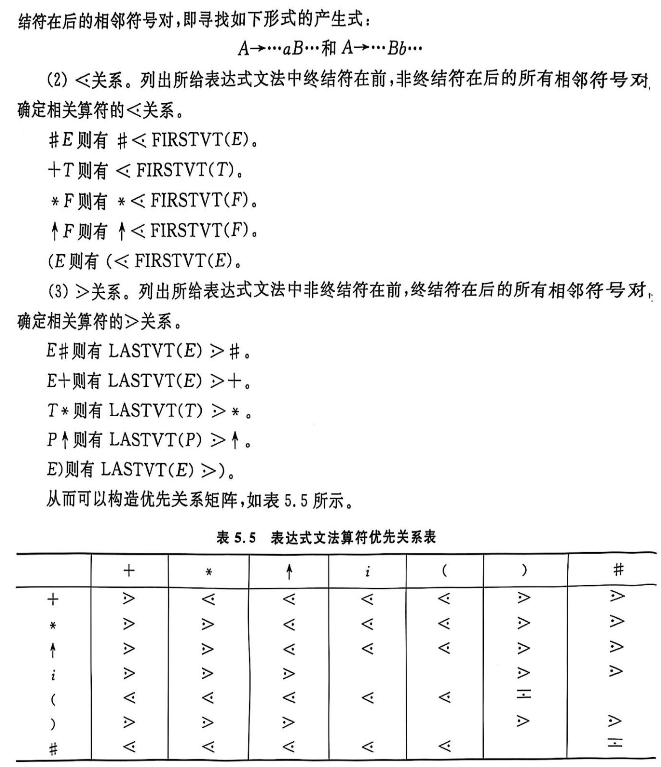

---
markmap:
    maxWidth: 500
---

# 编译原理笔记

## 引论<!-- markmap: fold -->

- 编译
    - 定义：**把一种源语言书写的程序翻译成目标语言的等价程序**
    - 过程：**源程序 -> 词法分析 -> 语法分析 -> 语义分析 -> 代码生成 -> 中间代码生成 -> 代码优化 -> 目标代码生成**
    - 每阶段任务
        - 词法分析：从左到右一个字符一个字符地读入源程序，对构成源程序的字符流进行扫描和分解，从而识别出一个个单词
            - 输入：源程序
            - 输出：单词序列
        - 语法分析：在词法分析的基础上将单词序列分解成各类语法短语
            - 输入：单词序列
            - 输出：语法树/ **语法短语** /语法单位
        - 语义分析：审查源程序有无语义错误看，为代码生成阶段收集类型信息
            - 输入：语法树/语法短语/语法单位
            - 输出：语义树/语义短语/语义单位
        - 中间代码生成：将语义树转换成中间代码
            - 输入：语义树/语义短语/语义单位
            - 输出：中间代码
        - 代码优化：对中间代码进行变换/改造，目的是使生成的目标代码更高效，即 **省时间和省空间** 
            - 输入：中间代码
            - 输出：优化后的中间代码
        - 目标代码生成：把中间代码变换成特定机器上的绝对指令代码或可重定位的指令代码或汇编指令代码
            - 输入：优化后的中间代码
            - 输出：目标代码
    - 和所有阶段都有关系：**表格管理、出错处理**
- 三种翻译程序的区别
    - 汇编程序
        - 输入：汇编语言
        - 输出：目标机器代码
    - 编译程序
        - 输入：高级语言源程序
        - 输出：等价的目标程序
    - 解释程序
        - 输入：源程序或中间表示
        - 输出：执行结果
        - 特点：不产生独立的机器目标文件

- 遍/趟：**对源程序或其等价的中间语言程序从头到尾扫描并完成规定任务的过程**
- 前端
    - 依赖于 **源语言** 而与目标机无关
    - 具体工作
        - 词法分析
        - 语法分析
        - 中间代码生成
        - 部分优化工作
        - 出错处理
        - 符号表管理
- 后端
    - 不依赖于源语言，只与 **中间代码** 有关的那些阶段的工作
    - 具体工作
        - 目标代码生成
        - 出错处理
        - 符号表操作

## 文法和语言<!-- markmap: fold -->

### 文法的直观概念

- 语言的指导规则

### 符号和符号串

- 定义
    - 字母表（符号集）：元素的非空有穷集合，字母表中的元素称为符号
    - 符号串：字母表中的符号组成的任何有穷序列称为符号串
- 符号串的运算：
    - 符号串的头尾，固有头和固有尾
    - 连接
    - 方幂
- 符号串集合的运算
    - 乘积：$AB=\{xy|x\in A\wedge y\in B\}$
    - 闭包：$\sum^*=\sum^0\cup\sum^1\cup\cdots$
    - 正闭包：$\sum^+=\sum^1\cup\sum^2\cup\cdots$

### 文法和语言的形式定义

- **文法**：四元组 $(V_N, V_T, P, S)$，其中 $V_N$ 为非终结符集合，$V_T$ 为终结符集合，$P$ 为产生式集合，$S$ 为开始符号。$V_N \cap V_T = \phi$，$V_N \cup V_T = V$，$V$ 为所有符号集合。**语言的指导规则。**
- **规则**/重写规则/产生式/生成式）：是形如 $\alpha \rightarrow \beta$ 或 $\alpha ::= \beta$ 的 $(\alpha, \beta)$ 有序对，其中 $\alpha$ 为产生式左部，$\beta$ 为产生式右部。$\alpha \rightarrow \beta$ 或 $\alpha ::= \beta$ 读作 *定义为* 。
- **直接推导**：设 $\alpha \to \beta$ 是文法 $G=(V_N, V_T, P, S)$ 的规则，$\gamma$ 和 $\delta$ 是 $V^*$ 中的任意符号，若有符号串 $v, w$ 满足$v = \gamma \alpha \delta,~w = \gamma \beta \delta$，即说 $v$ 直接产生 $w$，或说 $v$ 是 $w$ 的直接推导，或说 $w$ 直接归约到 $v$，记作 $v \Rightarrow w$。
- **多步推导 $(\geq 1)$**：$v \xRightarrow{+} w$
- **多步推导 $(\geq 0)$**：$v \xRightarrow{*} w$
- **句型**：设 $G[S]$ 是一个文法，如果符号串 $x$ 是从识别符号推导出来的，即有 $S \Rightarrow x$，则称 $x$ 是文法 $G[S]$ 的句型。
- **句子**：若 $x$ 仅由终结符号组成，即 $S \Rightarrow x, x \in V_T^*$，则称 $x$ 为 $G[S]$ 的句子。
- **语言**：文法 $G$ 所产生的语言定义为集合 $\{x \mid S \xRightarrow{*} x, \text{其中 } S \text{ 为文法识别符号, 且 } x \in V_T^*\}$。可用 $L(G)$ 表示该集合。
- **等价文法**：若 $L(G1)=L(G2)$，则称这两个文法是等价的。

### 文法的类型

- **0 型文法**：设 $G = (V_N, V_T, P, S)$，如果它的每个产生式 $\alpha \rightarrow \beta$ 是这样一种结构：$\alpha \in (V_N \cup V_T)^*$ 且至少含有一个非终结符，而 $\beta \in (V_N \cup V_T)^*$，则 $G$ 是一个 0 型文法。
    - 直观理解：对于产生式限制最少的文法，基本意思就你是个产生式就行。所以，$x(x\geq1)$ 型文法，也都是 0 型文法。

- **1 型文法**：设 $G = (V_N, V_T, P, S)$ 为一个文法，若 $P$ 中的每一个产生式 $\alpha \rightarrow \beta$ 均满足 $|\beta| \geq |\alpha|$，仅仅 $S \rightarrow \varepsilon$ 除外，则文法 $G$ 是 1 型或**上下文有关的**（context-sensitive）。
    - 直观理解：每一步推导都会导致串非严格递增。

- **2 型文法**：设 $G = (V_N, V_T, P, S)$，若 $P$ 中的每一个产生式 $\alpha \rightarrow \beta$ 满足：$\alpha$ 是一个非终结符，$\beta \in (V_N \cup V_T)^*$，则此文法称为 2 型的或**上下文无关的**（context-free）。
    - 直观理解：在 0 型文法上增加了限制条件，左边必须是非终结符。
- **3 型文法**：设 $G = (V_N, V_T, P, S)$，若 $P$ 中的每一个产生式的形式都是 $A \rightarrow aB$ 或 $A \rightarrow a$，其中 $A$ 和 $B$ 都是非终结符，$a \in V_T^*$，则 $G$ 是 3 型文法或正规文法。
    - 直观理解：在 2 型文法上增加了限制条件，右边必须是终结符或终结符加非终结符的形式。由于这样的形式，正规文法是**没有左递归**的。

### 上下文无关文法/ 2 型文法及其语法树

- 定义
    - 最左推导：如果在推导的任何一步 $\alpha \Rightarrow \beta$（$\alpha$、$\beta$ 是句型），都是对 $\alpha$ 中的最左非终结符进行替换，则称这种推导为最左推导。
    - 最右推导/**规范推导**：如果在推导的任何一步 $\alpha \Rightarrow \beta$（$\alpha$、$\beta$ 是句型），都是对 $\alpha$ 中的最右非终结符进行替换，则称这种推导为最右推导。
    - 右句型/**规范句型**：由规范推导所得的句型。
    - **二义**：一个文法存在某个句子，**对应两颗不同的语法树**。或者说，一个文法中存在某个句子，它有两个不同的最左（最右）推导
        - 文法的二义性和语言的二义是两个不同的概念。即 $\exists G, G'$，使得 $G$ 是二义的，而 $G'$ 不是，但 $L(G)=L(G')$

### 句型的分析

- 自顶向下的分析方法
- 自低向上的分析方法
- 句型分析的有关问题
    - **短语**：一颗子树的所有叶子，自左至右排列，是相对于子树根的短语
    - **直接短语/简单短语**：短语中只有父子两代的
    - **子树**：一颗语法树中的特有结点连同其全部后裔，以及联结后裔的边，以及这些节点的标记
    - **句柄**：一个右句型的直接短语，称为该句型的句柄。无二义文法，一个右句型的唯一句柄是其所有直接短语中最左边的那一个

### 有关文法实际应用的一些说明

- 有害规则。形如 $U\rightarrow U$ 的产生式，有害是因为会引起文法的二义性
- 多余规则
    - 不可到达的
    - 不可终止的

## 词法分析<!-- markmap: fold -->

### 单词的形式化描述工具

- 正规文法
- 正规式/正则表达式（也是表示正规集的工具）
    - 正规式服从的代数规律如下
        - “或”的交换律
        - **“或”的可结合律**
        - “连接”的可分配律
        - 分配律
        - **“或”的抽取律**
- 正规文法和正规式的等价性
    - 正规文法到正规式的转换规则
        - $A\rightarrow xB,~B\rightarrow y \Leftrightarrow A= xy$
        - $A\rightarrow xA|y \Leftrightarrow A= x^*y$
        - $A\rightarrow Ay|x,~A=xy*$
        - $A\rightarrow x,~A\rightarrow y \Leftrightarrow A = x|y$

### 有穷自动机

- DFA
- NFA
- NFA 转化为 DFA（NFA 的确定化）
- DFA 的化简（DFA 的最小化）
    - **两个状态等价的条件**
        - **一致性条件。必须同时为终态或非终态**
        - **蔓延性条件。对于所有的输入符号，必须转换到等价的状态里**
- 正规式和 DFA 的等价性
- 正规文法和 DFA 的等价性

## 自顶向下的语法分析方法<!-- markmap: fold -->

### 确定的自顶向下分析思想

- 从文法的开始符号出发，考虑如何根据当前的输入符号唯一地确定选用哪个产生式替换相应非终结符以往下推导，或如何构造一棵相应的语法树
- FIRST
- FOLLOW
- SELECT
    - 若 $\alpha$ 无法经过 0 步或若干步推导得到 $\epsilon$，则 $SELECT(A\rightarrow \alpha)=FIRST(\alpha)$
    - 否则，$(FIRST(\alpha) - \{\epsilon\})\cup FOLLOW(A)$

### LL(1) 文法的判别

- 一个上下文无关文法是 $LL(1)$ 的充分必要条件是，对于每个非终结符 $A$ 的两个不同产生式，$SELECT(A\rightarrow \alpha)\cap SELECT(A\rightarrow \beta)=\phi$

### 某些非 $LL(1)$ 文法到 $LL(1)$ 文法的等价变换

- 提取左公共因子
- 消除左递归
    - 消除直接左递归
    - 消除间接左递归
    - 消除文法中一切左递归的文法
- $LL(1)$ 分析的实现
    - 表驱动的 $LL(1)$ 分析程序

## 自低向上优先分析<!-- markmap: fold -->

- 简单优先分析
    - 基本思想：对一个文法按一定的原则求出该文法的所有符号之间的优先关系，按照这种关系确定规约过程中的句柄，是规范规约
    - 优先关系定义
        - $X \doteq Y$ 当且仅当 G 中存在产生式规则 $A \rightarrow \dots XY \dots$。
        - $X \lessdot Y$ 当且仅当 G 中存在产生式规则 $A \rightarrow \dots XB \dots$，且 $B \Rightarrow^+ Y \dots$。
        - $X \gtrdot Y$ 当且仅当 G 中存在产生式规则 $A \rightarrow \dots BD \dots$，且 $B \Rightarrow^+ \dots X$ 和 $D \Rightarrow^* Y \dots$。
    - 简单优先文法定义
        - 在文法符号集 $V$ 中，任意两符号之间最多只有一种优先关系成立
        - 在文法中，任意两个产生式没有相同的右部
- 算符优先分析
    - 基本思想：只考虑终结符的优先关系，在规约过程中找到可规串就规约，不考虑规约到哪个非终结符，不是规范规约
    - 算符优先文法的定义
        - 如果文法 $G$ 中没有形如 $A\rightarrow ...BC...$ 的产生式，其中 $B$ 和 $C$ 为非终结符，则称 $G$ 为算符文法，也称 OG 文法
        - 三种算符优先关系
            - $=$：这样出现 $\#E\#$ 或者这样出现 $\#\#$，# 和 # 都是 = 关系
            - $<$：$\#E$，则 $\# < FIRSTVT(E)$
            - $>$：$E\#$，则 $LASTVT(E) > \#$
    - 算符优先分析表。只看第一/第二位，只看倒数第一/倒数第二位
        - FIRSTVT：$A\rightarrow a\Rightarrow \{a\}$、$A\rightarrow Ba \Rightarrow FISRVT(B)\cup\{a\}$
        - LASTVT：$A\rightarrow a\Rightarrow \{a\}$、$A\rightarrow aB \Rightarrow LASTVT(B)\cup\{a\}$
    - 算符优先分析算法
        - 算符优先分析句型的性质
        - 最左素短语
            1. 找短语
            2. 找带终结符的、不包含的其他素短语的
            3. 最左边的
    - 缺陷：只能分析表达式文法

## LR 分析<!-- markmap: fold -->

### LR 分析概述

实际上，LR 分析器就是一个**状态转换图**，分析表就是一个**状态转换表**。这与 DFA 是一致的。

- LR 分析器有 3 部分：
    - 总控程序/驱动程序，所有的 LR 分析器的总控程序都是相同的
    - 分析表/分析函数
    - 分析栈

- 状态进行转换时，总共有四种转换类型：
    - 移进（Shift）
    - 规约（Reduce）
    - 接受（Accept）
    - 报错（Fail）

### LR(0) 分析

#### 什么是 LR(0) 文法

- 一个文法的 LR(0) 项目集规范族不存在 *移进-归约 / 归约-归约* 冲突时，称这个文法为 LR(0) 文法

#### 可归前缀、活前缀

- 可归前缀：规范句型中，可以进行规约的前缀
- 活前缀：若 $S' \xRightarrow[R]{} \alpha A \omega \xRightarrow[R]{} \alpha \beta \omega$ 是文法 $G$ 的扩广文法 $G'$ 中的一个规范推导，符号串 $\gamma$ 是 $\alpha\beta$ 的前缀，则称 $\gamma$ 是 $G$ 的一个活前缀。
- 把在规范句型中形成可归前缀之前，包括可归前缀在内的、所有前缀都称为活前缀。

#### $LR(0)$ 项目集规范族的构造

- 状态转换图中，每个状态包含若干个项目。项目类型：
    - 移进项目。点后面是终结符的
    - 待约项目。点后面是非终结符
    - 归约项目。点后面啥也没有
    - 接受项目（规约项目的特殊情况）。既然是规约项目的特殊情况，它首先肯定是点后面啥也没有，其次则是要满足左部的非终结符为拓广产生式 $S'$
- 这种问题都要构造 DFA 和 LR 分析表。
- DFA 构造步骤：
    - 对开始符拓广。
    - 构建开始状态。构建步骤：
        - 写下状态可以得到的产生式，注意点的位置
        - 如果点后有非终结符，则写下对应非终结符的产生式
        - 重复 2，直至项目集不再扩大
    - 从开始状态，逐个输入可能输入的符号，每输入一个符号。使用上述构建步骤构建一次状态，直到项目集不再扩大。
- LR(0) 分析表构造步骤：
    - 横轴是所有符号，终结符放一起（ACTION），非终结符放一起（GOTO）
    - 纵轴是所有 DFA 中所有状态的编号。对于状态 S 和符号 G，（S,G）代表状态 S 输入符号 G 后的状态，自然对应之前说的移进、规约、接受、报错四种。
    - 移进：$S_{移进的状态编号}$
    - 规约：$r_{规约使用的产生式编号}$。*此时把所有终结符作为输入*
    - 接受：acc
    - 报错：空白
- LR(0) 分析过程
    1. 初始化状态栈为状态 0，初始化符号栈为 #，初始化剩余栈
    2. 取状态栈顶符号 $k$，剩余栈顶符号 $s$。查表 $[k, s]$。
      如果是 $S_x$ -> 3；
      如果是 $r_x$ -> 4；
      如果是 acc -> 结束；
      如果是空白 -> 报错
    3. 把 $x$ 压入状态栈，符号栈压入剩余栈栈顶，剩余栈弹出栈顶。返回 2
    4. 查找产生式 $x$
      状态栈、符号栈弹出 len($x$的右部) 个值
      符号栈压入$x$的左部
      状态栈压入 $y$，取状态栈顶符号 $k$、符号栈顶符号 $p$，查表得$y=[k, p]$。**这里 $y$ 只可能是数字**
      返回 2

### SLR(1) 分析

- 当文法的 LR(0) 项目集规范族，存在 *移进-归约冲突 / 归约-归约* 冲突时。要判断该文法是不是 SLR(1) 文法
    1. 对于存在冲突的项目集来说，如果是归约-规约冲突，进行 2；如果是移进-规约冲突，进行 3；如果同时存在，2、3 都要进行。
    2. 两个归约式左部的 FOLLOW 集合的交集为空集，则为 SLR(1) 文法
    3. 移进-归约冲突。归约项目左部的 FOLLOW 集合与移进项目的终结符的交集为空，则为 SRL(1) 文法
- SLR(1) 分析表构造步骤：
    - 横轴是所有符号，终结符放一起（ACTION），非终结符放一起（GOTO）
    - 纵轴是所有 DFA 中所有状态的编号。对于状态 S 和符号 G，（S,G）代表状态 S 输入符号 G 后的状态，自然对应之前说的移进、规约、接受、报错四种。
    - 移进：$S_{移进的状态编号}$
    - 规约：$r_{规约使用的产生式编号}$。*此时把产生式左部的 FOLLOW 集合中的符号作为输入*
    - 接受：acc
    - 报错：空白

### LR(1) 分析

- 一个文法的 LR(1) 项目集规范族不存在 *移进-归约 / 归约-归约* 冲突时，称这个文法为 LR(1) 文法。
    - 如何判断 LR(1) 项目集规范族中有没有 *归约-归约* 冲突
        1. 先像 LR(0) 那样寻找 *归约-归约* 冲突项目
        2. 再比较冲突项目的搜索符集合是否有交集，有 -> 3，无 -> 4
        3.  该项目集有 *归约-归约* 冲突，该文法既不是 LR(0)，也不是 LR(1)
        4. 该项目集没有 *归约-归约* 冲突
    - 如何判断 LR(1) 项目集规范族中有没有 *移进-归约* 冲突
        1. 先像 LR(0) 那样寻找 *移进-归约* 冲突项目
        2. 再比较规约项目的搜索集，与移进项目的终结符是否有交集，有 -> 2，无 -> 3
        3. 该项目集有 *移进-归约* 冲突，该文法既不是 LR(0)，也不是 LR(1)
        4. 该项目集没有 *移进-归约* 冲突
- LR(1) 项目集族的构造
    1. 像构造 LR(0) 项目集规范族那样，先构造项目。开始项目要带 #，即：$S' \rightarrow S, \#$
    2. 对于构造的每个项目，计算 $A \rightarrow \alpha \cdot B \beta, a$ 的 $FIRST(\beta a)$，把结果作为搜索符号集合
- LR(1) 分析表的构造
    - 横轴是所有符号，终结符放一起（ACTION），非终结符放一起（GOTO）
    - 纵轴是所有 DFA 中所有状态的编号。对于状态 S 和符号 G，（S,G）代表状态 S 输入符号 G 后的状态，自然对应之前说的移进、规约、接受、报错四种。
    - 移进：$S_{移进的状态编号}$
    - 规约：$r_{规约使用的产生式编号}$。*此时把搜索符集合的元素作为输入*
    - 接受：acc
    - 报错：空白

### LALR(1) 分析

- 【why LALR(1)】由于 LR(1) 的构造对某些同心集的分裂，可能状态数目引起剧烈地增长，从而导致存储容量的急剧增加。为了克服这种缺点，
- 【what LRLR(1) 项目集规范族】可以尝试合并同心集，合并后的文法若不产生冲突（和 LR(1) 一样的判断方法），则称为 LALR(1) 文法
- 【what LALR(1)】一个文法的 LALR(1) 项目集规范族不存在 *移进-归约 / 归约-归约* 冲突时，称这个文法为 LALR(1) 文法
- LALR(1) 中只可能有 归约-归约 冲突，而不可能有 移进-归约 冲突
    1. 这是因为，说 LALR(1) 的前提是：该文法是 LR(1) 文法
    2. 如果文法是 LR(1) 文法，必无两种冲突
    3. 合并同心集时可能会产生冲突，但只可能产生 归约-归约 冲突，不可能产生 移进-归约 冲突
    4. 如果合并同心集时产生了 归约-归约 冲突，那么该文法只能是 LR(1) 文法，而不是 LALR(1) 文法

### LR 比较

- 如果一个文法是 LR(0) 文法，那么它必然是 SLR(1) 文法，也必然是 LR(1) 文法，也一定是 LALR(1) 文法。反之不一定
- LR(1) 分析法 **强于** LALR(1) 分析法，LALR(1) 分析法 **强于** SLR(1) 分析法

### 二义性文法在 LR 分析中的应用

## 语法制导的语义计算<!-- markmap: fold -->

### 基于属性文法的语义计算

- 在文法 $G[S]$ 基础上，为文法符号关联有特定意义的属性，并为产生式关联相应的语义动作/语义子程序/条件谓词，称之为属性文法，并称文法 $G[S]$ 是这一属性文法的基础文法
- 综合属性：条件谓词在 **产生式左部** 
- 继承属性：条件谓词在 **产生式右部** 

## 静态语义分析和中间代码生成<!-- markmap: fold -->

### 符号表

- 作用：在语义分析中，符号表所登记的内容是进行 **上下语义合法性检查** 的依据，检查标识符属性在上下文中的一致性和合法性
- 属性
    - 名字
    - 类别
    - 类型
    - 存储类别和存储分配信息
    - 作用域和可见性

### 静态语义分析

- 静态语义刻画程序在静态一致性或完整性的方面，而动态语义刻画程序执行时的行为
- 静态语义分析的任务（检查程序结构的一致性、完整性，包括控制结构和数据结构）：
    - 控制流检查
    - 唯一性检查
    - 名字的上下文和相关性检查
    - 类型检查
- 中间代码生成/中间表示
    - 源程序的不同表现形式
    - 作用
        - 用于源语言和目标语言之间的 **桥梁** ，避开二者之间较大的语义跨度
        - 利于编译程序的 **重定向** 
        - 利于进行与目标机无关的 **优化** 
- 常见的中间表示形式
    - AST，抽象语法树
    - DAG，抽象语法树的改进形式
    - TAC，三地址代码
    - P-code
    - Bytecode
    - SSA
- 两种考试要考的中间代码
    - 逆波兰表达式
        - `if <exp> then <s1> else <s2>` $\Leftrightarrow$ 
          `<exp逆> <N1> FJ <s1逆> <N2> RJ <s2逆>`
        - 例：把 `for i=1 to 20 do x=4*i` 转换为逆波兰式
            - `x 0 = i 1 = i 20 <= 24 FJ x 4 i * = i i 1 + = 7 RJ`
    - 三元式
        - 
    - 三地址码/四元式/TAC
        - 例：把 `x 0 = i 1 = i 20 <= 24 FJ x 4 i * = i i 1 + = 7 RJ` 转成 TAC 序列
            1. $(=~~0~~/~~x)$
            2. $(=~~1~~/~~i)$
            3. $(<=~~i~~20~~T_1)$
            4. $(FJ~~10~~T_1~~/)$
            5. $(*~~4~~i~~T_2)$
            6. $(=~~T_2~~/~~x)$
            7. $(+~~i~~1~~T_3)$
            8. $(=~~T_3~~/~~i)$
            9. $(RJ~~4~~/~~/)$
        - 例：x:=a+b*(c-d)
          1. $(-~~c~~d~~T_1)$
          2. $(*~~b~~T_1~~T_2)$
          3. $(+~~a~~T_2~~T_3)$
          4. $(:=~~T_3~~/~~x)$
        

## 运行时存储组织<!-- markmap: fold -->

- 概述
    - 问题：编译程序在生成目标程序之前应该合理安排好目标程序在逻辑地址空间中存储资源的使用
    - 存储空间布局
        - 
        - 保留地址区。专门为目标机体系结构和操作系统保留的内存地址区
        - 代码区。静态存放编译程序产生的目标代码
        - 静态数据区。静态存放全局数据
        - 共享库和分别编译模块区。静态存放共享模块和分别编译模块的代码和全局数据
        - 动态数据区。运行时动态变化的 **堆区** 和 **栈区**
    - 存储分配策略
        - 静态存储分配。在编译期间为数据对象分配存储空间。这要求在编译期间就可确定数据对象的大小，同时还可以确定数据对象的数目
        - **栈式存储分配**。在编译期间，过程、函数以及嵌套程序块的活动记录**大小（最大值）应该是可以确定的**（以便进入的时候动态地分配活动记录的空间），这是进行栈式存储分配的必要条件，如果不满足，则应该使用堆式存储分配
        - **堆式存储分配**。**当数据对象的生存期与创建它的过程/函数的执行期无关时**，某些数据对象可能在该过程/函数结束之后仍然长期存在，就不适合机进行栈式存储分配。一种灵活但是较昂贵的存储分配方式是堆式存储分配
- 过程调用的传值和传址

## 代码优化和目标代码生成<!-- markmap: fold -->

- 编译过程的最后阶段的工作是目标代码生成，其**输入是某一种中间代码（如三地址码）以及符号表等信息，输出是特定目标机或虚拟机的目标代码**

### 基本块、流图和循环

- **基本块的划分**
    1. **找入口**
        - 程序的 **第一条语句**
        - 跳转的 **目标语句**
        - 条件跳转的 **下一条语句**
    2. **对每个入口，找出口**
        - 下一入口的 **上一条语句**
        - 跳转语句
        - 停语句

### 代码优化技术

- 窥孔优化
    - 删除冗余的存取
    - 常量合并
    - 常量传播
    - 代数化简
    - 控制流优化
    - 死代码删除
    - 强度削弱
    - 使用目标机惯用指令
- 局部优化
    - 构建 DAG 图
- 循环优化
    - 循环不变量外提
    - 归纳变量删除
    - 强度削弱
- 全局优化

### 目标代码生成技术

- 问题：包括 **指令选择、寄存器分配、指令调度**
- **指令选择：为每条中间语言语句选择恰当的目标机指令或指令序列**
- **寄存器分配：在生成的代码中，尽可能多地、有效地利用寄存器非常重要**
    - **分配** 期间：为程序的某一点选择驻留在寄存器中的一组变量
    - **指派** 期间：挑出变量将要驻留的具体寄存器，即寄存器赋值
    - 在基本块范围内的寄存器分配称为 **局部寄存器分配**，在过程范围内的寄存器分配称为 **过程级寄存器分配/全局寄存器分配**
- **指令调度：指对指令的执行顺序进行适当的调整，从而使得整个程序得到优化的执行效果**

## 🔥 老师上课给出的一些问题<!-- markmap: fold -->

**据老师说，能让你从 80 到 90。**

### 第一章
- （a）运算符和运算对象不符；（b）算法逻辑错误
    - 都属于语义错误
    - （a）属于静态语义错误
    - （b）属于动态语义错误
- 在编译中产生语法树是为了语法分析
- 程序语言的生成机构是 **文法**，识别机构是 **自动机**
- 词法分析器可以用自动机来实现
- ❌编译程序在对程序进行优化时，可能会去处理注释
- 一般情况下，语法分析只产生中间代码，不产生目标代码
- 用 **BNF/EBNF** 或 **语法图** 描述高级语言
- 程序设计语言的定义涉及：**语法、语义、语用**
- 程序设计语言的形式语言涉及：**语法**
- 使用解释程序时，在程序执行未完成的情况下，**可以** 执行已经执行过的部分
- 在使用高级语言编程时，首先可通过编译程序发现源程序的**全部语法错误**和**部分语义错误**
- 编程语言的语言处理程序是一种**系统软件**
- 【存疑】什么是两类程序语言处理程序：**编译程序、解释程序**
- 【存疑】三种翻译程序：**汇编程序、编译程序、解释程序**
- 下面关于解释程序的描述正确的是 **(1)**。
    - (1) 解释程序的特点是处理程序时不产生目标代码
    - (2) 解释程序适用于 COBOL 和 FORTRAN 语言
    - (3) 解释程序是为打开编译程序技术的僵局而开发的
- 由于受到具体机器主存容量的限制，编译程序几个不同阶段的工作往往被组合成**D**。
    - A、过程  
    - B、程序  
    - C、批量  
    - D、遍(若干遍扫描)
- 编译的6个阶段 这些工作往往是**穿插**进行的
- 编译程序生成的目标程序，不一定是**机器语言的程序**。不一定是**可执行程序**
- 目标代码在形式上分为：**绝对指令代码、可重定位的指令代码、汇编指令代码**

### 第二章

- ❌符号就是字符
    - 字母表/符号集：元素的非空有穷集合，字母表中的元素称为符号。比如 begin/if/end 这种也可以算作符号
- BNF范式是一种广泛采用的描述**语言和语法规则**的范式
- 一个语言的文法是**不唯一的**
- 生成非0开头的正偶数的文法
- 若一个文法是递归的，则它产生的句子的个数是无穷的
- 一个句型的最左简单短语或直接短语称为句柄
- 对任意一个左限性文法，**都存在**一个右限性文法使得二者等价
- 正规文法**不一定是**二义性文法(二者无关)
- ❌ 文法的规则的左部就是非终结符(比如0和1型)

### 第三章

- 确定的有穷自动机是**五元组**
- **不存在**这样一些语言，他们能被确定的有穷自动机识别，但不能被正规式表示

### 第四章

- 不确定的自顶向下的语法分析会遇到的问题：**回溯**
- LL（1）的两个 L 分别代表什么含义？$\rightarrow$ 老师说不会出这种题。但多记一个又怎么了！
    - 第一个L表明自顶向下分析时从左向右扫描输入串
    - 第二个L表明分析过程将最左推导
- 编译程序的语法分析程序接受**单词**的输入
- 递归下降子程序的语法分析属于**自顶向下**
- 表驱动的可以用递归下降
- LL(K)文法都是非二义性的文法

### 第五章

- 算符优先分析每次都是对 **最左素短语** 进行规约
- LR 语法分析栈中，存在的状态，是识别 **可归前缀(活前缀)** 的DFA
- 若一个句型中，出现了某一个产生式的右部，该右部不一定是句柄
- 一个文法是SLR1文法，那么它一定是LR1文法，也一定是 LALR(1) 文法
- LR、SLR、LALR 的范围比较：
    - 最小 LR0
    - 中间 解决冲突用SLR1，不能都解决
    - 最大 的LR1
    - LALR1 比 LR1 小，但大小等于 SLR1
- 如果一个文法是 LR1，不一定是 LALR1，反之则一定是
    - 
- ❌ 符号表由词法分析程序建立，由语法分析程序使用
- 下列关于标识符和名字叙述中，正确的是**C**。
    - A、标识符有一定的含义  
    - B、名字是一个没有意义的字符串序列  
    - C、名字有确切的属性  
    - D、A~C都不正确  
    - 标识符（identifier）是语言的词法单元，只是一串符号组合，本身并不蕴含语义；它的含义要靠语法分析和后续的语义阶段再结合上下文赋予。说“标识符有一定的含义”是不准确的，因此 A 错误。名字（name）在语言的语义层面代表具体的语言实体（变量、常量、类型、过程等），与之关联的是一组属性（如类别、数据类型、作用域、存储位置等）。因此“名字有确切的属性”是正确的，C 正确。B 颠倒了概念：没有意义的字符序列描述的应是标识符而非名字，所以 B 错误。既然 C 正确，D 也随之错误。
- 过程和过程引用信息交换的方法是**参数传递**和**全局变量使用**
- 允许动态申请和释放空间，采用的存储分配的技术是**堆**
- Pascal中过程说明的局部变量地址分配在。
    - A. 调用者的数据区中
    - ✅B. 被调用者的数据区中
    - C. 主程序的数据区中
    - D. 公共数据区中

### 第七章

- 语法制导的编译程序能够同时进行语法、语义分析

### 第十章

- 局部优化是局限于一个基本块

## 🔥 题目分布<!-- markmap: fold --> 

### 第一章

- 书上划题：4

### 第二章

- 书上划题：1、2、6、10、11
- 【大题】给文法，问语言。或反之
- 【大题】语法树进行语法分析，找最左素短语

### 第三章

- 书上划题：1、3、4、7、8、9
- 【大题】NFA 的确定化、最小化

### 第四章

- 书上划题：1、2、7（2）
- 【大题】给文法、是否 LL(1)
- 【大题】表驱动方法分析句子

### 第五章

- 书上划题：无
- 题目
    - 题 1 
        
    - 题 1 答案
        
        
### 第六章

- 书上划题：7、9、11

### 第七章

- 书上划题：2（图7.19）、3、4

### 第八章

- 书上划题：无

### 第九章

- 书上划题：无

### 第十章

- 书上划题：2、4

## 🔥 我的错题本<!-- markmap: fold -->

### 其他

- 编译程序使用 **说明标识符的过程或函数的静态层次** 区别标识符的作用域
- 在程序流图中，对于任意节点 $n_i$ 和 $n_j$，如果从流图的首节点出发，到达 $n_j$ 的任一通路都必须经过 $n_i$，则称 $n_i$ 是 $n_j$ 的必经节点，记为 $n_i DOM n_j$
- 在程序流图中，如果 $n_i$ 和 $n_j$ 之间存在一条从 $n_i$ 到 $n_j$ 的有向边，且 $n_j DOM n_i$ ，则该有向边是回边
- 采用三元式实现三地址代码时，不利于对中间代码进行优化
    - 三元式 (triple) 把每条三地址指令的“结果”隐含在该指令的序号中，后续指令通过序号引用之前的运算结果。例如 `(i)  op  arg1  arg2` 中，若下一条指令要用到该结果，只能写成 `(... , i , ...)`。一旦在优化阶段进行“公共子表达式消除”“指令重排/代换”“死代码删除”等操作，导致指令顺序发生变化或插入、删除指令，原有序号就会被打乱，所有引用这些序号的字段都必须更新，工作量大、易出错。相比之下，四元式(quadruple)把结果放在单独的`result`列，用临时变量名（t1、t2…）来引用；只要保持“定义—使用”关系不变，就可以自由移动指令而无需改写大量索引。因此从实现层面看，用三元式存储三地址代码确实不利于后续的中间代码优化。
- 将编译程序分为若干遍，是为了 **使程序结构更加清晰** 
- 编译程序把绝大多数时间都花在 **管理表格** 上
- 文法 G：$S\rightarrow xSx|y$ 所识别的语言是 $x^nyx^n(n\geq 0)$
- 一个 **上下文无关文法** 是 LL(1) 文法的充要条件是对于每个相同左部非终结符的产生式，对应的 SELECT 集合两两无交集
- 文法符号的属性可用来刻画该文法符号关联的任何特定意义的信息，如值、名字串、类型、偏移地址、代码片段等
- 最右推导的逆过程称为规范规约/最左规约
- 算符优先关系表 **不一定** 存在对应的优先函数
- 语法分析时 **必须** 先消除文法中的左递归（针对自低向上）
- LR 分析法自左至右扫描输入串时就能发现错误，**但不能准确指出出错地点**
- 静态数组的存储空间可以在编译时确定
- ❌一个语义子程序描述了一个文法对应的翻译工作
    - 描述的应该是对应产生式，而非文法
- 如果文法 G 是无二义的，那么它的任何句子的最左推导和最右推导对应的语法树必定相同
- 每个基本块只有一个入口和出口
- ❌每个过程的活动记录的体积在编译时可静态确定
- 正规文法产生的语言都可以用上下文无关文法来描述
- 从功能上说，程序语言的语句大体可分为 **执行性语句** 和 **说明性语句** 
- 一个名字的属性包括
    - 类型
    - 作用域
- 根据优化所涉及的程序范围，可将优化分为局部优化、循环优化、全局优化（注意没有窥孔优化）
- 语法分析方法大致可分为两类
    - 自上而下
    - 自下而上
- 语法分析是依据语言的 **语法** 规则进行，中间代码生成是依据语言的 **语义** 规则进行
- 一个文法的预测分析表若不含多重定义，则该文法是LL(1)文法
- 对于数据空间的存储分配，FORTRAN 采用静态策略，PASCAL 采用动态策略

### LL/LR 的含义

- LL(k)
    - 第一个 L 代表自顶向下分析时从左向右 **扫描输入串**
    - 第二个 L 代表分析过程总是 **最左推导**
    - k 代表 **向前查看的终结符的个数**
- LR(k)
    - L：代表自顶向下分析时从左向右 **扫描输入串**
    - R：LR 分析属于自底向上的归约过程：它通过不断把已读入的符号归约为非终结符，最终得到开始符号；这种归约序列正好是把一棵语法树的“最右推导”倒过来执行，所以称为 “**右推导的逆过程**”
    - k：分析器在每一步做移进/归约决策时，至多向前窥视接下来的 k 个终结符即可唯一判定动作
