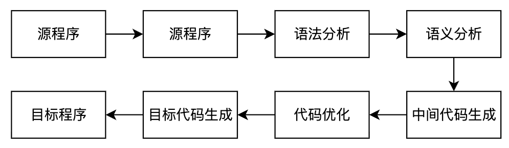

---
markmap:
    maxWidth: 500
---

# 编译原理笔记

## 引论<!-- markmap: fold -->

- **编译的基本概念**：把一种语言（源语言）书写的程序翻译成另一种语言（目标语言）的等价程序。
- 三种翻译程序的区别
- 编译的过程 
    - 和所有阶段都有关系：表格管理、出错处理
    - 每个阶段的任务
    - 每个阶段的输入、输出
- 遍
- 趟
- 前端
- 后端

## 文法和语言<!-- markmap: fold -->

### 文法的直观概念

- 语言的指导规则

### 符号和符号串

- 定义
    - 字母表（符号集）：元素的非空有穷集合，字母表中的元素称为符号
    - 符号串：字母表中的符号组成的任何有穷序列称为符号串
- 符号串的运算：
    - 【不重要】符号串的头尾，固有头和固有尾
    - 连接
    - 方幂
- 符号串集合的运算
    - 乘积：$AB=\{xy|x\in A\wedge y\in B\}$
    - 闭包：$\sum^*=\sum^0\cup\sum^1\cup\cdots$
    - 正闭包：$\sum^+=\sum^1\cup\sum^2\cup\cdots$

### 文法和语言的形式定义

- **文法**：四元组 $(V_N, V_T, P, S)$，其中 $V_N$ 为非终结符集合，$V_T$ 为终结符集合，$P$ 为产生式集合，$S$ 为开始符号。$V_N \cap V_T = \phi$，$V_N \cup V_T = V$，$V$ 为所有符号集合。**语言的指导规则。**
- **规则**（重写规则、产生式、生成式）：是形如 $\alpha \rightarrow \beta$ 或 $\alpha ::= \beta$ 的 $(\alpha, \beta)$ 有序对，其中 $\alpha$ 为产生式左部，$\beta$ 为产生式右部。$\alpha \rightarrow \beta$ 或 $\alpha ::= \beta$ 读作 *定义为* 。
- **直接推导**：设 $\alpha \to \beta$ 是文法 $G=(V_N, V_T, P, S)$ 的规则，$\gamma$ 和 $\delta$ 是 $V^*$ 中的任意符号，若有符号串 $v, w$ 满足$v = \gamma \alpha \delta,~w = \gamma \beta \delta$，即说 $v$ 直接产生 $w$，或说 $v$ 是 $w$ 的直接推导，或说 $w$ 直接归约到 $v$，记作 $v \Rightarrow w$。
- **多步推导 $(\geq 1)$**：$v \xRightarrow{+} w$
- **多步推导 $(\geq 0)$**：$v \xRightarrow{*} w$
- **句型**：设 $G[S]$ 是一个文法，如果符号串 $x$ 是从识别符号推导出来的，即有 $S \Rightarrow x$，则称 $x$ 是文法 $G[S]$ 的句型。
- **句子**：若 $x$ 仅由终结符号组成，即 $S \Rightarrow x, x \in V_T^*$，则称 $x$ 为 $G[S]$ 的句子。
- **语言**：文法 $G$ 所产生的语言定义为集合 $\{x \mid S \xRightarrow{*} x, \text{其中 } S \text{ 为文法识别符号, 且 } x \in V_T^*\}$。可用 $L(G)$ 表示该集合。
- **等价文法**：若 $L(G1)=L(G2)$，则称这两个文法是等价的。

### 文法的类型

- **0 型文法**：设 $G = (V_N, V_T, P, S)$，如果它的每个产生式 $\alpha \rightarrow \beta$ 是这样一种结构：$\alpha \in (V_N \cup V_T)^*$ 且至少含有一个非终结符，而 $\beta \in (V_N \cup V_T)^*$，则 $G$ 是一个 0 型文法。
    - 直观理解：对于产生式限制最少的文法，基本意思就你是个产生式就行。所以，$x(x\geq1)$ 型文法，也都是 0 型文法。

- **1 型文法**：设 $G = (V_N, V_T, P, S)$ 为一个文法，若 $P$ 中的每一个产生式 $\alpha \rightarrow \beta$ 均满足 $|\beta| \geq |\alpha|$，仅仅 $S \rightarrow \varepsilon$ 除外，则文法 $G$ 是 1 型或**上下文有关的**（context-sensitive）。
    - 直观理解：每一步推导都会导致串非严格递增。

- **2 型文法**：设 $G = (V_N, V_T, P, S)$，若 $P$ 中的每一个产生式 $\alpha \rightarrow \beta$ 满足：$\alpha$ 是一个非终结符，$\beta \in (V_N \cup V_T)^*$，则此文法称为 2 型的或**上下文无关的**（context-free）。
    - 直观理解：在 0 型文法上增加了限制条件，左边必须是非终结符。
- **3 型文法**：设 $G = (V_N, V_T, P, S)$，若 $P$ 中的每一个产生式的形式都是 $A \rightarrow aB$ 或 $A \rightarrow a$，其中 $A$ 和 $B$ 都是非终结符，$a \in V_T^*$，则 $G$ 是 3 型文法或正规文法。
    - 直观理解：在 2 型文法上增加了限制条件，右边必须是终结符或终结符加非终结符的形式。由于这样的形式，正规文法是**没有左递归**的。

### 上下文无关文法（2 型）文法及其语法树

- 定义
    - **最左推导**：如果在推导的任何一步 $\alpha \Rightarrow \beta$（$\alpha$、$\beta$ 是句型），都是对 $\alpha$ 中的最左非终结符进行替换，则称这种推导为最左推导。
    - **最右推导**（规范推导）：如果在推导的任何一步 $\alpha \Rightarrow \beta$（$\alpha$、$\beta$ 是句型），都是对 $\alpha$ 中的最右非终结符进行替换，则称这种推导为最右推导。
    - **右句型**（规范句型）：由规范推导所得的句型。

### 句型的分析

## 词法分析<!-- markmap: fold -->

## 自顶向下的语法分析方法<!-- markmap: fold -->

## 自低向上优先分析<!-- markmap: fold -->

## LR 分析<!-- markmap: fold -->

### LR 分析概述

实际上，LR 分析器就是一个**状态转换图**，分析表就是一个**状态转换表**。这与 DFA 是一致的。

- LR 分析器有 3 部分：
    - 总控程序（驱动程序），所有的 LR 分析器的总控程序都是相同的
    - 分析表（分析函数）
    - 分析栈

- 状态进行转换时，总共有四种转换类型：
    - 移进（Shift）
    - 规约（Reduce）
    - 接受（Accept）
    - 报错（Fail）

### LR(0) 分析

前面说，LR 分析本质上就是状态转换，因此，无论名字怎么变，也就是在状态转换上玩出花，不会有什么大的差异。

#### 可归前缀、活前缀

- 可归前缀：感觉就是规范句型中，可以进行规约的前缀
- 活前缀：若 $S' \xRightarrow[R]{} \alpha A \omega \xRightarrow[R]{} \alpha \beta \omega$ 是文法 $G$ 的扩广文法 $G'$ 中的一个规范推导，符号串 $\gamma$ 是 $\alpha\beta$ 的前缀，则称 $\gamma$ 是 $G$ 的一个活前缀。

!!! tip "活前缀｜直观理解"

    把在规范句型中形成可归前缀之前，包括可归前缀在内的、所有前缀都称为活前缀。

#### LR(0) 项目集规范族的构造

- 状态转换图中，每个状态包含若干个项目。项目类型：
    - 移进项目。点后面是终结符的
    - 待约项目。点后面是非终结符
    - 归约项目。点后面啥也没有
    - 接受项目（规约项目的特殊情况）。既然是规约项目的特殊情况，它首先肯定是点后面啥也没有，其次则是要满足左部的非终结符为拓广产生式 $S'$
- 这种问题都要构造 DFA 和 LR 分析表。
- DFA 构造步骤：
    - 对开始符拓广。
    - 构建开始状态。构建步骤：
        - 写下状态可以得到的产生式，注意点的位置
        - 如果点后有非终结符，则写下对应非终结符的产生式
        - 重复 2，直至项目集不再扩大
    - 从开始状态，逐个输入可能输入的符号，每输入一个符号。使用上述构建步骤构建一次状态，直到项目集不再扩大。
- LR 分析表构造步骤：
    - 横轴是所有符号，终结符放一起（ACTION），非终结符放一起（GOTO）
    - 纵轴是所有 DFA 中所有状态的编号。对于状态 S 和符号 G，（S,G）代表状态 S 输入符号 G 后的状态，自然对应之前说的移进、规约、接受、报错四种。
    - 移进：$S_{移进的状态编号}$
    - 规约：规约进入的状态编号
    - 接受：acc
    - 报错：空白

## 语法制导的语义计算<!-- markmap: fold -->

## 静态语义分析和中间代码生成<!-- markmap: fold -->

## 运行时存储组织<!-- markmap: fold -->

## 代码优化和目标代码生成<!-- markmap: fold -->

## 🔥 老师上课给出的一些问题<!-- markmap: fold -->

**据老师说，能让你从 80 到 90。**

### 第一章

- 用 <u>BNF/EBNF</u> 或<u>语法图</u>描述高级语言
- 程序设计语言的定义涉及：<u>语法、语义、语用</u>
- 程序设计语言的形式语言涉及：<u>语法、语义</u>
- 在使用高级语言编程时，首先可通过编译程序发现源程序的<u>全部语法错误</u>和<u>部分语义错误</u>
- 编程语言的语言处理程序是一种<u>系统软件</u>
- 【存疑】什么是两类程序语言处理程序：<u>编译程序、解释程序</u>
- 【存疑】三种翻译程序：<u>汇编程序、编译程序、解释程序</u>
- 下面关于解释程序的描述正确的是 <u>(1)</u>。
    - (1) 解释程序的特点是处理程序时不产生目标代码
    - (2) 解释程序适用于 COBOL 和 FORTRAN 语言
    - (3) 解释程序是为打开编译程序技术的僵局而开发的
- 由于受到具体机器主存容量的限制，编译程序几个不同阶段的工作往往被组合成<u>D</u>。
    - A、过程  
    - B、程序  
    - C、批量  
    - D、遍  
- 编译的6个阶段 这些工作往往是<u>穿插</u>进行的
- 编译程序生成的目标程序，不一定是<u>机器语言的程序</u>。不一定是<u>可执行程序</u>
- 目标代码在形式上分为：<u>绝对指令代码、可重定位的指令代码、汇编指令代码</u>

### 第二章

- BNF范式是一种广泛采用的描述<u>语言和语法规则</u>的范式
- 一个语言的文法是<u>不唯一的</u>
- 生成非0开头的正偶数的文法
- 若一个文法是递归的，则它产生的句子的个数是无穷的
- 一个句型的最左简单短语或直接短语称为句柄
- 对任意一个左限性文法，<u>都存在</u>一个右限性文法使得二者等价
- 正规文法<u>不一定是</u>二义性文法(二者无关)
- ❌ 文法的规则的左部就是非终结符(比如0和1型)

### 第三章

- 确定的有穷自动机是<u>五元组</u>
- <u>不存在</u>这样一些语言，他们能被确定的有穷自动机识别，但不能被正规式表示

### 第四章

- 不确定的自顶向下的语法分析会遇到的问题：<u>回溯</u>
- LL（1）的两个 L 分别代表什么含义？$\rightarrow$ 老师说不会出这种题。但多记一个又怎么了！
    - 第一个L表明自顶向下分析时从左向右扫描输入串
    - 第二个L表明分析过程将最左推导
- 编译程序的语法分析程序接受<u>单词</u>的输入
- 递归下降子程序的语法分析属于<u>自顶向下</u>
- 表驱动的可以用递归下降
- LL(K)文法都是非二义性的文法

### 第五章

- 算符优先分析每次都是对<u>最左素短语</u>进行规约
- LR 语法分析栈中，存在的状态，是识别<u>可归前缀(活前缀)</u>的DFA
- 若一个句型中，出现了某一个产生式的右部，该右部不一定是句柄
- ✅ 一个文法是LR1文法，那么它一定是SLR1文法
- LR、SLR、LALR 的范围比较：
    - 最小 LR0
    - 中间 解决冲突用SLR1，不能都解决
    - 最大 的LR1
    - LALR1 比 LR1 小，但大小等于 SLR1
- 如果一个文法是 LR1，不一定是 LALR1，反之则一定是
- ❌ 符号表由词法分析程序建立，由语法分析程序使用
- 下列关于标识符和名字叙述中，正确的是<u>C</u>。
    - A、标识符有一定的含义  
    - B、名字是一个没有意义的字符串序列  
    - C、名字有确切的属性  
    - D、A~C都不正确  
- 过程和过程引用信息交换的方法是<u>参数传递</u>和<u>全局变量使用</u>
- 允许动态申请和释放空间，采用的存储分配的技术是<u>堆</u>
- Pascal中过程说明的局部变量地址分配在<u>B</u>。
    - A. 调用者的数据区中
    - C. 被调用者的数据区中
    - C. 主程序的数据区中
    - D. 公共数据区中

## 🔥 题目分布<!-- markmap: fold -->

### 第二章

- 【大题】给文法，问语言。或反之
- 【大题】语法树进行语法分析，找最左素短语

### 第三章

- 【大题】NFA 的确定化、最小化

### 第四章

- 【大题】给文法、是否 LL(1)
- 【大题】表驱动方法分析句子

## 13 🔥 我的错题本<!-- markmap: fold -->