---
markmap:
    maxWidth: 500
---

# 计算机操作系统

## 操作系统引论<!-- markmap: fold -->

<!-- 操作系统的基本特性
发展过程中几个比较重要的基本系统 特点区别 分别是什么 
操作系统的主要功能有哪些 管cpu的 管内存的 管设备的 -->

- 操作系统的目标：方便性、有效性、可扩充性、开放性
- 发展过程中几个比较重要的基本系统
    - 未配置操作系统的计算机系统
    - **单道批处理系统**
    - **多道批处理系统**
    - **分时系统**
    - **实时系统**
    - 微机操作系统
    - 嵌入式操作系统
    - 网络操作系统
    - 分布式操作系统
- 基本特性
    - 并发
        - 在**一段时间内**宏观上有多个程序在同时运行
        - 并发与并行的区别：并行是指两个或多个事件在**同一时刻**发生
    - 共享
        - 互斥共享方式
        - 同时共享方式
    - 虚拟
        - 时分复用技术
        - 空分复用技术
    - 异步
        - 进程是以人们不可预知的速度向前推进的，此即进程的异步性
- 操作系统的主要功能
    - 处理机管理功能
        - 进程控制
        - 进程同步
        - 进程通信
        - 调度
    - 存储器管理功能
        - 内存分配和回收
        - 内存保护
        - 地址映射
        - 内存扩充
    - 设备管理功能
        - 缓冲管理
        - 设备分配
        - 设备处理
    - 文件管理功能
        - 文件存储空间管理
        - 目录管理
        - 文件的读/写保护
    - 接口管理功能
        - 用户接口
        - 程序接口

## 进程的描述与控制<!-- markmap: fold -->

<!-- 进程的三个基本状态，怎么样转换的，转换的条件，什么时候发生转换，能够画出图并说清楚什么时候转换

线程 和进程之间的区别
最小单位
为什么要引入线程？
线程的三种实现方式 -->

### 前趋图与程序执行

- 前趋图：有向无环图（DAG），用于描述进程之间执行的先后顺序。
- 程序顺序执行的特征：顺序性、封闭性、可再现性
- 程序并发执行的特征：间断性、失去封闭性、不可再现性（失去封闭性导致失去可再现性）

### 进程的描述

- 进程：进程是程序的执行过程，是系统进行资源分配和调度的一个独立单位。又称为重型进程。
    - 进程是一个可拥有资源的独立单位
    - 进程是一个可被独立调度和分派的基本单位
- 进程的基本状态：
    - 总图：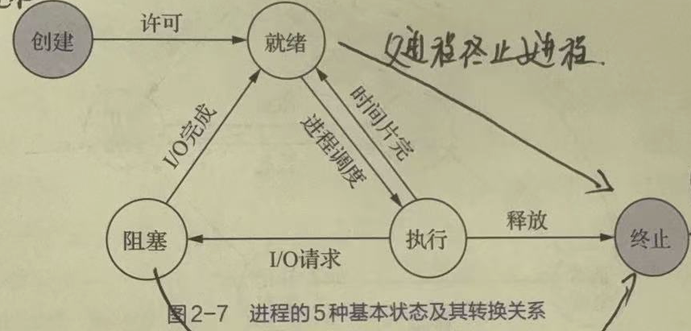
    - 就绪态：进程已处于准备好执行的状态。即进程已分配到除 CPU 以外的所有必要资源后，只要再获得 CPU，便可立即执行
    - 执行态：进程获得 CPU 后，其程序“正在执行”这一状态
    - 阻塞态：正在执行的进程，由于发生某事件而暂时无法执行。此时会引发进程调度，OS 会把处理机分配给另一个就绪态的进程
    - 创建态：在创建进程的过程中，进程所需的资源系统尚不能满足，此时创建工作尚未完成，进程不能被调度运行的状态 
    - 终止态：当一个进程到达了自然结束的终点，或是出现了无法克服的错误，或是被 OS 所终止，或是被其他有终止权的进程所终止时的状态 
- 进程的挂起操作和进程状态的转换
    - 引入的挂起原语和激活原语 
- 进程管理中的数据结构（PCB）
    - PCB 中的信息
        - 进程标识符：外部标识符、内部标识符
        - 处理机状态
        - 进程调度信息
        - 进程控制信息
    - 组织方式
        - 线性方式
        - 链接方式
        - 索引方式

### 进程的控制

- 创建
    - 引起进程创建的事件
        - 用户登陆
        - 作业调度
        - 提供服务
        - 应用请求
- 终止
    - 引起进程终止的事件
        - 正常结束
        - 异常结束
        - 外界干预
- 阻塞与唤醒
    - 引起进程阻塞或唤醒的事件
        - 向系统请求共享资源失败
        - 等待某种操作的完成
        - 新数据尚未到达
        - 等待新任务到达
- 挂起与激活

### 进程通信

- 定义：进程之间的信息交换。有低级和高级之分。
- 通信类型
    - 共享存储器系统
    - 管道通信系统
    - 消息传递系统
    - 客户机-服务器系统
- 实现方式
    - 直接通信
    - 间接通信

### 线程的概念

- 线程：是程序的执行过程，是系统进行资源分配和调度的一个比进程更小的基本单位。又称为轻型进程。
- 引入线程的动机
    - 由于进程是资源分配单位，因而在创建、终止、切换的过程中，系统必须为之付出较大的时空开销
    - 多处理器（Multiprocessor）系统和多核处理器（Chip Multi-processor，CMP）系统的引入对传统的进程模型带来挑战。在传统的操作系统中，进程是单线程的，单线程意味着进程内部必须是顺序执行，不能并发——即在一个时刻只能运行在一个处理器上，因此不能充分利用多处理器和多核处理器计算机的优势
    - 现实中有很多需要并发处理的任务，如字处理程序、Web服务器字处理程序（例如Word）
- 引入线程的优缺点
    - 优点
        - **减小**并发执行的**时间和空间开销**(线程的创建、退出和调度)，因此容许在系统中建立更多的线程来提高并发程度
        - 创建一个新线程花费时间少(结束亦如此)
        - 两个线程的切换花费时间少(如果机器设有保存/恢复所有寄存器指令，则整个切换过程用几条指令即可完成)
        - 因为同一进程内的线程共享内存和文件，因此它们之间相互通信无须调用内核
        - 适合多处理机系统
    - 缺点
        - 在程序设计模型中引入了某种程度的复杂性
        - 一个线程的崩溃可能影响到整个进程的稳定性
        - 线程能够提高的总性能有限，并且线程多了之后，线程本身的调度也更加复杂，需要消耗较多的CPU资源
- 线程的三个状态
    - 执行态
    - 就绪态
    - 阻塞态
    - **挂起状态对线程没有意义**，如果进程挂起后被对换出主存，则它的所有线程因共享了进程的地址空间，也必须全部对换出去，所以挂起状态是进程级状态，不作为线程级状态。类似地，进程的终止会导致所有线程的终止
- 线程管理中的数据结构：线程控制块（TCB），TCB可能属于操作系统空间，也可能属于用户进程空间，这取决于线程的实现方式。 TCB 包含
    - 程标识符
    - 一组寄存器
    - 线程执行状态
    - 优先级
    - 线程专有存储区
    - 信号屏蔽
    - 堆栈指针
- 进程和线程的区别
    - 根本区别：进程是操作系统资源分配的基本单位，而线程是处理器任务调度和执行的基本单位
    - 资源开销：每个进程都有独立的代码和数据空间（程序上下文），程序之间的切换会有较大的开销；线程可以看做轻量级的进程，同一类线程共享代码和数据空间，每个线程都有自己独立的运行栈和程序计数器（PC），线程之间切换的开销小。
    - 包含关系：如果一个进程内有多个线程，则执行过程不是一条线的，而是多条线（线程）共同完成的；线程是进程的一部分，所以线程也被称为轻权进程或者轻量级进程。
    - 内存分配：同一进程的线程共享本进程的地址空间和资源，而进程之间的地址空间和资源是相互独立的
    - 影响关系：一个进程崩溃后，在保护模式下不会对其他进程产生影响，但是一个线程崩溃整个进程都死掉。所以多进程要比多线程健壮。
    - 执行过程：每个独立的进程有程序运行的入口、顺序执行序列和程序出口。但是线程不能独立执行，必须依存在应用程序中，由应用程序提供多个线程执行控制，两者均可并发执行
- 多线程(multithreading)：这一术语用来描述在**同一个进程**中允许多个线程的情形
    - 多线程环境下的进程
        - 进程拥有独立的虚拟地址空间
        - 在创建一个进程时，同时要为该进程创建一个线程，否则该进程无法被调度执行
- 线程模型
    - 
    - 
- 线程的属性
    - 执行状态(状态转换)
    - 上下文
    - 执行栈(包括内核栈和用户栈)
    - 可存取所在进程的内存和其他资源
    - 可以创建、撤消另一个线程

### 线程的实现方式

- 用户级线程(User Level Thread，ULT)  
    - 线程管理工作由应用程序完成，在用户空间内实现  
        - 通过用户空间线程库（运行时系统）管理线程。线程库是一个管理ULT的例行程序包，实质上是线程的运行支撑环境  
        - 应用程序需通过调用线程库中的例程进行编程，与线程库链接后形成可执行程序，以实现多线程  
    - 操作系统内核不知道线程的存在
    - 线程切换不需要核心态特权  
    - 线程调度是应用特定的
    - 优点
        - 线程切换不调用操作系统内核，性能良好
        - 调度是应用程序特定的，可针对应用优化。线程库的线程调度算法与操作系统的低级调度算法是无关的
        - 无论操作系统内核是否支持线程，ULT都可以运行，只需要线程库即可，许多当代操作系统和程序设计语言均提供了线程库
    - 缺点
        - 调度通常采用非抢先式和更简单的规则
        - 大多数系统调用是阻塞的，因此内核阻塞进程，故进程中所有线程将被阻塞
        - 操作系统内核只将处理器分配给进程，同一进程中的两个线程不能同时运行于两个处理器上
- 内核级线程
    - 不需要线程库
    - 每个进程中不需要线程表
    - 在操作系统内核中需要有记录系统中所有线程的线程表
    - 优点
        - 对于多处理器，内核可以同时调度同一进程的多个线程
        - 阻塞是在线程一级完成
        - 内核例程是多线程的
    - 缺点
        - 在同一进程中，控制权从一个线程传送到另一个线程时需要用户态-内核态-用户态的模式切换，系统开销大
- 混合实现
    - 使用内核级线程，然后将用户级线程与某些或全部内核级线程多路复用起来
    - 内核只认识内核级线程，并对其进行调度
    - 某些内核级线程的顶部有若干可以轮流使用的用户级线程集合

## 处理机调度与死锁<!-- markmap: fold -->

<!-- 要清楚资源分配图 那些是资源，哪些是进程
调度算法都要知道怎么做的
之前特别喜欢考的 高响应比
死锁的四个必要条件
银行家算法 知道怎么检查安全状态 知道怎么根据初始的图计算是否是安全状态 -->

### 调度概述

- 处理机
    - 处理机是计算机系统中最重要的资源
    - 在多道程序设计系统中，通常会有多个进程(或线程)竞争处理机资源，因此操作系统必须选择要运行哪一个进程
    - 为其分配处理器完成选择工作的操作系统代码称为调度程序
- 调度的三个层次
    - 
    - 高级调度（长程调度、作业调度）
    - 低级调度（短程调度、进程调度）
    - 中级调度（内存调度）
- 作业和作业调度
    - 作业：包含通常的程序、数据，还包含作业说明书，系统根据说明书对程序的运行就行控制。多批道处理系统中，将作业作为基本单位从外存掉
- 不同等级的调度
    - 用户级线程
        - 内核并不知道线程的存在，所以内核调度的是进程，而线程的调度由用户级线程库的线程调度程序负责
    - 内核级线程
        - 内核选择线程运行，而不用考虑该线程属于哪个进程
- 调度程序的功能
    - 记录所有进程的运行状况
    - 当进程出让 CPU 或调度程序抢占处于执行状态的进程占用的CPU时：选择适当的进程分派 CPU
    - 完成上下文切换
- 进程的上下文切换过程（如何分配处理机）
    - 用户态执行进程A代码 → 进入OS核心
    - 保存进程 A 的上下文：恢复进程B的上下文(CPU 寄存器和一些表格的当前指针)
    - 用户态执行进程 B 代码
- 处理机调度的时机
    - 在创建一个新进程后
    - 当一个进程运行完毕：或由于某种错误而终止运行时。**必须执行处理机调度**
    - 当一个进程转入等待状态(等待 I/O、在进程间通信中执行了某种原语操作)。**必须执行处理机调度**
    - I/O 中断发生时
    - 在每个时钟中断或者每 k 个时钟中断发生时

### 调度算法（按什么原则分配处理机）

- FCFS
- SJF
- 优先级调度算法
    - 优先级调度算法的类型
        - 非抢占式
        - 抢占式。主要适用于**分时**系统和**实时**系统
            - 抢占原则有两种
                - 优先级原则：高优先级进程可抢占低优先级进程
                - 时间片原则：当运行进程的时间片用完后被抢占
    - 优先级的类型
        - 静态优先级
        - 动态优先级
    - **最高响应比优先**：响应比=$ \frac{等待时间+要求服务时间}{要求服务时间}=\frac{周转时间}{要求服务时间}$
    - **最短剩余时间优先**
- 交互式系统中的调度
    - 时间片轮转调度
    - 优先级调度
    - 多级反馈队列
    - 最短进程优先
    - 保证调度
    - 彩票调度
    - 公平分享调度

### 实时调度

- 外设给计算机一个刺激，计算机必须在一个**规定时间**恰当地做出反应
- 分类
    - 硬实时(HRT： Hard Real Time)，必须满足绝对的截止时间
    - 软实时(SRT： Soft Real Time)，偶尔超过时间限制是可以容忍的
- 实时系统的事件分类
    - 周期性事件
    - 非周期性事件
- 可调度的实时系统
    - 如果有 $m$ 个周期性事件，事件 $i$ 以周期 $P$ 发生，并且需要 $C_i$ 秒 CPU 时间处理：那么在单处理机系统中可以处理负载的条件为 $\sum_{i=1}^{m} \frac{C_{i}}{P_{i}} \leq 1$，满足该条件的实时系统称为是可调度的
- 调度算法以抢占式策略为基础
    - 速率单调调度（RMS）：静态优先级调度算法，为每个进程分配一个与事件发生频率成正比的优先级。例如周期为20ms的进程优先级为50，周期为100ms的进程优先级为10
    - 最早截止时限优先（EDF）：一种动态优先级调度算法。当一个事件发生时，对应的进程被加到就绪队列，该队列按照截止时限排序。对于周期性事件，截止时限即为事件下一次发生的时间调度程序总是选择截止时限最早的进程
    - 最小裕度优先（LLF）：一种动态优先级调度算法。裕度=(截止时刻-当前时刻)-剩余运行时间

### 死锁概述

- 定义：如果一组进程中的每个进程，都在等待仅有该组进程中的其他进程才能引发的事件发生，那么该组进程是死锁的
- 原因
    - 竞争资源：当系统中供多个进程所共享的资源，不足以同时满足它们的需要时，引起它们对资源的竞争而产生死锁
    - 进程推进的顺序不当：进程在运行过程中，请求和释放资源的顺序不当，导致进程的死锁
- 资源的分类
    - 根据资源的性质
        - 可抢占资源
        - 不可抢占资源
    - 根据使用方式
        - 共享资源
        - 独占资源
    - 根据使用期限
        - 永久资源（可重用性资源）
        - 临时资源（可消耗性资源）
    - 资源分配图 
- 必要条件
    - 互斥
    - 请求和保持
    - 不可抢占
    - 环路等待
- 处理死锁的方法
    - 鸵鸟算法
    - 死锁预a
    - 死锁避免
    - 死锁检测

### 死锁预防

- 定义：采用某种策略，限制并发进程对资源的请求，使系统在任何时刻都不满足死锁的必要条件
- 破坏互斥
    - 某些设备(例如打印机)可以假脱机操作，只有打印机守护程序使用打印机资源。不是所有的设备都可以进行假脱机操作
- 破坏请求和保持
    - 预先静态分配法：进程开始运行前一次分配所需全部资源，若系统不能满足，则进程阻塞，直到系统满足其要求——保证进程运行过程中不会再提出新的资源请求
        - 存在的问题
            - 降低了对资源的利用率，降低进程的并发程度
            - 有可能无法预先知道所需资源
        - 改进措施
            - 进程必须释放已分配的所有资源之后才能在需要时申请其他所需资源
- 破坏不可抢占
    - 消除不可抢占条件通常不是有效的/如果一个进程已分配到一台打印机，且正在进行打印，如果由于它需要的绘图仪无法获得而强制性地把它占有的打印机剥夺掉，这会引起一片混乱
- 破坏环路等待条件
    - 有序资源使用法。把资源分类按顺序排列，保证对资源的请求不形成环路
    - 存在的问题
        - 限制进程对资源的请求顺序
        - 资源的排序占用系统开销

### 死锁避免

- 定义：并不事先采取限制去破坏产生死锁的条件，而是在资源的动态分配过程中，用某种方法去防止系统进入不安全状态，从而避免死锁的发生
- 优点：事先只需要较弱的限制条件，可获得较高的资源利用率和系统吞吐量
- 缺点：实现较难
- 银行家算法
    - 描述 
    - 安全性算法 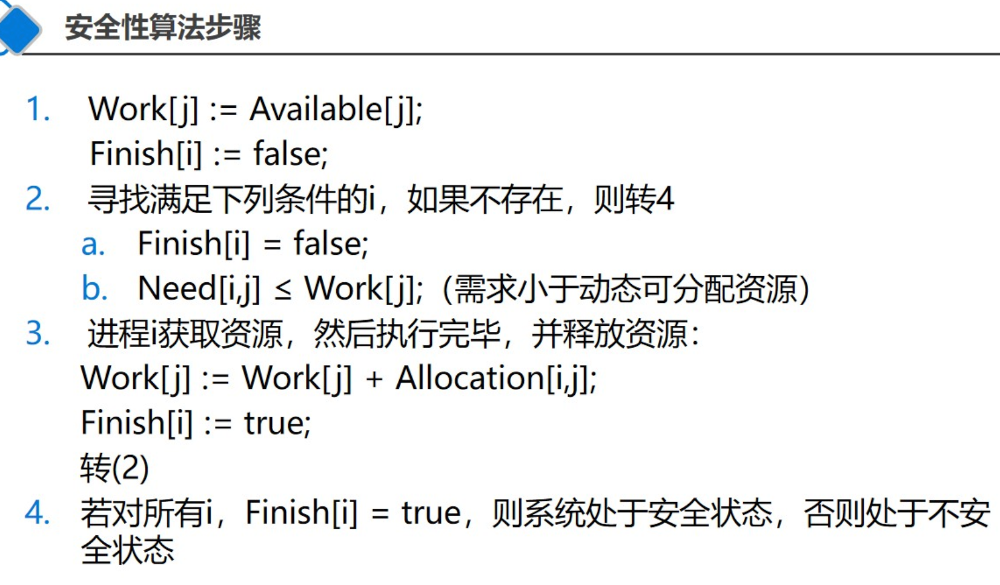
    - 优点：
        - 比起预防死锁的几种方法来说，限制条件放松，资源利用程度提高。
        - 由于系统可以满足、也可以拒绝进程提出的资源请求，当一个进程的资源要求将导致不安全状态时，系统就拒绝其要求，直到该资源要求不会导致不安全状态时，才满足此进程的资源要求(这主要由于其它进程释放出了资源)，这样系统总是处于安全状态
    - 缺点：要求被分配的每类资源的数量固定、要求用户数保持不变

### 死锁检测与解除

- 死锁检测
    - 死锁检测算法常被使用在允许前三个死锁必要条件存在的系统
    - 死锁检测算法主要检查系统中是否存在循环等待条件
    - 最常用的是一种基于资源分配图（RAG）和死锁定理的检测死锁算法
        - 资源分配图 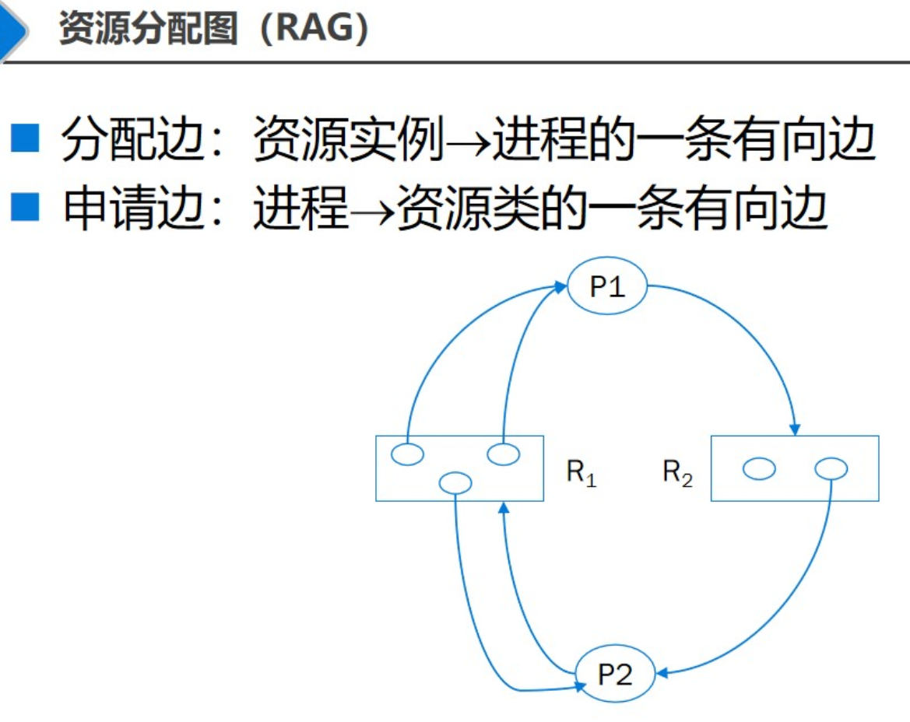
        - 化简
            - 
            - Step 1. 找出一个既不阻塞又非孤立的进程结点Pi，消去Pi所有的请求边和分配边，使之成为孤立结点(意义：进程Pi可获得所需资源并运行完毕，然后释放占有的所有资源)
            - Step 2. 循环执行1(意义：下一个进程在前面的进程释放资源后，可获得资源并执行完毕，然后又释放占有的全部资源)
            - Step 3. 重复执行，直到所有进程节点都成为孤立结点，则该图是可化简的;否则，存在环，该图是不可化简的
        - 对于给定的资源分配图，所有的化简顺序均可得到相同的化简结果图，即化简结果图与化简顺序无关
        - 死锁定理：死锁状态的充分必要条件是系统的资源分配图是不可完全化简的
- 死锁解除
    - 剥夺资源法
    - 撤销进程法

## 进程同步<!-- markmap: fold -->

### 基本概念

- 进程同步：异步环境下，一组并发进程因直接制约，而互**相发送消息、互相合作、互相等待**，使得各进程按一定的速度执行的过程
- 进程间的制约关系
    - 间接相互制约
    - 直接相互制约
- 同步问题有两类
    - 保证一组合作进程按逻辑需要的执行次序执行
    - 保证共享缓冲区(共享数据)的合作进程的同步
- 进程的互斥
    - 若干个进程同时竞争一个需要互斥使用的资源时（临界资源），任何时刻最多允许一个进程去使用，其他要使用该资源的进程必须等待，直到该资源被释放。进程间要通过某种中介发生联系，是**无意识**安排的
    - 产生的原因：资源共享
    - **互斥是一种特殊的同步**：逐次使用互斥资源，也是对进程使用资源次序上的一种协调
- 临界资源：系统中某些共享资源一次只允许一个进程使用
    - 硬件临界资源：打印机、光盘刻录机
    - 软件临界资源：只能互斥访问的变量、表格、队列，并非所有共享资源都是临界资源，如只读数据
- 临界区：进程中访问临界资源的代码片断
    - 进入区：在进入临界区之前，检查可否进入临界区的一段代码。如果可以进入临界区，通常设置相应“正在访问临界区”标志
    - 退出区：将“正在访问临界区”标志清除
    - 剩余区：代码中的其余部分
- 访问临界区的原则：
    - 空闲让进。当无进程在临界区时，任何有权使用临界区的进程可以进入
    - 忙则等待。不允许两个以上的进程同时进入临界区
    - 有限等待。任何进入临界区的要求应在有限的时间内得到满足
    - 让权等待。不能进入临界区的进程应放弃占用CPU
    - 目的：保证使用临界资源的进程能够正确和高效地进行协作，避免竞争条件（两个或多个进程访问某些共享资源，最终结果取决于进程运行的精确时序）

### 软件同步机制

- 锁变量
    - 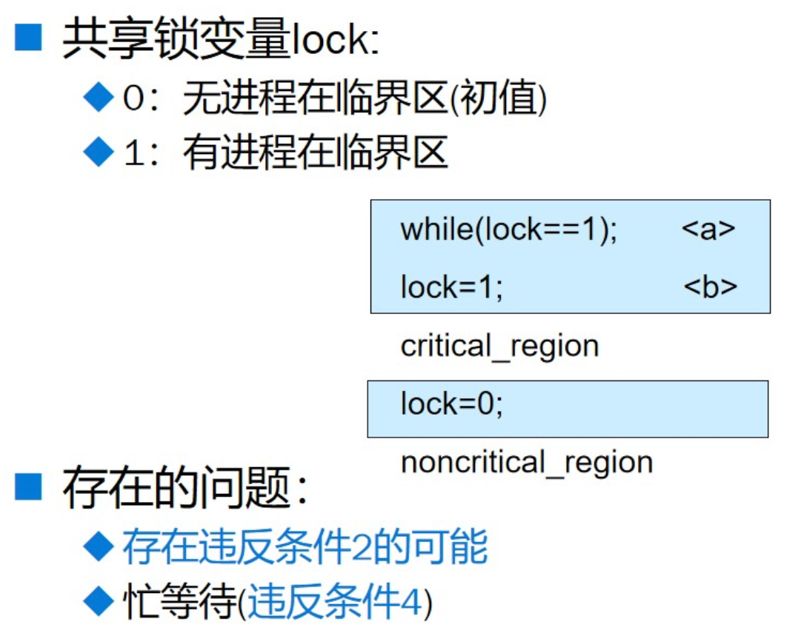
- 忙等待
    - 连续测试一个变量直到出现某个值为止
    - 忙等待浪费CPU时间，所以应该避免。只有等待时间非常短的情况下才使用忙等待
    - 用于忙等待的锁，称为自旋锁(spin lock)
- 轮转法
    - 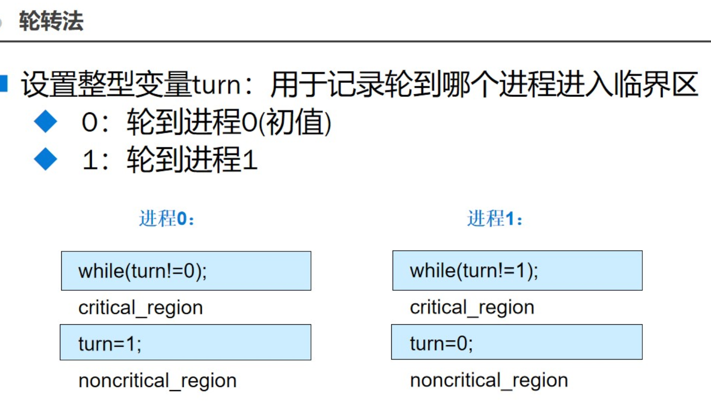
    - 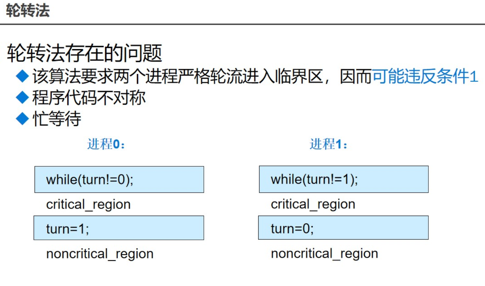
- Peterson 算法

### 硬件同步机制

- 关中断（禁止中断）
    - 进入临界区前执行“关中断”指令
    - 离开临界区后执行“开中断”指令
    - 只有在发生时钟中断或其他中断时才会进行进程切换
    - 优点：简单
    - 缺点：把禁止中断的权利交给用户进程导致系统可靠性较差。不适用于多处理器
- Test-and-Set 指令
    - 利用测试并设置(Test and Set)指令，例如 X86 的 BTS/BTR 指令
- 利用 swap 指令实现进程互斥
- 硬件同步机制的优缺点
    - 优点：
        - 适用于任意数目的进程
        - 简单，容易验证其正确性
        - 可以支持进程中存在多个临界区，只需为每个临界区设立一个布尔变量
    - 缺点：忙等待，耗费CPU时间。忙等待还可能导致优先级反转

### 信号量机制

- 基本概念
    - 每个信号量 $s$ 包括一个整数值 $s.count$，以及一个进程等待队列 $s.queue$，队列中是阻塞在该信号量上的各个进程的标识
    - 信号量只能通过初始化和两个标准的原语来访问——作为OS核心代码执行，不受进程调度的打断
- 计数值的含义
    - $s.count>0$ 表示有 $count$ 个资源可用
    - $s.count=0$ 表示无资源可用
    - $s.count<0$ 则 $|count|$ 表示 $s$ 等待队列中的进程个数
    - 以上意义的信号量也称为**资源信号量**
    - 如果不需要信号量的计数能力，只用于对临界资源的互斥访问，这样的信号量也称为**互斥信号量**
- P、V 操作
    - P 操作表示申请一个资源，它使信号量之值减1，如果信号量之值小于0，则进程被阻塞而不能进入临界区。P操作也称为wait操作、down操作
    - V 操作表示释放一个资源，它使信号量之值增1，如果信号量之值不大于0，则唤醒一个被阻塞的进程。V操作也称为signal操作、up操作
    - 使用要点
        - 必须成对使用
            - 遗漏P原语则不能保证互斥访问
            - 遗漏V原语则不能在使用临界资源之后将其释放(给其他等待的进程)
        - 当为互斥操作时,P和V原语同处于同一进程
        - 当为同步操作时,P和V原语不在同一进程中出现
        - P、V 原语不能次序错误
        - 如果 P(S1) 和 P(S2) 两个操作在一起,那么P操作的顺序至关重要,一个同步 P 操作与一个互斥 P 操作在一起时同步 P 操作必须在互斥 P 操作前
        - 两个 V 操作顺序无关紧要
- 利用信号量实现互斥
    - 为临界资源设置一个互斥信号量mutex(MUTual Exclusion)，其初值为1。在每个进程中将临界区代码置于P(mutex)和之间 
- 利用信号量实现同步
    - 并发执行的进程P1和P2中，分别有代码C1和C2，要求C1在C2开始前完成—————前趋关系为每个前趋关系设置一个互斥信号量S12，其初值为0 
- 缺点
    - 同步操作分散
    - 易读性差
    - 不利于修改和维护
    - 正确性难以保证

### 管程机制

- 定义：关于共享资源的数据结构及一组针对该资源的操作过程所构成的软件模块
- 基本思想：把共享变量及对共享变量能够进行的操作集中在一个模块中
- 特性
    - 模块化
    - 抽象数据类型
    - 信息封装
- 缺点
    - 不可靠的消息传递中的成功通信问题
    - 进程命名问题
    - 身份认证问题
    - 性能问题

### 消息传递

- 适用于分布式系统
    - 套接字
    - 过程调用/远程方法调用
- 原语
    - 发送消息（send）
    - 接收消息（receive）

### ‼️ 经典问题

- 生产者-消费者问题
- 哲学家进餐问题
- 读者-写者问题

## 存储器管理<!-- markmap: fold -->

### 存储器的层次结构

- 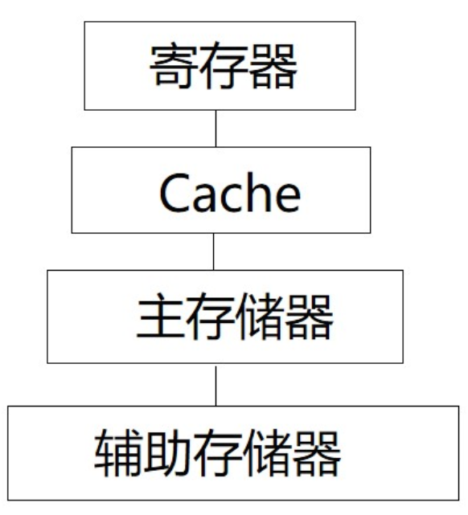
- 高速缓存: SRAM
    - Data Cache、Code Cache
    - TLB(Translation Lookaside Buffer)
- 内存: DRAM、SDRAM等
- 外存: 软盘、硬盘、光盘、磁带等

### 功能
- 内存分配和回收
    - 动作
        - 调入策略
        - 防止策略
        - 置换策略
        - 分配结构
    - 时机
        - 进程开始/结束
        - 进程运行过程中占用内存的变化
        - 进程映像在内/外存之间传递
        - 系统为了充分利用内存，对内存进行重整
- 地址变换/重定位
    - 前置概念
        - 名空间：程序员在程序中定义的标识符，没有地址的概念
        - 逻辑地址空间：由程序编译生成，逻辑地址的集合，首地址为 0
    - 定义：将用户程序中的逻辑地址**转换**为运行时由机器直接寻址的物理地址的过程
- 内存保护
    - 保护方式
        - 上限寄存器、下限寄存器
        - 基址寄存器、限长寄存器
        - 判断是否越界
    - 共享问题
- 内存扩充
    - 定义：实际内存容量不应该限制用户程序的大小，操作系统的存储管理功能应允许运行任意大小的程序
    - 实现方式
        - 由应用程序控制：覆盖技术
            - 把程序切割成片段序列，片段称为 *覆盖*。覆盖序列按序被 OS 逐个调入、调出内存
            - 切割操作必须由程序员完成
        - 由 OS 控制：
            - 交换技术（整个进程空间）
                - 定义：OS 把内存中的阻塞进程调出至外存，把外存具备运行条件的进程调入内存（中级调度），多用于 *分时系统*
                - 何时发生交换
                    - 不用就换出
                    - 内存不够，或有不够的危险
                - 需要一个磁盘交换区
                    - 足够大以存放内存映像
                    - 采用连续分配
            - 虚拟存储器技术（部分进程空间）
                - 定义：把进程暂时不用的部分调出至外存，正在使用的部分保留在内存。其地址空间称为 *虚拟地址空间*
                - 原理：程序运行的局部性原理

- 程序的装入与链接

- 对换与覆盖

### 连续分配存储管理方式

### 分页存储管理方式

### 分段存储管理方式

### 段页式存储管理方式

## 虚拟存储器<!-- markmap: fold -->

### 虚拟存储器概述

- 传统存储器管理方式
    - 第五章介绍的各种存储器管理方式，统称为传统存储器管理方式
    - 两个特征
        - 一次性
        - 驻留性
    - 两个缺点
        - 大作业无法全部装入内存
        - 大量作业要运行时，只能将少数作业装入运行
- 虚拟存储器
    - 利用的原理：存储器访问的局部性原理
        - 时间局部性。主要由循环造成
        - 空间局部性。主要有顺序执行和数据的聚集存放造成
    - 定义：具有**请求调入**功能和**置换功能**，能从逻辑上对内存容量加以扩充的一种存储系统
    - 优点：其逻辑容量由内存容量和外存容量之和决定。因此：
        - 运行速度接近内存速度
        - 成本接近于外存
    - 与传统存储管理方式比较，虚拟存储器具有三个重要特征：
        - 多次性
        - 对换性
        - 虚拟性
    - 实现方式
        - 请求分页系统：在分页的基础上，增加**请求调页**的功能、**页面置换**功能
        - 请求分段系统：在分段的基础上，增加了**请求调段**的功能、**分段置换**功能

### 请求分页存储管理方式

- 硬件支持
    - 请求页表机制（页表机制）
        - 基本作用：逻辑地址 $\Leftrightarrow$ 物理地址
        - 页表项：
            - 页号
            - 物理块号
            - 状态位 P，指示该页是否在内存
            - 访问字段 A，记录该页在一段时间内被访问的次数
            - 修改位 M（脏位），标记是否被修改过
            - 外存地址，指示该页在外存中的地址
    - 缺页中断机构
        - 基本作用：当要访问的页面不在内存中时，产生一个缺页中断
        - 和一般中断的区别
            - 可以在指令的执行期间产生和处理中断信号
            - 可以在一条指令的执行期间，产生多次缺页中断
        - 对硬件的要求：硬件机构应能够保存多次中断时的状态，并保证最后能够返回到中断前产生缺页中断的指令处，继续执行
    - 地址变换机构
        - 定义：在分页系统地址变换机构的基础上，为实现虚拟存储器而通过增加某些功能所形成的
        - 功能
            - 产生和处理缺页中断
            - 从内存中换处一页
        - 地址变换过程 
- 页面分配（内存分配）
    - 最小物理块的确定（保证进程正常运行，所需要的最少物理块？）
    - 内存分配策略（分配的物理块数目是固定的，还是可变的？）
        - 采取两种分配策略，即固定和可变分配策略；采取两种置换策略，即全局置换和局部置换。由此组合出以下三种适用的策略：
        - 固定分配局部置换
            - 为每个进程分配固定页数的内存空间，整个运行期间不在改变。如果在运行中发现缺页，则只能从该进程在内存的固定页面中选出一页换出，然后再调入一页。
            - 缺点：
            （1）为每个进程分配多少个页面难以确定。太少，频繁缺页中断，降低系统吞吐量。太多，内存驻留进程减少，可能造成资源空闲
            （2）实现进程对换时，会花费更多的时间
        - 可变分配全局置换
            - 先为系统中的每个进程分配一定数目的物理块，而OS自身也保持一个空闲物理块队列。当某进程发现缺页时，由系统从空闲的物理块队列中，取出一物理块分配该进程，并将欲调入的缺页装入其中。当空闲物理块用完时，OS从内存中任选一页调出(任意进程)。--可能影响其它进程运行
            - 优点：易于实现
        - 可变分配局部置换
            - 根据进程的类型或程序员的要求，为每个进程分配一定数目的内存空间。当某进程发生缺页时，只允许从该进程在内存的页面中选出一页换出，这样就不会影响其它进程运行。如果进程在运行中频繁地发生缺页中断，则系统再为该进程分配附加的物理块。若一个进程在运行中缺页频率低，则此时适当减少分配给该进程的物理块
    - 物理块分配算法（分配的物理块数，是平均分配，还是根据进程大小来分配）
        - 平均分配算法。物理块平均分配给给进程
        - 按比例分配算法。按进程大小的比例分配物理块
        - 考虑优先权的分配算法。按照作业的重要性、紧迫性进行分配
- 页面调入策略
    - 何时调入页面
        - 预调页策略。OS 猜哪些页面要被调入，预先调入
        - 👍请求调页策略。程序请求调入页面时，才调入
    - 如何调入页面
    - 缺页率
        - 若访问页面成功(在内存)的次数为S，访问页面失败(不在内存)的次数为F，则总访问次数为A=S+F
        - 缺页率：$f=F/A$
        - 影响因素：
            - 页面大小
            - 分配内存块的数目
            - 页面置换算法
            - 程序固有属性

### 页面置换算法
- 最佳置换
- 先进先出
- 最近最久未使用置换
    - 硬件支持：寄存器、栈
- 最少使用置换：简单的 Clock 置换算法、改进型 Clock 置换算法
- 页面缓冲算法

### “抖动”与工作集

- 抖动
    - 刚被调出的页面很快又被访问。CPU 把大量时间花费在页面置换上
    - 原因：
        - 系统中运行的进程太多
        - 进程分得物理块太少
        - 页面置换算法够好
    - 预防：
        - **采取局部置换策略**。在页面分配和置换策略中，如果采取的是可变分配方式，则为了预防发生“抖动”，可采取局部置换策略
        - **把工作集算法融入到处理机调度中**。当调度程序发现处理机利用率低下时，它将试图从外存调入一个新作业进入内存，来改善处理机的利用率
        - **选择暂停的进程**。当多道程序度偏高时，已影响到处理机的利用率，为了防止发生“抖动”，系统必须减少多道程序的数目
        - 利用**L=S准则**调节缺页率
- 工作集
    - 在时间段 $\Delta$ 内，进程访问的页面集合

### 请求分段存储管理方式

- 硬件支持
    - 请求段表机制
    - 缺段中断机构
    - 地址变换机构
- 分段的共享和保护
    - 共享段表
    - 共享段的分配与回收
    - 分段保护
        - 越界检查
        - 环保护机构 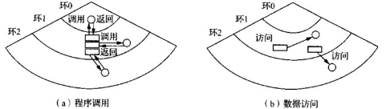
        
## 输入/输出系统<!-- markmap: fold -->

### I/O 系统的功能、模型与接口

- I/O 系统的基本功能
    - 隐藏 I/O 设备的细节
    - 保证设备无关性
    - 提高处理机和 I/O 设备的利用率
    - 对 I/O 设备进行控制
    - 确保对设备的正确共享
    - 能够处理错误
- I/O 系统的层次结构与模型
    - 层次结构
        - 用户层软件。执行输入输出系统调用，对I/O数据进行格式化，为假脱机输入/输出作准备
        - 与设备无关的 I/O 软件。实现设备的命名、设备的保护、成块处理、缓冲技术和设备分配
        - 设备驱动程序。设置设备寄存器、检查设备的执行状态
        - 中断处理程序。负责I/O完成时，唤醒设备驱动程序进程，进行中断处理
        - 硬件。实现物理I/O的操作
    - I/O 系统的模型
        - I/O 系统的上/下接口
            - I/O 系统接口
            - 软件/硬件接口
        - I/O 系统的分层
            - 中断处理程序
            - 设备驱动程序
            - 与设备无关的 I/O 软件
- I/O 系统的接口
    - 块设备接口
    - 设备接口
    - 网络通信接口

### I/O 设备和设备控制器

- I/O 设备
    - I/O 设备的类型
        - 按数据组织：块设备、字符设备、非上述设备的设备
        - 按使用特性（功能特性）：存储设备、I/O 设备、数据通信设备
        - 按资源分配：独占设备、共享设备
        - 按传输速率：低速设备、中速设备、高速设备
    - 设备与设备控制器之间的接口
        - 数据信号线
        - 控制信号线
        - 状态信号线
- 设备控制器 
    - 设备控制器的功能
        - 接收、识别命令
        - *数据交换
        - 标志和报告设备状态
        - *地址译码
        - *数据缓冲区
        - 差错控制
        - *数模/模数转换
    - 设备控制器的组成
        - 设备控制器与 CPU 的接口
        - 设备控制器与设备的接口
        - I/O 逻辑
- 内存映射 I/O（I/O 端口编址）
    - 内存映射编址
    - I/O 独立编址
    - 混合方案：具有内存映射 I/O 的数据缓冲区，而控制/状态寄存器则具有单独的 I/O 端口
- I/O 控制方式
    - 程序控制 I/O（使用轮询的可编程 I/O 方式）
    - 中断驱动 I/O（使用中断的可编程 I/O 方式）
    - DMA
    - 通道

### 中断和中断处理程序

- 中断应该深深隐藏在操作系统内部。隐藏的办法是每个进程在启动一个I/O操作后阻塞，直到I/O操作完成并产生一个中断由操作系统接管CPU后唤醒该进程为止
- 驱动程序发送控制命令后，阻塞自己
    - 在信号量上执行P操作
    - 在条件变量上执行wait操作
    - 在消息上执行receive操作
- 中断发生时，中断处理程序将对中断进行处理，然后将启动被阻塞的驱动程序解除阻塞
    - 在信号量上执行V操作
    - 在条件变量上执行signal操作
    - 在消息上执行send操作
    
### 设备驱动程序

- 与设备密切相关的代码放在设备驱动程序中，每个设备驱动程序处理一种设备类型
- 每一个控制器都设有一个或多个设备寄存器，用来存放向设备发送的命令和参数
- 设备驱动程序负责下达这些命令，并监督它们正确执行
- 设备驱动程序的任务是接收来自与设备无关的上层软件的抽象请求，并执行这个请求
- 在设备驱动程序的进程发出一条或多条命令后，系统有两种处理方式，多数情况下，执行设备驱动程序的进程必须等待命令完成，这样，在命令开始执行后，它阻塞自已，直到中断处理时将它解除阻塞为止
- 另一些情况下，命令执行不必延迟就很快完成
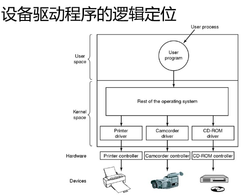

### 与设备无关的I/O软件

- 功能
    - 设备驱动程序的统一接口
    - 缓冲 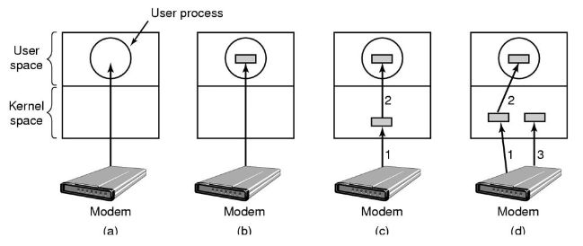
    - 错误报告
    - 分配与释放专用设备
    - 提供与设备无关的块大小
- 设备独立性：使用户/程序员可以访问任何 I/O 设备，而无需实现指定设备
- 统一命名：对 I/O 设备采用与文件统一的命名方式，所有文件和设备都使用相同的方式，然后通过路径名进行寻址
- 错误处理：错误应该在尽可能靠近硬件的层面得到处理。在很多情况下，错误处理可以在低层透明地得到解决，高层软件甚至不知道存在这一错误
- 同步、异步传输：同步传输为阻塞式传输，异步传输为非阻塞式(中断驱动)传输

### 用户层的 I/O 软件

- 尽管大部分I/O软件都包含在操作系统中，但仍有一小部分是由与用户程序连接在一起的库过程，甚至完全由运行于内核外的程序构成
- 系统调用，包括I/O系统调用，通常由库过程实现
- 这些过程所做的工作只是将系统调用时所用的参数放在合适的位置，由其它的I/O过程实际实现真正的操作
- 共享设备与独占设备
    - 共享设备每次只能分配给一个进程使用
    - 共享设备是可由若干个进程同时共享的设备
- SPOOLing（假脱机技术）
    - 磁盘缓冲区
    - 打印缓冲区
    - 假脱机管理进程和假脱机打印进程

### 缓冲区管理

- 缓冲技术
    - 无缓冲
    - 单缓冲
    - 多缓冲

### 磁盘性能概述和磁盘调度

- 磁盘组织成许多柱面，每一个柱面上的磁道数和垂直放置的磁头个数相同
- 磁道又被分成许多扇区，每条磁道上扇区数目典型为8至32
- 每个扇区包含相同的字节数 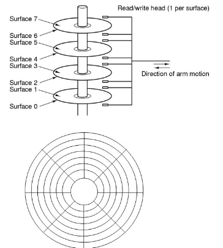
- 磁盘 I/O 访问时间
    - 寻道时间 $T_s$：磁头移动到指定柱面的机械运动时间，通常每个柱面移动需要10ms左右
    - 旋转延迟时间 $T_r$：等待指定扇区旋转到磁头下的机械运动时间。它与磁盘转速相关，例如某硬盘转速为7200rpm，则$T_r$=4.17ms
    - 实际数据传输时间 $T_t$：数据读写的时间，与读写的字节数和磁盘转速有关
- 磁盘臂调度算法
    - 先来先服务（FCFS）
    - 最短寻道时间优先（SSTF）
    - 电梯算法
    - 单向扫描算法
- 廉价磁盘冗余阵列：RAID(Redundant Array of Independent Disk) 是利用一台磁盘阵列控制器，统一管理和控制一组磁盘驱动器，组成一个速度快、可靠性高、性能价格比好的大容量磁盘系统
    - RAID共有6级组成，RAID0 ~ RAID5，其中RAID0无校验；RAID1 ~ RAID5的区别仅是实现冗余校验的方法不同
    - RAID 0 
    - RAID 1 
    - RAID 2 
    - RAID 3 
    - RAID 4 
    - RAID 5 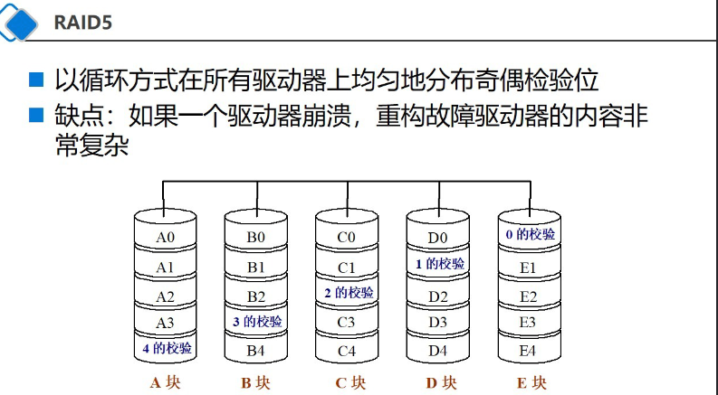

## 文件管理<!-- markmap: fold -->

### 文件和文件系统

### 文件的逻辑结构

### 文件目录

### 文件共享

### 文件保护

## 磁盘存储管理
