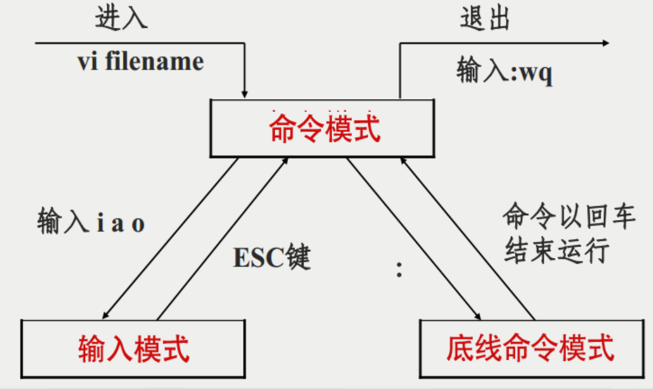

# Linux 笔记

## 常用命令
```
su、passwd、who、date、echo、ps、kill
ls、cat、more、cd、cp、pwd、mv、rm、mkdir、grep、sort、tail、chmod、chown、adduser、deluser、gpasswd、newgrp、nohup cmd &、fg、bg
```

| **命令**       | **简要介绍**                                                                 |  
|----------------|-----------------------------------------------------------------------------|  
| `su`           | 切换用户身份，默认切换为超级用户（root）。                                   |  
| `passwd`       | 修改用户密码。                                                              |  
| `who`          | 显示当前登录系统的用户信息。                                                |  
| `date`         | 显示或设置系统日期和时间。                                                  |  
| `echo`         | 输出字符串或变量的值到终端。                                                |  
| `ps`           | 显示当前运行的进程信息。                                                    |  
| `kill`         | 终止指定的进程。                                                            |  
| `ls`           | 列出目录内容。                                                              |  
| `cat`          | 查看文件内容，或将多个文件内容连接输出。                                     |  
| `more`         | 分页查看文件内容。                                                          |  
| `cd`           | 切换当前工作目录。                                                          |  
| `cp`           | 复制文件或目录。                                                            |  
| `pwd`          | 显示当前工作目录的绝对路径。                                                |  
| `mv`           | 移动或重命名文件或目录。                                                    |  
| `rm`           | 删除文件或目录。                                                            |  
| `mkdir`        | 创建新目录。                                                                |  
| `grep`         | 搜索文件中匹配指定模式的行。                                                |  
| `sort`         | 对文本文件内容进行排序。                                                    |  
| `tail`         | 查看文件的最后几行内容。                                                    |  
| `chmod`        | 修改文件或目录的权限。                                                      |  
| `chown`        | 修改文件或目录的所有者或所属组。                                             |  
| `adduser`      | 添加新用户（通常是 `useradd` 的交互式封装）。                                |  
| `deluser`      | 删除用户（通常是 `userdel` 的交互式封装）。                                  |  
| `gpasswd`      | 管理组密码或修改组成员。                                                    |  
| `newgrp`       | 切换到新的用户组。                                                          |  
| `nohup cmd &`  | 在后台运行命令，并忽略挂起信号（退出终端后命令仍继续运行）。                 |  
| `fg`           | 将后台运行的任务切换到前台。                                                |  
| `bg`           | 将暂停的任务切换到后台运行。                                                |

## 简答题知识点
#### Linux 的标准目录结构及其存放内容（10个主要一级目录）

|目录|描述|
|----|----|
|/bin|存放 **Linux 最常用的基本命令**，如 ls, cd, cp, mkdir, date，cat等 。|
|/sbin|存放 **系统管理员的系统管理命令**，如 fdisk, init, ifconfig, reboot 等 。|
|/root|超级用户的主目录|
|/etc|存放 **各种配置信息**，如网络配置文件、文件系统、系统配置文件、设备配置信息、设置用户信息等都在这个目录下。|
|/dev|存放 **设备文件**，这种文件与普通文件不同，**没有真正的内容，只是各种设备的名称**，用户像访问文件一样访问设备|
|/proc|存放 **系统信息**，该目录下的文件不是存于硬盘中，是系统初启时在内存中产生的。关闭计算机时它会消失，每次重启时又重新生成|
|/var|存放 **系统记帐信息、日志文件**|
|/usr|用户的很多 **应用程序和文件几乎都存放在这个目录下**。这里有许多目录，/usr/bin中存放软件包程序。如bin, sbin, lib, src， X11R6等|
|/home|存放**用户的主目录**|
|/lib|存放系统最基本的 **动态连接库**，几乎所有的应用程序都要用到这个目录中的共享库 |
|/boot|存放**系统启动时要用到的程序**。我们在使用 grub 或 lilo 引导 Linux 的时候，会用到这里的一些信息|
|/tmp|存放 **临时数据**|
|/mnt|一般为空，通常临时将别的文件系统挂在该目录|
 
#### 源代码安装的常见的方法和过程

基于 CMake 的、基于脚本的、基于 `./configure` 的

1. 释放 `TAR` 包
1. 查看并阅读包内附带的软件安装说明
1. 进行编译准备。`--prefix` 指的是安装路径，`--with` 指的是安装本文件所依赖的库文件

```
./configure  [--prefix=directory --with=library]
```

4. 进行编译。经过执行 `./configure` 会产生 `MakeFile` 文件，运行 `make` 命令进行编译
1. 进行软件安装。执行 `make install` 安装软件
1. 清除临时文件。执行 `make clean` 清除编译过程中产生的临时文件

#### Linux 如何使用设备，设备的分类，常用的设备名有哪些（硬盘、终端、空设备）

Linux 内核在探测到设备硬件后，会在 `/dev` 目录下创建其对应的设备文件，此设备文件将关联该设备的驱动程序，通过访问此设备文件即可访问到文件所关联的设备。

1. 使用：Linux 使用**设备文件**来与硬件设备交互。设备文件是特殊的文件，通常位于 `/dev` 目录下，用户或程序通过对这些文件的操作（如读写）来与硬件设备通信。
1. 分类：
    1. **字符设备**。以字符为单位进行数据传输，通常是顺序访问
    1. **块设备**。以块为单位进行数据传输，支持随机访问
    1. **网络设备**。不通过 `/dev` 目录管理，而是通过网络接口（如 `eth0`、`wlan0`）进行操作
1. 常用设备名： `/dev/sdX`、`/dev/tty`、`/dev/null`、`/dev/zero`

#### 在 Linux 系统中怎样运行脚本文件？举例说明脚本文件的多种运行方式

1. 在子 `shell` 中运行脚本文件
    1. `chmod a+x script.sh && ./script.sh`
    1. `bash script.sh`
1. 在当前 `shell` 中运行脚本文件
    1. `source script.sh`
    1. `. script.sh`

#### 怎样进入，退出 vi/vim。vi/vim 的三种工作模式如何转换。定位、查找字符串方法（任何一种即可）

1. 进入：`vi/vim file_name`
1. 退出：`:q!` 强制退出，`:wq` 保存并退出，`:q` 退出不保存
1. 三种工作模式：
    1. 命令模式：按 `i` 进入插入模式，按 `ESC` 进入命令模式
    1. 插入模式：按 `i` 或 `a` 或 `o` 进入一般模式，按 `ESC` 进入插入模式
    1. 底行模式：按 `:` 进入低行模式，按 `i` 进入插入模式，按 `ESC` 进入命令模式
1. 查找：在命令模式下使用 `/` 或 `?` 进行查找，`/` 向下查找，`?` 向上查找，`n` 向下查找下一个，`N` 向上查找上一个



#### Linux 系统中的命令补全的用法，Linux 系统的输入、输出重定向的用法

命令补全：主要通过按下 `Tab` 键实现，如果有多个可能的命令，按 `Tab` 键两次，会列出所有可能的选项

输入重定向：`wc -l < input.txt` 或 `ls -l | grep "txt"`

| 符号       | 功能                                                                 |
|------------|----------------------------------------------------------------------|
| `<`        | 将文件内容作为命令的标准输入。                                        |
| `<<`       | Here Document，用于将多行字符串作为命令的标准输入。                   |
| `<<<`      | Here String，用于将单行字符串作为命令的标准输入。                     |

输出重定向：`ls -l > output.txt` 或 `echo "Hello again!" >> output.txt`

| 符号       | 功能                                                                 |
|------------|----------------------------------------------------------------------|
| `>`        | 将标准输出重定向到文件（覆盖文件内容）。                              |
| `>>`       | 将标准输出追加到文件末尾（不覆盖文件内容）。                          |
| `2>`       | 将标准错误重定向到文件（覆盖文件内容）。                              |
| `2>>`      | 将标准错误追加到文件末尾（不覆盖文件内容）。                          |
| `&>`       | 将标准输出和标准错误同时重定向到文件（覆盖文件内容）。                |
| `&>>`      | 将标准输出和标准错误同时追加到文件末尾（不覆盖文件内容）。            |

#### Linux系统的特殊权限 SUID（文件）、SGID（文件和目录）、SBIT（目录）

SUID（Set User ID）：只对**文件**有效，当一个文件设置了 `SUID` 位并被执行时，执行该文件的用户会**临时获得文件所有者的权限**，而不是以执行者本身的权限运行。

SGID（Set Group ID）：对**文件**和**目录**有效，当一个文件设置了 `SGID` 位并被执行时，执行该文件的用户会**临时获得文件所属组的权限**，而不是以执行者本身的组权限运行。目录下创建的目录会继承目录的 `SGID` 位。

SBIT（Sticky Bit）：对**目录**有效，当一个目录设置了 `Sticky Bit` 时，目录中的文件只能**被文件的所有者或 root 用户删除或修改**，即使其他用户对该目录有写权限。

#### Linux C 语言程序编译方法，调试方法

编译器就是将高级程序语言转换为执行效率更高的机器语言的程序，GCC 也是使用最为普遍的一种编译器。

| 选项      | 说明                                   |  
|-----------|----------------------------------------|  
| -E    | **预处理**后即停止，不进行编译、汇编及连接 |  
| -S        | **编译**后即停止，不进行汇编及连接            |  
| -c        | **汇编**源文件，但不进行连接            |  
| -o file   | **连接**，指定输出文件为 file                     |

分阶段：

```
gcc -E example.c -o example.i
gcc -S example.c -o example.s
gcc -c example.c -o example.o
gcc example.o -o example
```

一步到位：

```
gcc example.c -o example
```

调试：

```
gcc -g example.c -o example
gdb example
```

#### 符号链接和硬链接文件的区别，怎样创建链接文件

| **特性**              | **硬链接（Hard Link）**                          | **符号链接（Symbolic Link）**               |
|-----------------------|------------------------------------------------|--------------------------------------------|
| **inode**             | 共享相同的 inode，与原文件相同                  | 有自己的 inode，与原文件不同               |
| **文件系统限制**       | 只能在同一文件系统中创建                        | 可以跨文件系统                              |
| **目录支持**          | 不支持对目录创建硬链接                          | 支持对目录创建符号链接                      |
| **文件依赖性**         | 硬链接独立存在，删除原文件不影响硬链接          | 符号链接依赖原文件，删除原文件会导致断链    |
| **大小**              | 与原文件相同                                   | 符号链接的大小是目标文件路径的长度         |
| **修改内容**          | 修改硬链接或原文件会同步更新                    | 修改符号链接指向的文件会更新原文件          |
| **删除文件**          | 删除硬链接不会影响文件数据，只有所有硬链接删除后文件才会被删除 | 删除符号链接不会影响原文件                 |

创建硬链接：
```sh
ln source_file hard_link
```

创建符号链接：
```sh
ln -s source_file symbolic_link
```

#### Linux 系统中管道的功能

它通过符号 `|` 实现，允许多个命令组合在一起执行

1. 连接命令：**将一个命令的输出作为另一个命令的输入**
1. 与过滤器结合：筛选、格式化和处理数据

#### Linux 下的隐含文件如何标识和显示

在 Linux 文件系统中，任何文件或目录的名称以 `.` 开头都会被视为隐含文件。使用 `ls -a` 或 `ls -A`。

#### Linux 系统的主要应用领域

Linux 系统的主要应用领域包括：

1. 传统企业级**服务器**应用场景
1. **嵌入式**、物联网、边缘计算等应用场景
1. **智能手机**、平板电脑等移动终端
1. **云计算**、区块链、大数据、**深度学习**等应用场景
1. **个人桌面操作系统**
1. **服务器**（Web、数据库、邮件、云计算等）。
1. **嵌入式系统**（智能设备、物联网、汽车电子等）。
1. **云计算与虚拟化**（容器、分布式计算等）。
1. **超级计算机**（高性能计算）。
1. **桌面操作系统**（开发、教育、科研等）。
1. **网络设备**（路由器、防火墙等）。
1. **网络安全**（渗透测试、日志分析等）。
1. **科学研究与教育**。
1. **游戏开发与运行**。
1. **企业应用**（ERP、存储、邮件系统等）。
1. **多媒体与创意**（视频、音频、图像处理）。

## 综合题
#### 计划任务 `cron` 的建立方法及管理

语法表达式：

```
* * * * * command  
- - - - -  
| | | | |  
| | | | +---- 星期几 (0 - 7, 0 和 7 都表示周日)  
| | | +------ 月份 (1 - 12)  
| | +-------- 日期 (1 - 31)  
| +---------- 小时 (0 - 23)  
+------------ 分钟 (0 - 59)
```

方法一

1. 利用 `vi/vim` 创建 `cron` 作业列表文件，假设文件命名为 `mycron`。
1. 按照上述格式创建好任务文件
1. 使用命令 `crontab mycron` 加载 `mycron` 作业列表文件（其实是被写入了 `/var/spool/cron/crontabs/username` 中）

方法二

1. 使用命令 `crontab -e` 进入 `vim` 编辑器
1. 按照上述格式编辑好作业列表文件
1. 保存退出

#### 文件基本操作综合

可以联系数据库中的增删改查想一想，至少有**添加文件、删除文件、修改文件、查看文件**。

所对应的命令有 `touch`、`rm`、`cp`、`mv`、`cat`、`less`、`head`、`tail`、`grep`、`find`。

#### 提升普通用户成为管理员（ `/etc/sudoers` 文件的配置）

直接编辑 `/etc/sudoers` 文件可能会导致语法错误，从而使系统无法正常使用 `sudo`。推荐使用 `sudo visudo` 工具来编辑 `/etc/sudoers` 文件。

```
username    ALL=(ALL:ALL) ALL  
|           |   |        |  
|           |   |        +---- 用户可以运行的命令范围（ALL 表示所有命令）  
|           |   +------------- 用户可以以哪些用户和组的身份运行命令  
|           +----------------- 用户可以在哪些主机上使用 sudo（ALL 表示所有主机）  
+----------------------------- 指定的用户名（需要赋予 sudo 权限的用户）
```

#### 多用户管理（用户和组管理）

添加用户：

```
useradd -m -d /home/username -s /bin/bash username -G group
```

删除用户：

```
userdel -r username
```

添加组：

```
groupadd groupname
```

删除组：

```
groupdel groupname
```

自己加入新组：

```
newgrp groupname
```

把别人加入新组：

```
usermod -aG groupname username
``` 

查看自己的组：

```
groups
```

将用户加入组：

```
gpasswd -a username groupname
```

从组中删除用户：

```
gpasswd -d username groupname
```

设置组的管理员：

```
gpasswd -A username groupname
```

查看系统上的组：

```
cat /etc/group
```


## `Shell` 脚本编程

参考实验课 `Shell` 脚本例子

自己遇到的注意的点：

1. 判断字符是否为空要用 `[[ X"$msg" == "X" ]]`
1. 每条 `case` 后面要加双分号
