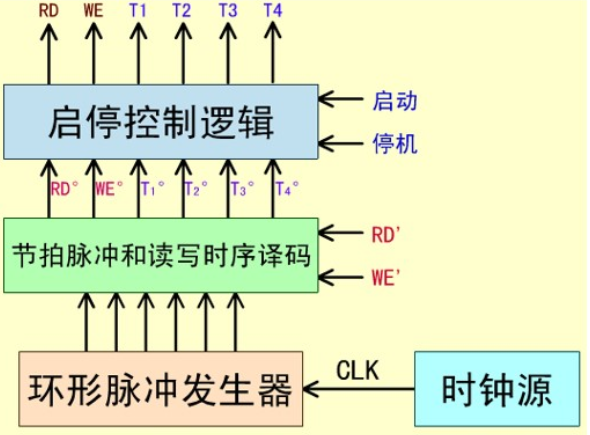

# 计算机组成原理笔记

## 1 计算机系统概论

#### 计算机的性能指标    

- **吞吐量** 表征一台计算机在某一时间间隔内能够处理的信息量。
- **响应时间** 表征从输入有效到系统产生响应之间的时间度量，用时间单位来度量。
- **利用率** 在给定的时间间隔内系统被实际使用的时间所占的比率，用百分比表示。
- **处理机字长** 指处理机运算器中一次能够完成二进制数运算的位数，如32位、64位。总线宽度一般指CPU中运算器与存储器之间进行互连的内部总线二进制位数。
- **存储器容量** 存储器中所有存储单元的总数目，通常用KB、MB、GB、TB 来表示。
- **存储器带宽** 单位时间内从存储器读出的二进制数信息量，一般用字节数/秒表示。
- **主频/时钟周期** CPU的工作节拍受主时钟控制，主时钟不断产生固定频率的时钟，主时钟的频率(/)叫CPU的主频。度量单位是 MHz(兆赫兹)、GHz(吉赫兹)。
- **CPU 时钟周期** 即主频的倒数，度量单位是 $\mu s$、$ns$。
- **CPU 执行时间** 表示CPU执行一般程序所占用的CPU时间，可用下式计算：CPU 执行时间 = CPU 时钟周期数 $\times$ CPU 时钟周期
- **CPI** 表示每条指令周期数，即执行一条指令所需的平均时钟周期数。用下式计算：CPI = 执行某段程序所需的CPU时钟周期数 / 程序包含的指令条数
- **MIPS** (Million Instructions Per Second) 的缩写，表示平均每秒执行多少百万条定点指令数，用下式计算：MIPS=指令数/程序执行时间 $\times 10^6$
- **FLOPS** (Floating-point Operations Per Second) 的缩写，表示每秒执行浮点操作的次数，用来衡量机器浮点操作的性能

#### 杂项

- 计算机硬件组成要素：运算器、存储器、控制器
- 冯·诺依曼架构：指令和数据放在**同一个存储器**
- 哈佛结构：指令和数据分**放在两个存储器**

## 2 运算方法和运算器

#### 数据与文字的表示方法

- 计算机中常用的数据格式：定点格式、浮点格式
- 定点格式：*纯小数*：最高位是符号位，剩下的位是小数部分，取值范围 $0\leq |x| \leq 1-2^{-n}$；*纯整数*：最高位是符号位，剩下都是整数部分，取值范围 $ 0\leq |x| \leq 2^n-1$
- 浮点格式：任意一个十进制数 $N=10^E\dots M$，因此可以表示为四部分：阶符、阶码、数符、数码
- 数的机器码表示方法：    
    - 原码表示法：用最高位表示符号，其余位表示数值
    - 补码表示法：用最高位表示符号，其余位表示数值，符号位参与运算
    - 原码 $\rightleftharpoons$ 补码：从最低位直到遇到的第一个 1 的这段序列不变，其余位**除了符号位**均取反
    - 移码表示法：移码常用于表示浮点数的阶码（指数部分）， $[e]_y=2^k+e_{acutal~number}$ ，符号位的规律和原码、补码相反
    - IEEE 754 标准：**31(S，符号)、30-23(E，阶码)、22-0(M，数值)**，其中，$E=e_{acutal~number}+127$，为什么是 +127？因为当 $E=255$ 时，被用来表示特殊数值了
    - 在 IEEE 754 标准中，当 $0<E<255$ 时，表示规格化数，否则一定不是规格化数，具体是啥查书 22 页    

#### 定点加法、减法运算
- 补码加法：符号位参与运算，直接加就行
- 补码减法：把 $[x]_{complementary~code}$ 变成 $[-x]_{complementary~code}$，从最低位直到遇到的第一个 1 的这段序列不变，其余位**包括符号位**均取反
- 溢出检测：双符号运算，若运算后两个符号位异号，则发生溢出；符号位产生的进位和 $\oplus$ 最高有效位产生的进位，1 为溢出，0 为正常

#### 定点运算器的组成

分为逻辑运算（逻辑非、逻辑加、逻辑乘、逻辑异或）和多功能算术/逻辑运算单元

#### 浮点运算方法和浮点运算器

设有两个浮点数 $x$ 和 $y$ ，他们分别为：$x = 2^{E_x} \cdot M_x$，$y = 2^{E_y} \cdot M_y$。

**浮点加减法运算**

$z=x\pm y=(M_x \pm 2^{E_x-E_y}\pm M_y)2^{E_y}$

六步：零操作数检查、对阶、尾数加减运算、规格化、溢出检查（阶码）、舍入

**浮点加乘除运算**

$x\times y=2^{E_x+E_y} \cdot (M_x \times M_y)$

$x \div y=2^{E_x-E_y} \cdot (M_x\div M_y)$

## 3 存储系统

#### 存储系统概述

- 程序的局部性原理：在某一段时间内频繁访问某一局部的存储器地址空间， 而对此范围以外的地址空间则很少访问的现象。
- 多级存储系统：寄存器 cache（CPU 内） - cache 主存储器（主板内）- 磁盘光盘（主板外）- 磁带
- 主存分类：RAM 和 ROM
- RAM 分类：SRAM（不掉电，记忆不丢失）、DRAM（随着时间推移，电荷会逐渐漏掉，要周期性地刷新）
- ROM 分类：掩膜 ROM、一次可编程 ROM（PROM）、可擦除 PROM（EPROM）、紫外线擦除 EPROM（UV-EPROM）、电擦除 EPROM（EEPROM）、闪速（FLASH）只读存储器
- 端模式：大端模式（高字节放低地址、低字节放高地址），小端模式（低字节放低地址、高字节放高地址）
- 存储器的技术指标：存储容量、存取时间、存储周期、存储器带宽

#### 静态随机存储器

- 任何 SRAM 都有三组信号线：地址线、数据线、控制线
- 存储器容量的扩充：位扩展、字拓展、位字扩展

#### 动态随机存储器

DRAM 的刷新操作：集中式刷新、分散式刷新、异步刷新

DRAM 和 SRAM 的比较：

| 比较内容         | SRAM               | DRAM               |  
|------------------|--------------------|--------------------|  
| 存储信息 0 和 1 的方式 | 双稳态触发器        | 极间电容上的电荷     |  
| 电源不掉电时      | 信息稳定           | 信息会丢失          |  
| 刷新             | 不需要             | 需要               |  
| 集成度           | 低                 | 高                 |  
| 容量             | 小                 | 大                 |  
| 价格             | 高                 | 低                 |  
| 速度             | 快                 | 慢                 |  
| 适用场合         | Cache             | 主存               |

#### ROM

| 存储器         | 类别           | 擦除方式                 | 能否单字节修改 | 写机制   |  
|----------------|----------------|--------------------------|----------------|----------|  
| MROM          | 只读           | 不允许                   | 否             | 掩膜位写 |  
| PROM          | 写一次读多次   | 不允许                   | 否             | 电信号   |  
| EPROM         | 写多次读多次   | 紫外线擦除，脱机改写     | 否             | 电信号   |  
| E$^2$PROM        | 写多次读多次   | 电擦除，在线改写         | 能             | 电信号   |  
| Flash Memory  | 写多次读多次   | 电擦除，在线改写         | 否             | 电信号   |

#### 并行存储器
- 双端口存储器，一个存储器，两套读写电路
- 多模块交叉存储器
    - 特点：通过改进主存的组织方式，在不改变存储器存取周期的情况下，提高存储器的带宽
    - 结构特点：多体交叉存储器由M个的存储体（或称存储模块）组成，每个存储体有相同的容量和存取速度，又有各自独立的地址寄存器、地址译码器、读写电路和驱动电路
    - 编址方法：交叉编址，即任何两个相邻地址的物理单元不属于同一个存储体，一般在相邻的存储体中；同一个存储体内的地址都是不连续的

#### Cache 存储器

- Cache 的命中率：命中次数 / 总访问次数
- cache/主存系统的平均访问时间 $t_a$：(命中次数*cache 读取时间 + 未命中次数*主存读取时间)/总访问次数
- 访问效率：cache 读取时间/平均访问时间
- 地址映射方式：全相联映射方式、直接映射方式、组相联映射方式
- **全相联映射方式**：允许主存中的任意块映射在 cache 中，（标记）、字地址，高速比较器难实现，只适合小容量 cache 使用。
- **直接映射方式**：*cache 行号* = *主存行号* mod *cache 总行数*，主存地址：区号（除数，也是标记，长度是主存行数的log减去cache行数的log）、区内行号（余数，对应 cache 行数）、字地址，只适合大容量 cache 使用
- **组相联映射方式**：*cache 组号* = *主存行号* mod *cache 总组数*，把 cache 分成 u 组，每组 v 行，主存地址：区号（除数，也是标记，长度是主存行数的log减去cach组数的log）、区内组号（余数，对应 cache 组数）、字地址，适合大容量 cache 使用。
- cache 的替换策略：最不经常使用算法（LFU）、近期最少使用算法（LRU）、随机替换（用的最多、最流行）
- cache 的写操作策略：写回法（命中时只修改 cache 的内容，当行呗换出时才修改主存）、全写法（命中时同时修改 cache 内容和主存内容）、写一次法（写命中和写未命中的处理方法与写回法相同，除了第一次写命中时要写入主存）

## 4 指令系统
#### 指令系统的发展与性能要求
- 指令
    - 微指令，微程序级的指令，属于硬件
    - 机器指令，介于二者之间，简称指令
    - 宏指令，若干条机器指令组成的软件指令，属于软件
- 指令系统（指令集） 一台计算机中所有机器指令的集合
- 性能要求
    - 完备性
    - 有效性
    - 规整性
    - 兼容性

#### 指令格式
- 概念
    - 指令字（指令） 表示一条指令的机器字
    - 操作码
    - 地址码
    - 二地址指令
        - 存储器 - 存储器 (SS)
        - 寄存器 - 寄存器 (RR)
        - 寄存器 - 存储器 (RS)
    - 指令字长度
        - 单字长指令 指令字长度 = 机器字长度
        - 半字长指令 指令字长度 = 机器字长度/2
        - 双字长指令 指令字长度 = 机器字长度*2
    - 指令助记符：MOV 啥的

#### 操作数类型
- 一般数据类型
    - 地址数据
    - 数值数据
    - 字符数据
    - 逻辑数据

#### 指令和数据的寻址方式
- 指令的寻址方式
    - 顺序寻址
    - 跳跃寻址
- 操作数的寻址方式
    - 概念 形成操作数有效地址的方法
    - 注意偏移寻址包含
        - 相对寻址
        - 基址寻址
        - 变址寻址
    
| 方式         | 算法           | 主要优点         | 主要缺点         |  
|--------------|----------------|------------------|------------------|  
| 隐含寻址     | 操作数在专用寄存器 | 无存储器访问     | 数据范围有限     |  
| 立即寻址     | 操作数=A       | 无存储器访问     | 操作数幅值有限   |  
| 直接寻址     | EA=A           | 简单             | 地址范围有限     |  
| 间接寻址     | EA=(A)         | 大的地址范围     | 多重存储器访问   |  
| 寄存器寻址   | EA=R           | 无存储器访问     | 地址范围有限     |  
| 寄存器间接寻址 | EA=(R)        | 大的地址范围     | 额外存储器访问   |  
| 偏移寻址     | EA=A+(R)       | 灵活             | 复杂             |  
| 段寻址       | EA=A+(R)       | 灵活             | 复杂             |  
| 堆栈寻址     | EA=栈顶        | 无需给出存储器地址 | 需要堆栈指示器   |

#### 典型指令
| 对比项目       | CISC                          | RISC                          |  
|----------------|-------------------------------|-------------------------------|  
| 指令系统       | 复杂、庞大                    | 简单、精简                    |  
| 指令数目       | 一般大于 200 条               | 一般小于 100 条               |  
| 指令字长       | 不固定                        | 定长                          |  
| 可访存指令     | 不加限制                      | 只有 Load/Store 指令          |  
| 各种指令执行时间 | 相差较大                     | 绝大多数在一个周期内完成      |  
| 各种指令使用频度 | 相差很大                     | 都比较常用                    |  
| 通用寄存器数量 | 较少                          | 多                            |  
| 目标代码       | 难以用优化编译生成高效的目标代码程序 | 采用优化的编译程序，生成代码较为高效 |  
| 控制方式       | 绝大多数为微程序控制          | 绝大多数为组合逻辑控制        |  
| 指令流水线     | 可以通过一定方式实现          | 必须实现                      |

## 5 中央处理器
#### CPU 的功能和组成
- CPU 的功能
    - 指令控制
    - 操作控制
    - 时间控制
    - 数据加工
        - 算术运算
        - 逻辑运算
- CPU 的组成
    - 运算器
        - ALU
        - 通用寄存器
        - 数据缓冲寄存器
        - 程序状态字寄存器
    - 控制器
        - 程序计数器
        - 指令寄存器
        - 指令译码器
        - 时序产生器
        - 操作控制器
- CPU 中的主要寄存器
    - DR，数据缓冲寄存器
    - IR，指令寄存器
    - PC，程序计数器
    - AR，地址寄存器
    - 通用寄存器
    - PSWR，程序状态字寄存器
- 操作控制器与时序产生器
    - 操作控制器
        - 硬布线控制器
        - 微程序控制器
    - 时序产生器，操作控制器产生的时序信号必须定时，为此必须有时序产生器

#### 指令周期
- 概念
    - *指令周期*是取出一条指令并执行这条指令的时间
    - *指令周期*常用若干个 CPU 周期数来表示，CPU 周期又称为*机器周期*
    - 单周期 CPU
        - 一个时钟周期内完成从取指到得到结果的所有工作，效率低。目前不采用
    - 多周期 CPU
        - 指令周期分为若干个阶段，每个阶段在一个时钟周期内完成
- 指令周期分分两阶段：取指令、执行指令

- 总结
    - 一个时钟脉冲 $\hArr$ 一个时钟周期
    - 若干个时钟周期 $\hArr$ 一个机器周期
    - 若干个机器周期 $\hArr$ 一个指令周期

#### 时序产生器和控制方式
- 时序信号的作用和体制
    - 作用
        - 控制器用时序信号指挥机器工作
        - 通过时序控制来识别指令和数据
        - 一个 CPU 周期的时钟脉冲对 CPU 的动作有严格的约束
    - 体制
        - 基本体制：电位-脉冲制
        - 硬布线控制器：**主状态周期-节拍电位-节拍脉冲**三级体制
        - 微程序控制器：**节拍电位-节拍脉冲**二级体制
- 时序信号产生器

- 控制器的控制方式
    - 概念：控制不同操作序列的时序信号的方法
    - 同步控制方式：在任何情况下，已定的指令在执行时所需的机器周期数和时钟周期数都固定不变
    - 异步控制方式：每条指令、每个操作控制信号需要多少时间就占用多少时间
    - 联合控制方式：前两种的结合，
        - 机器周期能固定就固定，实在不行以执行部件的回答信号作为操作的结束
        - 机器周期的节拍脉冲数是固定的，各条指令周期的机器周期数不固定

#### 微程序控制器
- 概念
    - 基本工作原理：仿照通常的解题方法，把操作控制信号编成微指令，存放到一个只读存储器里
    - 微命令：控制部件通过控制线向执行部件发出各种控制指令
    - 微操作：执行部件接受微命令后所进行的操作
    - 状态测试：执行部件执行完成后，向控制部件反映操作情况
    - 相容/相斥的微操作：同时或同一个 CPU 可以并行执行的微操作/不能同时或不能在同一个 CPU 并行执行的微操作
    - 微指令：在一个 CPU 周期中，一组实现一定操作功能的微命令的组合
    - 微程序：微指令序列
- 微程序控制器组成
    - 控制存储器，存放实现全部指令系统的微程序
    - 微指令寄存器，存放由控制存储器读出的一条微指令信息
        - 微地址寄存器
        - 微命令寄存器
    - 地址转移逻辑，当微程序出现分支时，承担自动完成修改微地址的任务
- CPU 周期与微指令周期的关系：一个 CPU 周期 = 微指令周期（取微指令 + 执行微指令）
- 机器指令与微指令的关系：一条机器指令对应一个微程序，一个微程序包含若干条微指令，一条微指令包含若干微命令
- 微命令编码
    - 直接表示法，控制字段的每一位代表一个微命令
    - 编码表示法，把一组相斥性的微命令组成一个小组（字段）
    - 混合表示法，把前两种方法混用
- 微地址的形成方法，产生后继微地址的方式
    - 计数器方式
    - 多路转移方式
- 微指令格式：
    - 水平型微指令：控制字段 + 判别测试字段 + 下地址字段
    - 垂直型微指令：微操作码 + 源寄存器编址 + 目的寄存器编址 + 其他，由微操作码指定操作类型
    - 水平型微指令并行性好、执行一条微指令时间短、微程序短指令字长、较难掌握 $hArr$ 垂直型微指令刚好相反

#### 硬布线控制器
硬布线控制器的各种控制操作都是由硬件电路实现的，所以运行速度要比在同样半导体工艺下的微程序控制器快很多。但是电路复杂、增加修改指令需要修改电路

#### 流水 CPU
- 并行处理技术：时间并行、空间并行
- 流水线分类
    - 指令流水线
    - 算数流水线
    - 处理机流水线
- 流水线的主要问题
    - 资源相关
    - 数据相关
    - 控制相关
        - 延迟转移法
        - 转移预测法
- $k$ 级流水线执行 $n$ 个任务时的加速比：$C_k=\frac{TL}{Tk}=\frac{n\cdot k}{k+(n-1)}$

## 6 总线系统

#### 总线概念和结构形态
- **概念** 构成计算机系统的互联机构，多个系统功能部件之间进行数据传送的公共通路。
- **总线的特性** 
    - 物理特性（*物理连接方式，包括总线的根数、插头、形状、引脚线排列方式*）
    - 功能特性（*描述每一根线的功能，如位宽，我们说数据线的宽度指的就是位宽，而说总线的宽度则往往指的是物理宽度*）
    - 电气特性（*每一根线上信号的传递方向及有效电平范围*）
    - 时间特性（*每根线在什么时间有效*）

- **总线的连接方式** 单总线结构、多总线结构
- 挂在总线上的设备通过**适配器**（亦称*接口*）与 CPU 相连
- 多总线结构中，通过不同类型的桥拓展出不同层次的总线，分别连接高中低速设备
- 现代总线结构包括以下四部分：
    - 数据传送总线 *包括地址线、数据线、控制线*
    - 仲裁总线 *包括总线请求线和总线授权线*
    - 中断和同步总线 *包括中断请求线和中断认可线*
    - 公用线 *包括时钟信号线、电源线、地线、系统复位线、加断点时序信号线*

- **北桥** CPU 总线 - PCI 总线
- **南桥** PCI 总线 - ISA 总线

#### 总线接口
- 总线中信息的两种传送方式：串行传送和并行传送
- 串行传送：数据线上一个时钟脉冲一个数据位，串行传送时低位在前、高位在后。因为成本低适合长距离传输
- 并行传送：数据线上同时传输多个数据位，一般采用电位传送
- 分时传送：总线复用
- I/O 功能模块，亦即 *I/O 接口*、*适配器* 具有以下功能：
    - 控制
    - 缓冲
    - 状态
    - 转换 *串并转换或并串转换*
    - 整理
    - 程序中断
    

#### 总线仲裁
- 连接到总线上的功能模块共有两种形态：
    - 主动 主方，*可以启动一个总线周期*，可以是 CPU
    - 被动 从方，*总线周期由其他模块发起*，可以是 CPU、存储器模块

- 多个主设备提出的占用总线请求，采用**优先级**或**公平策略**进行仲裁
- 按照总线仲裁电路的位置不同，分为**集中式仲裁**和**分布式仲裁**
- **集中式仲裁** 
    - 链式查询方式 *亦即菊花链式查询。离总线仲裁器越近则优先级越高。优点是容易扩充设备，缺点是坏了一个设备，其后的设备都不能正常工作。*
    - 计数器定时查方式 *请求设备发送信号后，总线仲裁器的计数器开始计数（从 0 或者上次的 中止点），当计数的值和某发出请求的（可能有多个设备发出了请求）设备的地址相等时，仲裁器将总线授权给该设备。优点是可以动态改变设备优先级，实质上使得每个设备获得总线的授权的优先级相等。代价是增加了线的数量*
    - 独立请求方式 *每个设备都有两条专线用来发送总线请求和接受总线授权，然后在总线仲裁器中排队。优点是响应速度快，优先次序控制灵活，缺点是线有亿点点多。但现代总线标准就是她*

- **分布式仲裁** 每个潜在的主设备都可以向总线仲裁器发送请求（唯一仲裁号），每个仲裁器把仲裁总线上的号与自己的进行比较，仲裁总线上的号大，不予响应，并撤销其仲裁号。最后获胜者的仲裁号保留在仲裁总线上

#### 总线定时和数据传送模式
- 总线定时
    - **同步总线定时协定** 事件出现在总线上的时刻由总线时钟信号来确定，所以总线中包含时钟信号线
    - **异步总线定时协定** 后一事件出现在总线上的时刻取决于前一事件出现的时刻，即建立在应答式或互锁机制基础上
    - **半同步总线定时协定（现代常用）** 整体仍采用同步总线协定方式，不同之处是增加了一根联络信号线，由此信号线上的信号决定是否要增加时钟周期
    - **周期分裂式总线定时协定**
- 数据传送模式
    - 读、写操作
    - 块传送操作（突发、猝发式传送）
    - 写后读、读修改写操作
    - 广播、广集操作

#### PCI 总线和 PCIe(Peripheral Component Interconnect Express) 总线
好像不考

## 8 输入、输出（I/O）系统

#### CPU 与外设之间的信息交换方式

- 通过*I/O 接口*与外设交互
- 端口 接口内可直接被 CPU 访问的*寄存器*，下面都是端口：
    - 命令口 接口内可接收来自主控设备的控制命令的*寄存器*
    - 状态口 接口内向 CPU 报告 I/O 设备的工作状态的*寄存器*
    - 数据口 接口内在外设和总线间交换数据的缓冲寄存器
- 端口的编址方式
    - 统一编址方式
    - I/O 独立编址方式
- I/O 接口与外设间的数据传送方式
    - 无条件传送方式
    - 应答方式
    - 同步传送方式
- CPU 与 I/O 接口之间的数据传送方式
    - 无条件传送方式
    - 程序查询方式
        - 主要由程序实现
        - 电路简单，缺点是 CPU 要等得太久
    - 程序中断方式 主要由程序实现
    - 直接内存访问（DMA）方式 主要由硬件实现
    - 通道和输入/输出处理器 主要由硬件实现

#### 程序查询方式

- 由程序实现
- 接口
    - 设备选择电路
    - 数据缓冲寄存器
    - 设备状态标志
- 轮询设备

#### 程序中断方式

- 中断的基本概念
    - 中断是一种程序随机切换的方式，有时也统称为*异常*。但不是所有的中断都是随机发生的，比如软中断。
- 中断服务程序入口地址的获取
    - 向量中断
    - 查询中断
- 程序中断方式的基本 I/O 接口
    - RD，准备就绪触发器
    - EI，允许中断触发器，可以产生中断禁止，从设备的角度禁止中断
    - IR，中断请求触发器
    - IM，中断屏蔽触发器，可以产生中断屏蔽，从 `CPU` 的角度屏蔽所有中断
- 单级中断
- 多级中断

#### DMA 方式

- DMA 的基本概念
    - 直接内存访问（`DMA`）是一种完全由硬件执行的 I/O 交换的工作方式，`DMA` 控制器从 `CPU` 完全接管对总线的控制，数据交换不经过 `CPU`，而直接在内存和 I/O 设备之间进行
- DMA 的基本操作
    - 外围设备发出 DMA 请求
    - CPU 响应请求，把 CPU 工作改成 DMA 操作方式，DMA 接管总线
    - DMA 寻址并传送数据
    - DMA 向 CPU 报告操作结果
- DMA 传送方式
    - 成组连续传送（一次只传送一组数据，CPU 空闲时再传送下一组数据，占用 CPU 大量周期）
    - 周期挪用方式（一个个地、分散的地占用内存周期）
    - 透明 DMA 方式（半个半个地占用内存周期）
- DMA 控制器的基本组成
    - 内存地址计数器
    - 字计数器
    - 数据缓冲寄存器
    - DMA 请求标志
    - 控制/状态逻辑
    - 中断机构
- DMA 数据传送过程
    - 传送前预处理
    - 正式传送
    - 传送后处理
- 选择型和多路型 DMA 控制器

#### 通道方式

- 通道的功能
    - 通道是一个**特殊功能的处理器**，即 CPU 把*传输控制*的功能下放给通道，CPU 只负责数据处理
    - 有 CPU 总线和通道总线（即 I/O 总线），两类总线可以按照自己的时序进行工作
- 通道的五个任务
    - 接受 CPU 的 I/O 指令，按指令与外围设备通信
    - 从存储器获取通道指令、译码后发送命令
    - 组织数据传送
    - 得到外围设备信息
    - 向 CPU 报告中断请求
- CPU 对通道的管理
    - 管态： CPU 运行管理程序
    - 目态： CPU 执行目的程序，此时不能运行 I/O 指令
- 通道对设备控制器的管理
    - 通道控制 I/O 模块进行数据传输
- 通道类型
    - 选择通道（高速通道）
    - 多路通道（多路转换通道），如数组多路通道、字节多路通道