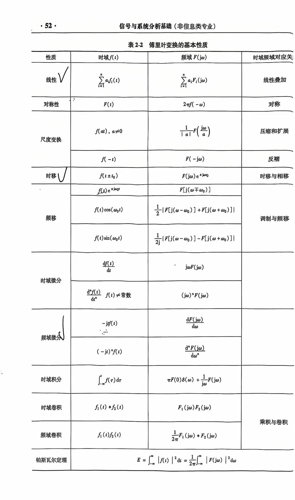
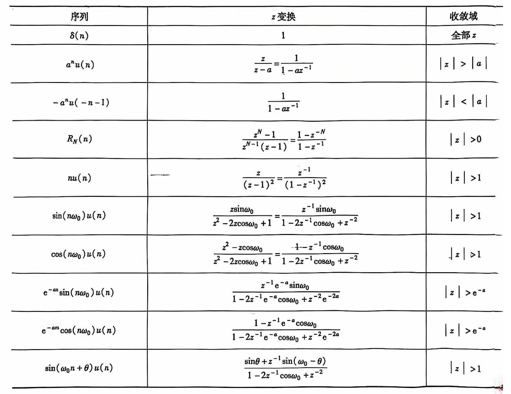
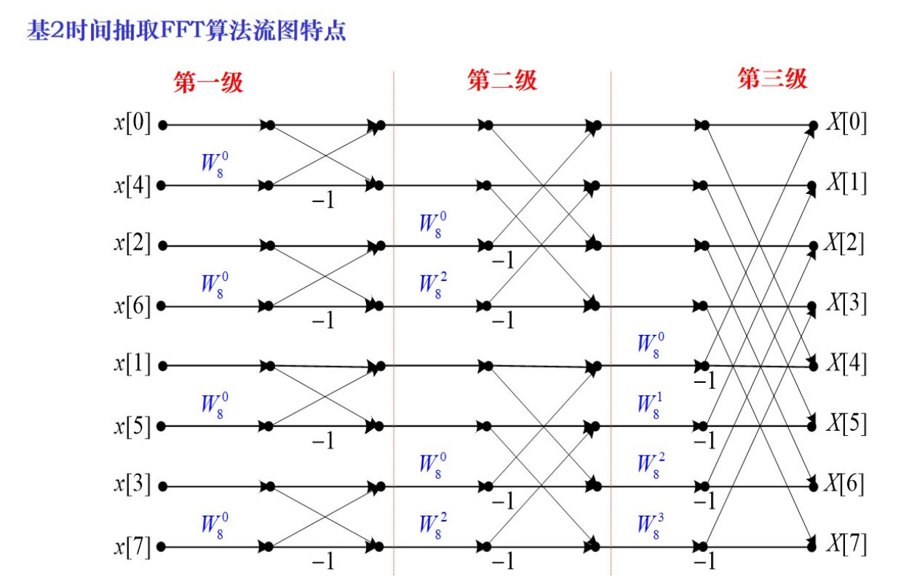
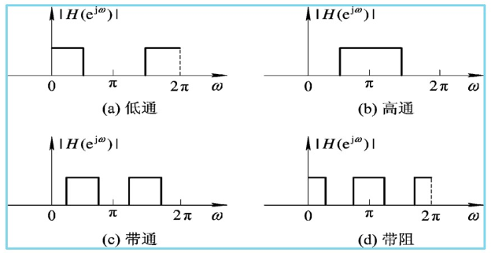
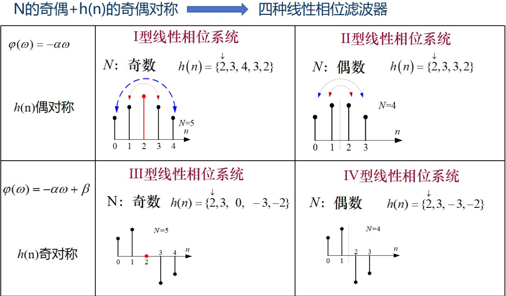
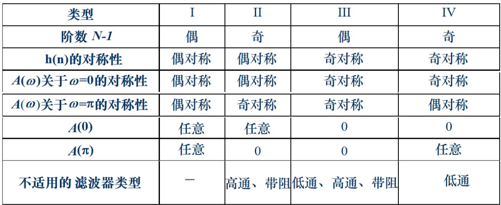

---
markmap:
    maxWidth: 300
---
# 信号分析基础

## 1 信号与系统的基本概念<!-- markmap: fold -->

---

#### 信号定义
信号是信息的载体，信息是信号的内涵。

#### 信号的分类
- 连续时间信号 &hArr; 离散时间序列
- 周期信号 &hArr; 非周期信号
- 确定性信号 &hArr; 随机信号
- 能量信号 &hArr; 功率信号。能量信号绝对平方可积（和），否则称为功率信号。
- 因果信号 &hArr; 反因果信号。**右边信号**就是**因果信号**，**左边信号**就是**反因果信号**。

#### 连续与离散信号的运算
- 反褶
- 移位
- 尺度变换
- 加、减、乘、标量乘
- 差分运算：向前差分：$\nabla x[n] = x[n+1] - x[n]$；向后差分：$\Delta x[n] = x[n] - x[n-1]$。且 $\nabla x[n] = \Delta x[n-1]$。
- 卷积运算：连续信号的卷积分：$\int_{-\infty}^{\infty} f_1(\tau) f_2(t-\tau) d\tau$；离散信号的卷积：$x[n] * y[n] = \sum_{k=-\infty}^{\infty} x[k] y[n-k]$。卷积运算的性质：交换律、分配律、结合律。
- 离散线性卷积计算示例： 

#### 常见的信号序列
- 正弦类：$f(t)=A\cos(\omega t+\varphi)$。根据欧拉恒等式，正弦函数信号可以写为：$\sin(\omega t) = \frac{e^{j\omega t}-e^{-j\omega t}}{2j}$，$\cos(\omega t) = \frac{e^{j\omega t}+e^{-j\omega t}}{2}$。
- 指数类：$f(t)=Ae^{st}$。根据欧拉等式，指数函数信号可以写为：$e^{j\omega t} = \cos(\omega t) + j\sin(\omega t)$。
- 单位冲激信号：$\boxed{f(t)=\delta(t)=\begin{cases} \infty & t = 0\\0 & t\neq 0\end{cases}}$ 且有 $\boxed{\int_{-\infty}^{\infty} \delta(t) dt=1}$，且有如下筛选特性：$\int_{-\infty}^{\infty}f\left(t\right)\delta\left(t\right)dt=\int_{0-}^{0+}f\left(t\right)\delta\left(t\right)dt=f\left(0\right)\int_{0-}^{0+}\delta\left(t\right)dt=f\left(0\right)$
- 单位阶跃信号：$\boxed{f(t)=u(t)=\begin{cases} 1 & t > 0\\0 & t < 0\end{cases}}$.
- 门函数：$\boxed{\prod(\frac{t}{\tau}) = u(t+\frac{\tau}{2}) - u(t-\frac{\tau}{2}) = \begin{cases} 1 & |t| < \frac{\tau}{2} \\ 0 & others \end{cases}}$；矩形序列：$R_N(n) = \begin{cases} 1 & 0\leq n\leq N-1 \\ 0 & others \end{cases}$。
- 内插函数信号（辛格函数）：$sinc(x) = \frac{\sin(x)}{x}$。

#### 系统
- 直接理解成这个就行：$y(t)=T[x(t)]$
- **连续系统与离散系统**
- **线性系统与非线性系统**。线性系统要满足**可加性**和**比例性**，即：$T[x_1(t)+x_2(t)]=T[x_1(t)]+T[x_2(t)]$、$T[a_1x_1(t)]=a_1y_1(t)$。一般来说，带常数就不是线性系统，同时不满足比例性和可加性。
- **时变系统与时不变系统**。时不变系统要满足 $T[x(t-t_0)]=y(t-t_0)$ 或 $T[x(n-m)]=y(n-m)$
- 判断线性、时不变性的关键点在于，套用公式时，**要明确是对 $x(t)$ 或 $x(n)$ 进行变换（即 $T[x(t)]$ 或 $T[x(n)]$），还是对 $t$ 或 $n$ 进行变换（即 $y(t)$ 或 $y(n)$）**。
- 同时具有**线性**和**时不变性**的系统成为**线性时不变系统**，也即 **LTI 系统**
- **因果系统与非因果系统**。如果输出取决于**未来的输入**则成为非因果系统。非因果系统是不可物理实现的
- **稳定系统**。输入有界且输出也有界，称为稳定系统，否则称为不稳定系统
- **零输入响应**：**输入信号为零**，仅由**系统初始状态**(系统没有外部激励时系统的固有状态)单独作
用于系统而产生的输出响应，用 $y_{zi}(t)$ 表示
- **零状态响应**：忽略系统的初始状态，**只由外部激励**作用于系统而产生的输出响应，用 $y_{zs}(t)$ 表示
- **全响应**：$y_{zi}(t) + y_{zs}(t)$
        
## 2 连续信号的傅里叶变换<!-- markmap: fold -->

---

#### Fourier 级数

- **三角形式的傅里叶级数**：$\boxed{f\left(t\right)=a_{0}+\sum_{n=1}^{\infty}\left(a_{n}\cos n\omega_{1}t+b_{n}\sin n\omega_{1}t\right)}$；余弦形式：$f\left(t\right)=c_{0}+\sum_{n=1}^{\infty}c_{n}\cos\left(n\omega_{1}t+\varphi_{n}\right)$；正弦形式：$f\left(t\right)=d_{0}+\sum_{n=1}^{\infty}d_{n}\sin\left(n\omega_{1}t+\theta_{n}\right)$
- 直流分量：$a_{0}=\frac{1}{T_{1}}\int_{0}^{T_{1}}f\left(t\right)dt=\frac{1}{T_{1}}\int_{-\frac{T_{1}}{2}}^{\frac{T_{1}}{2}}f\left(t\right)dt$
- 余弦分量系数：$a_{n}=\frac{2}{T_{1}}\int_{0}^{T_{1}}f\left(t\right)\cos n\omega_{1}tdt=\frac{2}{T_{1}}\int_{-\frac{T_{1}}{2}}^{\frac{T_{1}}{2}}f\left(t\right)\cos n\omega_{1}tdt$
- 正弦分量系数：$b_{n}=\frac{2}{T_{1}}\int_{0}^{T_{1}}f\left(t\right)\mathrm{sin}n\omega_{1}t\mathrm{d}t=\frac{2}{T_{1}}\int_{-\frac{T_{1}}{2}}^{\frac{T_{1}}{2}}f\left(t\right)\mathrm{sin}n\omega_{1}t\mathrm{d}t$
- 各项关系，其中（$n=1,2,\cdots$）：$\begin{cases}
                & a_{0}=c_{0}=d_{0} \\
                & c_{n}=d_{n}=\sqrt{a_{n}^{2}+b_{n}^{2}} \\
                & a_{n}=c_{n}\mathrm{cos}\varphi_{n}=d_{n}\mathrm{sin}\theta_{n} \\
                & b_{n}=-c_{n}\mathrm{sin}\varphi_{n}=d_{n}\mathrm{cos}\theta_{n} \\
                & \tan\theta_{n}=\frac{a_{n}}{b_{n}} \\
                & \tan\varphi_{n}=-\frac{b_{n}}{a_{n}}
                \end{cases}$
- **复指数形式的傅里叶级数**：$\boxed{f(t)=\sum_{n=-\infty}^{\infty}F_{n}e^{jn\omega_{1}t}}$，其中 $F_{n}=\frac{1}{T_{1}}\int_{0}^{T_{1}}f\left(t\right)e^{-jn\omega_{1}t}dt=\frac{1}{T_{1}}\int_{-\frac{T_{1}}{2}}^{\frac{T_{1}}{2}}f\left(t\right)e^{-jn\omega_{1}t}dt$
- 周期信号的实质：**一个周期信号由不同频率的谐波分量所组成**。什么是*谐波*？可以简单理解为能够使用公式表达的、和谐的、规律的波形
- 傅里叶级数的频谱分为**幅度谱**和**相位谱**，分别对应幅频特性和相频特性
- **从傅里叶级数三角形式导出的单边频谱**。幅频特性：$\left|c_{n}\right|=\sqrt{a_{n}^{2}+b_{n}^{2}}$；相频特性：$\varphi_{n}=\arctan\left(\frac{-b_{n}}{a_{n}}\right)$
- **从傅里叶级数复指数形式导出的双边频谱** 幅频特性：$\left|F_{n}\right|=\left|\frac{a_{n}-jb_{n}}{2}\right|=\frac{1}{2}\sqrt{a_{n}^{2}+b_{n}^{2}}$；相频特性：$\varphi_{n}=\arctan\left(\frac{-b_{n}}{a_{n}}\right)$
- 双边频谱虽然有负频率，但负频率的出现完全是数学运算的结果，并没有任何物理意义
- 周期信号频谱的特点：离散性、谐波性、收敛性

#### FT
- 正变换：$\boxed{F\left(j\omega\right)=\mathcal{F}\left[f\left(t\right)\right]=\int_{-\infty}^{\infty}f\left(t\right)e^{-j\omega t}dt}$
- 逆变换：$\boxed{f\left(t\right)=\mathcal{F}^{-1}\left[F\left(j\omega\right)\right]=\frac{1}{2\pi}\int_{-\infty}^{\infty}F\left(j\omega\right)e^{j\omega t}d\omega}$
- 傅里叶变换是一对线性变换，它们之间存在一一对应的关系
- 傅里叶级数分析对象是**周期信号**，傅里叶变换分析对象是**非周期信号**
- 傅里叶级数频率定义域是**离散频率、谐波频率处**，傅里叶变换频率定义域是**连续频率、整个频率轴**
- 傅里叶级数函数值意义是频率分量的**数值**，傅里叶变换函数值意义是频率分量的**密度值**
- 函数存在傅里叶变换的**充分**条件：$\int_{-\infty}^{\infty}|f\left(t\right)|dt<\infty$
- 根据欧拉恒等式：$F\left(j\omega\right)=\int_{-\infty}^{\infty}f\left(t\right)e^{-j\omega t}dt=\int_{-\infty}^{\infty}f\left(t\right)\cos\left(\omega t\right)dt-j\int_{-\infty}^{\infty}f\left(t\right)\sin\left(\omega t\right)dt$
- 由上式：$\begin{cases}R\left(\omega\right)=\int_{-\infty}^{\infty}f\left(t\right)\cos\left(\omega t\right)dt \\X\left(\omega\right)=-\int_{-\infty}^{\infty}f\left(t\right)\sin\left(\omega t\right)dt & \end{cases}$
- 由上式：$\boxed{\begin{cases}|F\left(j\omega\right)|=\sqrt{R^{2}\left(\omega\right)+X^{2}\left(\omega\right)} \\ \varphi\left(\omega\right)=\arctan=\frac{X\left(\omega\right)}{R\left(\omega\right)} & \end{cases}}$
- 由上式：$|F\left(j\omega\right)|$ 是**偶函数**，$\varphi\left(\omega\right)$ 是**奇函数**
- 如果信号 $f(t)$ 的傅里叶变换 $F($j$\omega )$ 当 $\omega>\omega_\mathrm{m}$ 时均为零，则称$f(t)$是带限的，正实数 $\omega_m$ 称为信号 $f({t})$ 的带宽
- 如果信号 $f(t)$ 存在一个正实数 $T_\mathrm{m}$，当$|t|>T_\mathrm{m}$ 时，$f(t)=0$，则该信号是时限的，它对应于频域有一个时宽$T_{\mathrm{m}}$
- 带限信号在时域上是无限连续时间的，即**带限信号不能是时限**的；相应地，**时限信号必然是无限带宽的**
- 典型傅里叶变换对：    
    - 门信号：$\boxed{\Pi\left(\frac{t}{\tau}\right)\xleftrightarrow{F}\tau\sin c\left(\frac{\omega\tau}{2}\right)}$
    - 单边指数信号：$\boxed{e^{-at}u\left(t\right)\xleftrightarrow{F}\frac{1}{a+j\omega}}$
    - 双边指数信号：$\boxed{e^{-a|t|}\left(a>0\right)\xleftrightarrow{F}\frac{2a}{a^{2}+\omega^{2}}}$
    - 单位冲激信号：$\boxed{\delta (t)\xleftrightarrow{F}1}$
    - 直流信号 $f(t)=E$：$\boxed{E\xleftrightarrow{F}2\pi E\delta(\omega)}$
    - 符号函数：$sgn(t)\xleftrightarrow{F}\frac{2}{j\omega}$
    - 单位阶跃信号：$\boxed{u(t) \xleftrightarrow{F} \pi\delta(\omega)+\frac{1}{j\omega}}$
        

#### FT 的基本性质

#### 周期信号的 FT
- 直接使用傅里叶变换的定义的前提条件是要满足**绝对可积**，但周期信号并不满足绝对可积的条件。而引入**奇异函数**后，某些不满足绝对可积的信号也可以求傅里叶变换，所以有这一节。
- 周期信号的傅里叶变换公式：$F\left(j\omega\right)=2\pi\sum_{n=-\infty}^{\infty}F_{n}\delta\left(\omega-n\omega_{1}\right)=\omega_{1}\sum_{n=-\infty}^{\infty}F_{0}\left(jn\omega_{1}\right)\delta\left(\omega-n\omega_{1}\right)$
- 余弦函数的傅里叶变换：$\mathcal{F}\left[\cos\left(\omega_{0}t\right)\right]=\pi\left[\delta\left(\omega-\omega_{0}\right)+\delta\left(\omega+\omega_{0}\right)\right]$
- 正弦函数的傅里叶变换：$\mathcal{F}\left[\sin\left(\omega_{0}t\right)\right]=\frac{\pi}{j}\left[\delta\left(\omega-\omega_{0}\right)-\delta\left(\omega+\omega_{0}\right)\right]$
- 周期单位冲击序列的傅里叶变换：$\mathcal{F}[\delta_{\omega 1}(\omega)] = \omega_{1}\delta_{\omega 1}(\omega)$
- 周期矩形脉冲序列的傅里叶变换：$E\tau\omega_{1}\sum_{n=-\infty}^{\infty}sinc\left(\frac{n\omega_{1}\tau}{2}\right)\delta\left(\omega-n\omega_{1}\right)$；其傅里叶系数：$F_{n}=\frac{1}{T}F_{0}\left(jn\omega_{1}\right)=\frac{E\tau}{T}sinc\left(\frac{n\omega_{1}\tau}{2}\right)$

#### 抽样信号的 FT
- 时域抽样定理（奈奎斯特定理）：一个频带受限的信号 $f(t)$，要想抽样后能够不失真地还原出原信号，抽样频率必须大于 2 倍信号谱的最高频率。

## 3 连续信号的拉普拉斯变换<!-- markmap: fold -->

#### LT 的定义及收敛域
- 为什么要有拉普拉斯变换：傅里叶变换需要满足绝对可积的先决条件，为不收敛的函数乘上收敛因子后，就可以满足这一条件。而乘上收敛因子再求其傅里叶变换的过程，就可以视为拉普拉斯变换。
- 求法：$\begin{cases} F\left(s\right)=\int_{-\infty}^{\infty}f\left(t\right)e^{-st}dt \\ f\left(t\right)=\frac{1}{2\pi j}\int_{\sigma-j\infty}^{\sigma+j\infty}F\left(s\right)e^{st}ds & \end{cases}$
- 收敛域：右边信号（$\sigma > \sigma_1$）、左边信号（$\sigma < \sigma_2$）、双边信号（$\sigma_1 < \sigma < \sigma_2$）、时限信号（整个 s 平面）

#### 单边 LT 的性质

#### 单边 LT 的逆变换
- 查表法
- 部分分式展开法
    - 分母的所有根均为单实根：分式划开，各部查表
    - 分母的根具有共轭复根且无重复根
    - 分母仅有重根
    
#### 连续时间系统的 s 域分析
- 系统函数 $H(s)$：$H(s)=\frac{Y_{ZS}(s)}{X(s)}$，它与系统的输入和输出无关，描述了系统本身的特性。一旦系统的拓扑结构已定，它也就确定了，**它存在的条件是系统的起始状态为零，即 $y_{zi(0)=0}$**。
- 线性系统的稳定性：一个系统受某种干扰信号作用时，其所引起的系统响应在干扰消失后，会最终消失，即系统可以回到干扰作用前的状态，称系统是稳定的。
- 对于一般系统，系统稳定的充要条件是冲击响应 $h(t)$ 绝对可积。
- 系统稳定性结论：
    - 稳定：*$H(s)$ 的全部极点位于 $s$ 域的左半平面*
    - 临界稳定：*$H(s)$ 在虚轴上有 $p=0$ 的单极点或一对共轭单极点，其余极点全在 $s$ 域的左半平面*
    - 不稳定：*$H(s)$ 只要有一个极点位于 $s$ 域的右半平面，或在虚轴上有二阶或二阶以上的重极点，则系统不稳定。*
    
## 4 离散信号与系统<!-- markmap: fold -->

---

#### z 变换
- $\boxed{X\left(z\right)=\sum_{-\infty}^{\infty}x\left(n\right)z^{-n}}$，其中 $z = e^{s}$
- 级数判断敛散性的两个方法：
    - $\rho=\lim_{n\to\infty}\left|\frac{a_{n+1}}{a_{n}}\right|$
    - $\eta=\lim_{n\to\infty}\sqrt[n]{\left|a_{n}\right|}$

- z 变换的收敛域：
    - 有限长序列：$0<|z|<\infty$，但两边是否能取等号要看情况，如果求和下界小于零，则不能取无穷的等号；求和上界大于零则不能取零的等号
    - 右边序列：$|z|>\lim\limits_{n\to\infty}\sqrt[n]{|x\left(n\right)|}=R_{x1}$
    - 左边序列：$|z|<\frac{1}{\lim\limits_{n\to\infty}\sqrt[n]{\left|x\left(-n\right)\right|}}=R_{x2}$
    - 双边序列：$R_{x1}<|z|<R_{x2}$
    

#### z 逆变换
- 部分分式法
- 幂级数法（长除法，也就是硬除）

#### z 变换的性质与定理

- 线性：$Z\left[ax(n)+by(n)\right]=aX(z)+bY(z)\quad\left(R_1<\left|z\right|<R_2\right)$，收敛域取交集
- 位移性：$Z\left[x(n-n_0)\right]=z^{-n_0}X(z)$，收敛域只会影响 $z=0$ 和 $z=\infty$ 处
- 尺度变换：$Z[a^nx(n)]=X(\frac{z}{a})~~~(R_{x1}<\left|\frac{z}{a}\right|<R_{x2})$
- 序列线性加权：${Z}\left[nx(n)\right]=-z\frac{\mathrm{d}X\left(z\right)}{\mathrm{d}z}\quad\left(R_{x1}<\left|z\right|<R_{x2}\right)$
- 初值定理：$x(0)=\lim_{z\to\infty}X(z)$
- 终值定理：$\lim_{n\to\infty}x(n)=\lim_{z\to1}(z-1)X(z)$

#### 离散系统的时域分析与系统函数
1. z 变换法解常系数差分方程
    1. 等式两边单边 z 变换（利用 z 变换的位移性质）
    1. 对不包含 $X(z)$ 的部分应用 z 逆变换，求得零输入响应
    1. 对包含 $X(z)$ 的部分应用 z 逆变换，先求 $x(n)$ 的 z 变换得到 $X(z)$，带入后求 z 逆变换，求得零状态响应
    1. 相加得全响应
1. 定义离散系统的系统函数：$\boxed{H(z)=\frac{Y_{zs}(z)}{X(z)}=\frac{\sum_{j=0}^{M}b_{j}z^{-j}}{\sum_{i=0}^{N}a_{i}z^{-i}}}$，且可以利用 $H(z)$ 求单位脉冲响应 $h(t)$
1. 离散系统的稳定性
    1. 系统稳定性的定义：当输入信号有界，输出信号也必定有界
    1. 系统输出等于单位脉冲响应与系统输入的卷积：$y(n)=h(n)*x(n)$
    1. $H(z)$ 的极点：
        1. 在单位圆上：$h(n)$ 的累加和与该极点的对应项为复正弦序列
        1. 在单位圆内：$h(n)$ 的累加和与该极点的对应项为指数衰减序列
        1. 在单位圆外：$h(n)$ 的累加和与该极点的对应项为指数递增序列
        1. 显然若为复正弦、递增，会导致 $h(n)$ 不绝对可和，进而导致系统不稳定，因此若说系统是稳定的，$H(z)$ 的极点必须均在单位圆内

## 5 离散傅里叶变换（DFT）<!-- markmap: fold -->

---

#### 有限长序列的 DFT
1. 旋转因子：$W^n_N=e^{-j\frac{2\pi}{N}n}$
    1. 共轭对称性
    1. 周期性
    1. 可约性，就是 $n$ 和 $N$ 可以约分
    1. 正交性
1. 离散傅里叶变换定义
    1. 正变换：$\boxed{X(k)=\mathrm{DFT}[x(n)]=\sum_{n=0}^{N-1}x(n)W_N^{kn}\quad0\leq k\leq N-1}$
    1. 逆变换：$\boxed{x(n)=\mathrm{IDFT}[X(k)]=\frac{1}{N}\sum_{k=0}^{N-1}X(k)W_N^{-kn}\quad0\leq n\leq N-1}$

#### DFT 的性质
1. 线性性质：可加性和比例性
1. 共轭对称性
1. 循环（圆周）移位特性，若：$x[n]\overset{\mathrm{DFT}}{\operatorname*{\longleftrightarrow}}X[k]$
    1. 时域的循环位移对应频域的相移，$x[(n+m)_N]\overset{\mathrm{DFT}}{\operatorname*{\longleftrightarrow}}W_N^{-km}X[k]$
    1. 时域的相移对应频域的循环位移，$W_N^{ln}x[n]\overset{\mathrm{DFT}}{\operatorname*{\longleftrightarrow}}X[(k+l)_N]$
1. 循环（圆周）卷积
    1. 若 $x[n]$ 的长度为 $N$，$h[n]$的长度为 $M$，则 $L\geq N+M-1$ 点循环卷积等于 $x[n]$ 与 $h[n]$ 的[线性卷积](#_4)。
    1. 循环卷积计算示例：  
    1. 循环卷积定理：
        1. 时域卷积定理：$x_1[n]x_2[n]\leftarrow\xrightarrow{\mathrm{DFT}}\frac1NX_1[k]\textcircled {n}X_2[k]$
        1. 频域卷积定理：$x_1[n]\textcircled n$   $x_2[n]\longleftarrow\xrightarrow{\mathrm{DFT}}X_1[k]X_2[k]$

## 6 快速傅里叶变换（FFT）<!-- markmap: fold -->

---

#### 按时间抽取的基-2FFT算法

#### 按频率抽取的基-2FFT算法

#### 时间复杂度
1. 正常算法的时间复杂度：乘法：$N^2$，加法：$N(N-1)$
1. 两种基-2FFT算法的复杂度：乘法：$\frac{N}{2}\mathrm{log}_2N$，加法：$N\mathrm{log}_2N$

#### 逆快速傅里叶变换（IFFT）

- $x[k]=\frac{1}{N}(\mathrm{DFT}\{X^*[m]\})^*$
- 意即：将 $X[m]$ 选取共轭，用 $FFT$ 流图计算 $DFT\{X^*[m]\}$，再取共轭并除以 $N$

#### FFT 应用
1. 利用 $N$ 点复序列 FFT 计算 2 个 $N$ 点实序列 FFT
    1. 把两个实序列构造为 $x_1[k]+jx_2[k]$
    1. 计算 FFT 得到 $Y[m]$
    1. $X_1[m]=\frac{1}{2}\left\{Y[m]+Y^*[(N-m)_N]\right\}$
    1. $X_2[m]=\frac{1}{2j}\left\{Y[m]-Y^*[(N-m)_N]\right\}$
1. 利用 $N$ 点复序列 FFT 计算 $2N$ 点实序列 FFT
    1. 把 $2N$ 实序列分解为：$\begin{cases}x_{1}[k]=x[2k]\\x_{2}[k]=x[2k+1]&\end{cases}$
    1. 构造 $x_1[k]+jx_2[k]$
    1. 计算 FFT 得到 $Y[m]$
    1. $2N$ 点实序列的 FFT 的前 $N$ 点：$X[m]=X_1[m]+W_{2N}^mX_2[m]$
    1. $2N$ 点实序列的 FFT 的后 $N$ 点：$X[m+N]=X_1[m]-W_{2N}^mX_2[m]$
1. [利用 $N$ 点复序列 FFT 计算 $N$ 点复序列 IFFT](#ifft)
1. 频谱混叠：使抽样频率 $f_{sam}$ 满足 $f_{sam}\geq 2f_{m}$
1. 泄露现象
    1. 原因：原函数和矩形函数在时域上相乘，新函数的频谱相当于频域上卷积，即原函数的频谱与 $sinc$ 函数做卷积操作，可想而知频谱会向高频分散，就好像泄露一样
    1. 提高分辨率措施：增加窗函数的长度 $N$，使之满足 $N\geq \frac{f_{sam}}{\Delta f_c}=\frac{f_{sam}}{f_2-f_1}$，其中 $\Delta f_c$ 为分辨率。该公式同样可以确定最短采集时间，式子两侧同时乘以 $\frac{1}{f_{sam}}$，即每两个抽样点的时间间隔 $T$，可得最短采集时间 $T_p=\frac{1}{\Delta f_c}$，即分辨率的倒数。
1. 栅栏现象：DFT 点数 $L\geq\frac{f_{sam}}{\Delta f_d}$，其中 $\Delta f_d$ 为谱线间隔。实际上，$L$ 一般取 2 的次幂，即 $L=2^{\lceil \log_2{\frac{f_{sam}}{\Delta f_d}} \rceil}$

| 窗函数类型      | 主瓣有效宽度| 旁瓣峰值衰耗  |  
|-------------------------------|-------------------------------|---------------------------------|  
| 矩形 (Rectangle)             | 2π / N                       | 13 dB                          |  
| 汉宁 (Hanning)               | 4π / N                       | 31 dB                          |  
| 海明 (Hamming)               | 4π / N                       | 41 dB                          |  
| 布莱克曼 (Blackman)          | 6π / N                       | 57 dB                          |  
| 凯塞 (Kaiser) b=5.86         | 5π / N                       | 57 dB                          |

\*主瓣有效宽度越小越好、旁瓣峰值衰耗越大越好，但往往鱼和熊掌不可兼得，只能取一个平衡

## 7 数字滤波器设计<!-- markmap: fold -->

---

#### 滤波器的基本概念
- 概念 离散时间系统，输入、输出均为数字信号。可以根据需要，通过数值运算改变信号频率成分的相对比例，或者有选择性的滤除输入信号的某些频率成分
- 按功能分类   
- 按单位脉冲响应长度分类
    - `FIR` 滤波器 $H(z)=\sum_{n=0}^{N-1}h(n)z^{-n}$
    - `IIR` (Infinite Impulse Response) 滤波器 $H(z)=\frac{\sum_{j=0}^{M}b_{j}z^{-j}}{1+\sum_{i=1}^{N}a_{i}z^{-i}}$
- 技术指标
    - 频率响应函数：$H(e^{j\omega})=\left|H(e^{j\omega})\right|e^{j\theta(\omega)}$，则：
      - 幅频特性 $\left|H(e^{j\omega})\right|$，表示信号通过该滤波器后**各频率成分振幅衰减**情况
      - 相频特性 $\theta(\omega)$，反应各频率成分通过滤波器后**各频率成分在时间上的延时**情况
    - 理想数字滤波器   
      - 通带衰减(dB) $\boxed{A_{\mathrm{p}}=-20\lg(1-\delta_{\mathrm{p}})}$
      - 阻带衰减(dB) $\boxed{A_{\mathrm{s}}=-20\lg\delta_{\mathrm{s}}}$
    - 实际低通数字滤波器   
      - $\omega_\mathrm{p}$：通带截止频率
      - $\omega_\mathrm{s}$：阻带截止频率
      - $\delta_{\mathfrak{p}}$：通带波动
      - $\delta_{\mathrm{s}}$：阻带波动

#### 常用模拟滤波器的设计方法
- 由幅度平方函数确定。看不懂，做题碰到了再说吧。
- Butterworth 低通逼近   
    - $\left|H(\mathrm{j}\Omega)\right|^2=\frac{1}{1+\left(\Omega/\Omega_\mathrm{c}\right)^{2N}}$
    - 具有单调下降的幅频特性
    - 最大平坦性 $|H(\mathrm{j}\Omega)|^2$ 在 $\Omega=0 $ 点的 $1$ 到 $2N-1$ 阶导数为零
    - 3dB 不变性 不管 N 为多少，所有的特性曲线都通过 -3dB 点，或者说衰减为 3dB    
- Butterworth 模拟低通滤波器的设计步骤
    - 步骤 1：确定模拟滤波器的阶数 $N$，$N\geq\frac{\lg(\frac{10^{0.1A_s}-1}{10^{0.1A_p}-1})}{2\lg(\Omega_s/\Omega_p)}$
    - 步骤 2：确定模拟滤波器的 $3dB$ 截频 $\Omega_c$，$\frac{\Omega_\mathrm{p}}{(10^{0.1A_\mathrm{p}}-1)^{\frac{1}{2N}}}\leq\Omega_\mathrm{c}\leq\frac{\Omega_\mathrm{s}}{(10^{0.1A_\mathrm{s}}-1)^{\frac{1}{2N}}}$
    - \*步骤 3：计算模拟滤波器的系统函数极点
    - \*步骤 4：得到模拟低通滤波器的系统函数 $H_L(s)$
    - 其中，步骤 3、4，也可以通过查表法得到

#### 无限长单位脉冲响应 `IIR` 数字滤波器的设计
- 脉冲响应不变法（线性变换）
    - 对应关系：$H(s)=\sum\limits_{i=1}^{N}\frac{A}{s-p_i}$ 和 $\boxed{H(z)=\sum\limits^{N}_{i=1}\frac{A_i}{1-e^{p_iT} z^{-1}}}$
    - $\omega$ 和 $\Omega$ 的关系：$\Omega=\frac{\omega}{T}$
    - 由上面的式子可知，求出 $A_i$ 和 $p_i$ 是写出两种式子的关键
    - 优点：时域逼近良好，线性（$\Omega=\frac{\omega}{T}$）
    - 缺点：频率响应的混叠失真，只适用于限带的模拟滤波器（**低通、带通**）
- 双线性变换法（非线性变换，$tan$ 函数）
    - 对应关系：$\boxed{H\left(z\right)=H_{a}\left(s\right)|_{s=\frac{2}{T}\frac{1-z^{-1}}{1+z^{-1}}}=H_{a}\left(\frac{2}{T}\frac{1-z^{-1}}{1+z^{-1}}\right)}$
    - $\omega$ 和 $\Omega$ 的关系：$\Omega=\frac{2}{T}\tan(\frac{\omega}{2})$
    - 不用分式展开，比较友好
    - 优点：避免了混叠失真（以引入非线性为代价），能直接用于设计低通、带通、高通、带阻滤波器，保持原有的幅频性能
    - 缺点：转换前后的频率呈非线性关系（可以通过频率预畸变减轻），产生相频特性失真

#### 有限长脉冲响应数字滤波器设计（FIR）
1. $H\left(z\right)=\sum_{j=0}^{N-1}b_{j}z^{-j}$ 和 $h(n)=\sum_{i=0}^{N-1}b_jx(n-j)$
1. 线性相位是指 $\phi(\omega)$ 是 $\omega$ 的线性函数
    1. 严格线性相位系统：$\phi(\omega)=-\alpha\omega$
    1. 宽（广义）线性相位系统：$\phi(\omega)=-\alpha\omega+\beta$
1. 四种线性相位系统         
1. 窗函数法设计 `FIR` 滤波器
    1. 核心：只需求出  $H\left(z\right)=\sum_{n=0}^{N-1}b_{n}z^{-n}=\sum_{n=0}^{N-1}h(n)z^{-n}$ 中的 $h(n)$
    1. 由设计目标 $H_{\mathrm{d}}(\mathrm{e}^{\mathrm{j}\omega})$ 确定`FIR` 的类型 (四选一) 和幅度函数 $A_{\mathrm{d}}(\omega)$，$H_\text{d}(\mathrm{e}^{\mathrm{j}\omega})=A_d(\omega)e^{j\varphi_d(\omega)}$
    1. 根据类型确定线性相位FIR滤波器的相位 $\varphi_{\mathrm{d}}(\omega)$，$\varphi_{\mathrm{d}}(\omega)=-\alpha\omega+\beta\quad(\beta=0, \pi/2)$
    1. 根据 $A_{\mathrm{d}}(\omega)$ 和 $\varphi_{\mathrm{d}}(\omega)$ 通过 `IDTFT` 求解 $h_\mathrm{d}(n)$，$h_\mathrm{d}(n)=\frac{1}{2\pi}\int_{-\pi}^{\pi}A_\mathrm{d}(\omega)\mathrm{e}^{\mathrm{j}\varphi_\mathrm{d}(\omega)}\mathrm{e}^{\mathrm{j}k\omega}\mathrm{d}\omega $
    1. 加窗截短 $h_\mathrm{d}(n)$，得到有限长因果序列 $h(n)$，$h(\mathrm{n})=h_\mathrm{d}(\mathrm{n})w_N(\mathrm{n})$

| 特性           | FIR                                      | IIR                                      |  
|----------------|-----------------------------------------|-----------------------------------------|  
| 严格线性相位   | 有                                      | 没有                                    |  
| h(n) 长度      | 有限                                    | 无限                                    |  
| 稳定性         | 极点全部在原点（永远稳定），无稳定性问题 | 有稳定性问题                            |  
| 阶数           | 高                                      | 低                                      |  
| 结构           | 非递归                                  | 递归系统                                |  
| 运算误差       | 无反馈，运算误差小                      | 有反馈，由于运算中的四舍五入会产生极限环 |  
| 快速算法       | 用 FFT 实现，减少运算量                 | 无快速运算方法                          |

## 需要关注的课后习题<!-- markmap: fold -->

#### 概表

|章节|占比|关注习题|
|---|---|---|
|一|15%|1-1、1-4、1-5、1-6|
|二|20%|2-2、2-4、2-5、2-6、2-7、2-8、2-10、2-15、2-17、2-18、2-19、2-20、2-21|
|三|0~2%|无|
|四|20%|4-1、4-3、4-6、4-12、4-13、4-14、4-16、4-17|
|五|15%|5-1、5-2、5-10、5-12|
|六|15%|6-1、6-2、6-6、6-8|
|七|13~15%|7-2、7-3、7-4、7-13、7-14|

掌握函数周期性，频率带派周期，否则非周期 -> 选填
线性、时不变性 -> 大题 1 道
掌握常见信号，知道单位冲击信号具有筛选性
知道常见函数的表示，单位阶跃、门函数

1-7/15不用看

涉及时移、频移、尺度变换、对称、求傅里叶变换

2-19 1 2 3 
2-20 逆变换题目

大题 第二章 正变换一题  、逆变换一题

#### 第一章

P24

- 1-1
- 1-4 判断一个序列是否是周期的
- 1-5 数模转换、求解周期
- 1-6 判断系统的线性、时不变性

#### 第二章

- 43-52 页的例题

P67

- 2-2
- 2-4
- 2-5
- 2-6 前三道题
- 2-7
- 2-8
- 2-10
- 2-15
- 2-17
- 2-18
- 2-19
- 2-21

*关注线性、移位、尺度特性

#### 第三章

考得少

#### 第四章

所有例题都要看

- 4-1 7/8 不做
- 4-3
- 4-6
- 4-12
- 4-13
- 4-14
- 4-16
- 4-17

#### 第五章（更多关注课堂上讲的内容）

P157

- 5-1 要会用公式求解有限长傅里叶变换
- 5-2
- 5-10 （1）（2）
- 5-12 （3）

#### 第六章（更多关注课堂上讲的内容）

P192

- 6-1
- 6-2
- 6-6
- 6-8

#### 第七章

主要是例题

P245

- 7-2
- 7-3
- 7-4
- 7-13
- 7-14

## 考试重点<!-- markmap: fold -->

#### 第一章
1. 周期性判定（选择），两个周期函数之和仍然是周期函数的条件是：**两个函数的周期的比值是有理数**
1. 线性时不变判定、稳定性、因果性（简答分析）例题 1-4、1-5
    1. 线性
        1. 比例性：$T[ax(t)]=ay(t)$
        1. 可加性：$T[x_1(t)+x_2(t)]=y_1(t)+y_2(t)$
    1. 时不变性：$T[x(t-t_0)]=y(t-t_0)$
1. 稳定、不稳定要分别从时域和 `z` 域判断
1. 卷积，能计算线性卷积，并知道卷积结果长度
1. 矩形序列 $R_N(n)$ 的表达式：
    1. $R_N(n)=u(n)-u(n-N)$
    1. $R_N(n)=\{\underline{1},1,1,\cdots,1\}$（共 $N$ 个 1）
    1. $R_N(n)=\sum\limits_{m=0}^{N-1}\delta(n-m)=\delta(n)+\delta(n-1)+\cdots+\delta(n-N+1)$（共 $N$ 个单位冲击）
1. 信号尺度变换：$f(at)=\begin{cases}扩展,~~a<1\\压缩,~~a>1&\end{cases}$
1. 冲激信号：$\int\limits_{-\infty}^{\infty}f(t)\delta(t-t_0)dt=f(t_0)$

#### 第二章

1. A 卷 B 卷正、逆变换各一道大题（ **线性、对称 <- 大题、尺度、移位** ）
1. 给典型信号，分析傅里叶变换性质
1. 傅里叶级数不出大题
1. 理解什么叫频谱
1. 指数展开和三角级数展开的两种形式中，物理意义、单双边频谱计算、能够解决工程中的什么问题（选择、判断、填空）
1. 通信系统的振幅调制和同步调制，是利用傅里叶变换的 **频移** 性质
1. **白色谱** 或均匀谱是指 **傅里叶变换之后频谱为常数 $I_0$** 的信号（也可以说，频谱在任何频率处的密度都是均匀的），冲击函数 $\delta(t)$ 的频谱就是白色谱
1. $DTFT$ 变换是周期性函数，周期是 $2\pi$
1. 傅里叶正逆变换具有 **唯一性**
1. 会求解 **正弦信号** 的傅里叶变换
1. 傅里叶变换的应用，调制
1. 43~52 页例题注意
1. 补练习题 2-19~21
1. 周期信号傅里叶变换的特点 **离散性、收敛性、谐波性**
1. 周期信号的傅里叶级数不用掌握
1. $f(t)$ 为 $t$ 实偶函数、实奇函数时，傅里叶变换的结果
1. 傅里叶变换存在的条件：**绝对可积**
1. 判定因果、稳定，时域用时域判定方法，频域用频域判定方法（2 页、3 页，17 页、18页）
    1. 稳定
        1. **系统的输入有界，输出也有界**
        1. 极点判定
    1. 因果
        1. **系统的输入不超前于输出**
        1. 极点在单位圆内
1. 判断 $h(n)$ 或 $h(t)$ 在 $t$ 小于 0 时或 $n$ 小于 0 时，是否恒等于 0

#### 第四章

1. 第四章所有例题都要做一遍 例题 4-4 必须会做
1. 习题 4-14、4-16 必须会做
1. `z` 变换的正变换和逆变换
1. `z` 变换存在的充要条件：无穷项级数求和必须收敛
1. 利用 `z` 变换求解离散系统判断系统特性（一道大题，给一个系统，求解系统的 $H(z)$、判断系统是否稳定）
1. 收敛域（右边、左边、双边）
1. 两个序列的 `z` 变换相等，两个序列 **不一定相等，还要看收敛域**
1. 卷积性：时域相乘、频域卷积

#### 第五章

137、145

1. 有可能计算循环卷积或者是利用 DFT 的性质做一些操作
1. `DFT` 的每一个性质都会考（A 卷圆周卷积不考，B 卷会考）
1. $DFT[x((n\pm M))_NR_N]=W^{\mp Mk}_{N}X(k)$
1. 要注意圆周特性 例题 5-3
1. 共轭特性
1. `DFT`、`DTFT`、`z` 变换的关系（5.1.3）：对有限长序列在单位圆上的 $N$ 个等分点上计算其 $z$ 变换，即令 $z=e^{j\frac{2\pi}{N}k}$，就是有限长序列的离散傅里叶变换
1. 求某一个点的 `DFT`，比如 N=5 时求 X(5) 的 `DFT`
1. 若满足 $N=M+L-1$，则 $N$ 点循环卷积等于线性卷积
1. 如果 $x(n)$ 为实序列，则 $DFT[x(n)]=X(k)$ 满足 $X(k)=X^*(N-k)$，这意味着 $X(k)$ 在 $0\sim N$ 范围内，对于 $\frac{N}{2}$ 点，$|X(k)|$ 呈半周偶对称分布，$\arg[X(k)]$ 呈半周奇对称分布。
1. 共轭对称性：$DFT[x^*(n)]=DFT[x^*(N-n)]$

#### 第六章

1. 蝶形图 4 点按时间/频率抽取
1. 运算量比较
    1. `DFT` 加法：$N-1$，乘法：$N^2$
    1. `FFT` 加法：$N\log_2 N$，乘法：$\frac{N}{2}\log_2 N$
1. FFT 应用
	1. 快速逆变换
	1. 分析信号频谱（经历的步骤：时域抽样、时域截短、频域抽样）
1. 记住频率分辨能力：$F_0=\frac{f_s}{N}=\frac{1}{NT_s}=\frac{1}{T_0}$
1. 例题 6-2、6-3
1. `FFT` 应用求 `IDFT`、线性卷积、分析信号频谱。知道基本原理（简答题）
1. (xxb) `FFT` 的应用 N 求 2N
1. (xxb) `FFT` 求逆变换
1. (xxb) `FFT` 求线性卷积
1. (xxb) 栅栏现象：离散傅里叶变换是对连续频谱的抽样，只能**观察到频率离散点上的谱值**，而无法看到连续谱 $X(e^{j\omega})$ 上的内容。就好像通过百叶窗观察景色一样，可以通过补零法减轻

#### 第七章

1. 例题 7-4/5
1. `Butterworth` 的三个性质
    1. 最大平坦性
    1. 3dB 不变性
    1. 通带和阻带下降的单调性
1. 脉冲响应不变法和双线性变换法的优缺点对比：
    1. 脉冲响应不变法（P207）
        1. 优点：时域逼近良好，线性（$\Omega=\frac{\omega}{T}$）
        1. 缺点：频率响应的混叠失真（可以通过引入保护滤波器减轻），只适用于限带的模拟滤波器（衰减特性好的**低通、带通**）
    1. 双线性变换法（P212，非线性变换，$\Omega=\frac{2}{T}\tan(\frac{\omega}{2})$）
        1. 优点：避免了混叠失真（以引入非线性为代价），能直接用于设计低通、带通、高通、带阻滤波器，保持原有的幅频性能
        1. 缺点：转换前后的频率呈非线性关系（可以通过频率预畸变减轻），产生相频特性失真
1. 利用脉冲响应不变法和双线性变换把模拟滤波器转换为数字滤波器
1. 双向都会转换 s &hArr; z
1. 线性相位 `FIR` 滤波器的线性条件：奇对称或偶对称。$h(n)=h(N-1-n)$ 和 $h(n)=-h(N-1-n)$
1. `FIR` 的设计不考

#### 杂项

1. 计算最后要化到三角函数
1. 频域抽样定理，时域离散化、频域周期化

#### xxb 补充

函数和delta t 卷积的性质，delta t加减t0，函数左右移t0
函数和delta t相乘积分性质，delta t 加减t0，结果为 f(减加t0)
利用 FFT 计算线性卷积

因果判断
	时域：t<0, f(t)=0
	时域：输入不超前于输出
	频域：极点位置

稳定判断
	时域：积分小于无穷
	频域：极点 

FIR 判断什么情况下线性相位 h(n) = 正负h(N-1-n)
重点看四种类型，总结优缺点

DFT 的含义、公式、138页关系
循环卷积定理、循环位移（选择）、共轭性质
什么是泄露、什么是栅栏
