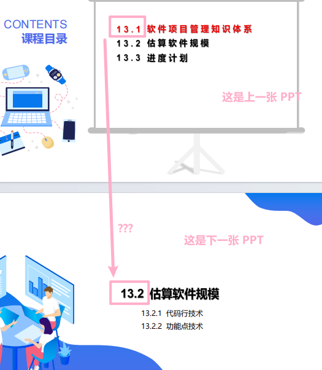

# 软件工程课程简介

## 课程评价

无尽的画图，厚重的砖头。

理了一遍 PPT ，发现 PPT 的结构就是依托，软件工程最大、最核心、最本质的要求，我认为是通俗易懂，不论是项目代码、文档、算法。然而软件工程的教学往往不是这样，无尽的、乱七八糟的、通常他们自己也不太清楚的概念，会被僵硬的塞到正在低头玩手机的学生耳中，在期末时让学生们回味无穷。

放图为证

## 复习资料

1. [练习题](https://github.com/Indolent-Kawhi/XJU-Computing-Heart/tree/master/%E8%AF%BE%E7%A8%8B%E8%B5%84%E6%96%99/%E8%BD%AF%E4%BB%B6%E5%B7%A5%E7%A8%8B)
2. [PPT](https://github.com/Indolent-Kawhi/XJU-Computing-Heart/tree/master/%E8%AF%BE%E7%A8%8B%E8%B5%84%E6%96%99/%E8%BD%AF%E4%BB%B6%E5%B7%A5%E7%A8%8B/PPT)

## 推荐老师
- 郑炅

