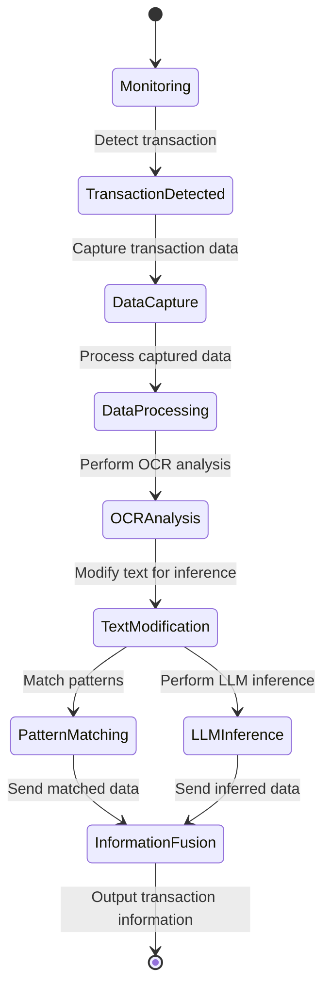

# Fast Transaction Recorder

## 待补充
1. 用例图
2. 用例建模（面向对象方法学引论-下）

## 软件生命周期

---

为了利用软件工程的思想，来制作一款软件，先来看看软件工程中定义的软件生命周期：

- 软件定义（问题定义、可行性研究、需求分析）
- 软件开发（总体设计、详细设计、编码和单元测试、综合测试）
- 运行维护（维护）

## 问题定义（提出问题） & 可行性研究（解答问题）

---

#### 前置问题

|问题|解答|
|---|---|
|`FTR` 要解决什么问题？|**自动化**、智能、快速、稳定地帮助用户记录交易流水|
|`FTR` 的目标用户群体是？|使用 `Android` 系统、经常使用移动支付的用户|
|为了解决上述问题，`FTR` 应该**至少**具备什么功能？|a. 能够稳定的在后台运行，监控 Android 系统中相关交易软件的运行状态；  b. 能够识别交易行为，在交易完成前，做好记录准备，交易进行时，尽最大化努力获取交易信息，交易完成后，尽最大化努力识别交易数据与类型，并记录|
|`FTR` 的定位是？|一个插件，连接**交易信息**与**记账软件**|

#### 技术难题

|问题|解答|
|---|---|
|既然 `FTR` 会监控交易软件的运行状态，凭什么认为它不会窃取用户的个人信息？|`FTR` 必须开源，保证其通过源代码方式构建是容易的。|
|`FTR` 应该如何稳定地运行？|后台保活问题现在已经有比较成熟的解决方案，但均需要引导用户操作（这受 `Android` 系统限制），包括运行自启动、锁定后台、通知锁定|
|`FTR` 应该如何获取交易信息？|截图、无障碍获取 `Activity` 信息、提权获得强制获得任何 `Activity` 信息以及内存数据|
|`FTR` 应该如何分析数据？|市面上数据分析的软件很多，`FTR` 的目标是连接**交易信息**与**记账软件**，`FTR` 的重点是分析交易数据，从而判断出其究竟是什么样的交易，告诉记账软件，让其记录到账本中|

## 需求分析（准确回答系统必须做什么）

这里请务必参考[需求分析](https://sunsealucky.github.io/xju-course-wiki/software-engineering/note/main/#_4)，明确**目的**、**输出**和要画的几张图（E-R 图、数据流图、状态图）。

---

### 软件需求规格说明书 (SRS)

#### 1. 引言

##### 1.1 目的
本软件（以下简称 `FTR`）旨在为 Android 用户提供一种**自动化**、**智能化**、**快速**且**稳定**的交易流水记录工具。通过监控交易软件的运行状态，识别交易行为，分析交易数据，并将其分类记录到记账软件中，帮助用户高效管理个人财务。

##### 1.2 背景
随着移动支付的普及，用户的交易频率显著增加，但手动记录交易流水的方式效率低下且容易遗漏。`FTR` 通过后台运行和智能分析，自动完成交易流水的记录工作，解决用户的痛点。

##### 1.3 定义
- **交易行为**：用户在移动支付软件中完成的支付、转账、收款等操作。
- **交易流水**：交易行为的详细信息，包括金额、交易类型、交易平台等。
- **记账软件**：用于记录用户财务信息的第三方应用。

##### 1.4 参考资料
- 用户需求问题表
- 技术难题解答
- 提供的代码实现与数据流图

---

#### 2. 总体描述

##### 2.1 产品功能
`FTR` 的核心功能包括：
1. **后台监控**：稳定运行于 Android 系统后台，监控交易软件的运行状态。
2. **交易识别**：通过截图、无障碍服务或提权方式，获取交易行为的相关信息。
3. **数据分析**：利用 OCR 技术和模式匹配算法，分析交易数据，判断交易类型、金额和平台。
4. **数据输出**：将分析结果以标准化格式输出，供记账软件使用。

##### 2.2 用户特点
目标用户为经常使用移动支付的 Android 用户，尤其是需要高效管理个人财务的用户群体。

##### 2.3 约束条件
1. **隐私保护**：`FTR` 必须开源，确保用户数据安全，杜绝隐私泄露。
2. **系统限制**：由于 Android 系统的后台运行限制，需引导用户完成自启动、后台锁定等操作。
3. **兼容性**：支持主流支付平台（如微信支付、支付宝、银联支付等）。

##### 2.4 假设与依赖
- 用户愿意授予必要的权限（如无障碍服务、截图权限等）。
- 用户愿意按照指引完成后台保活设置。

---

#### 3. 功能需求

##### 3.1 核心功能

###### 3.1.1 后台监控
- **描述**：监控 Android 系统中交易软件的运行状态，捕获交易行为。
- **输入**：交易软件的运行状态、Activity 信息。
- **输出**：交易行为触发信号。

###### 3.1.2 交易识别
- **描述**：通过截图或无障碍服务，获取交易行为的详细信息。
- **输入**：交易软件的截图或 Activity 数据。
- **输出**：交易行为的原始数据（如金额、交易时间、交易平台等）。

###### 3.1.3 数据分析
- **描述**：利用 OCR 技术和模式匹配算法，分析交易数据，判断交易类型、金额和平台。
- **输入**：交易行为的原始数据。
- **输出**：标准化的交易信息（如 `(income, food, 5.00)`）。

###### 3.1.4 数据输出
- **描述**：将分析结果以标准化格式输出，供记账软件使用。
- **输入**：标准化的交易信息。
- **输出**：JSON 格式的交易数据。

---

#### 4. 非功能需求

##### 4.1 性能需求
- **响应时间**：交易行为识别与分析的总时间不超过 2 秒。
- **资源占用**：后台运行时，内存占用不超过 50MB。

##### 4.2 安全需求
- **隐私保护**：所有用户数据仅在本地处理，不上传至云端。
- **开源透明**：代码开源，用户可自行编译和验证。

##### 4.3 可用性需求
- **兼容性**：支持 Android 8.0 及以上版本。
- **稳定性**：在后台运行时，崩溃率低于 1%。

---

#### 5. 技术实现

##### 5.1 数据获取
- **截图方式**：通过无障碍服务截取交易软件的屏幕内容。
- **Activity 信息**：利用无障碍服务或提权方式获取交易软件的 Activity 数据。

##### 5.2 数据分析
- **OCR 技术**：使用 PaddleOCR 识别截图中的文字信息。
- **模式匹配**：通过正则表达式匹配交易数据的关键字段（如金额、交易类型等）。
- **LLM 推理**：利用大语言模型（如 OpenAI API）对复杂交易数据进行推理分析。

##### 5.3 数据输出
- **标准化格式**：将分析结果以 JSON 格式输出，供记账软件调用。

---

#### 6. 系统架构

##### 6.1 模块划分
1. **Android 前端模块**：
   - 交易监控：监控交易软件的运行状态。
   - 数据获取：通过截图或 Activity 信息获取交易数据。
2. **Python 后端模块**：
    - 数据分析：利用 OCR 和模式匹配算法分析交易数据。
    - 数据输出：将分析结果以标准化格式输出。

**E-R 图**

**状态流程图**

##### 6.2 数据流
1. Android 前端捕获交易行为，生成截图或 Activity 数据。
2. Python 后端接收数据，进行 OCR 识别和模式匹配分析。
3. 分析结果以 JSON 格式输出，供记账软件使用。

---

#### 7. 开发计划

##### 7.1 里程碑
1. **第一阶段**：完成 Android 前端模块的开发，包括交易监控和数据获取功能。
2. **第二阶段**：完成 Python 后端模块的开发，包括数据分析和输出功能。
3. **第三阶段**：集成前后端模块，进行功能测试和性能优化。
4. **第四阶段**：开源代码，发布正式版本。

##### 7.2 时间安排
- 第一阶段：2 周
- 第二阶段：3 周
- 第三阶段：2 周
- 第四阶段：1 周

---

#### 8. 附录

##### 8.1 术语表
- **OCR**：光学字符识别（Optical Character Recognition）。
- **LLM**：大语言模型（Large Language Model）。
- **JSON**：一种轻量级的数据交换格式。

##### 8.2 参考资料
- 提供的代码实现与数据流图
- 用户需求问题表
- 技术难题解答

--- 

## 系统设计与实现（包括传统中的概要设计和详细设计）

#### 程序结构设计

- ocr_image 方法流程图

- draw 方法流程图

- ocr_pattern 方法流程图

- ocr_all 方法流程图

- reason 方法流程图

- Flask 路由 /local-picture-test 流程图

#### 人机界面设计

## 测试

#### 测试总览

| **测试类型**       | **测试模块/功能**                                                                 | **测试内容**                                                                                                     | **预期结果**                                                                                     |
|--------------------|----------------------------------------------------------------------------------|------------------------------------------------------------------------------------------------------------------|--------------------------------------------------------------------------------------------------|
| **单元测试**       | `ocr_image` 方法                                                                | 测试 OCR 识别功能，输入一张图片路径，检查返回的 OCR 结果是否正确。                                                | 返回的 OCR 结果包含正确的文本内容和坐标信息。                                                   |
| **单元测试**       | `draw` 方法                                                                     | 测试绘制功能，输入图片路径和 OCR 结果，检查生成的图片是否正确绘制识别框和文本。                                    | 输出图片包含正确的识别框、文本和分数，保存到指定路径。                                           |
| **单元测试**       | `ocr_pattern` 方法                                                              | 测试模式匹配功能，输入 OCR 结果，检查是否正确识别平台、金额和交易类型。                                            | 返回的 `platform`、`value` 和 `type` 与输入数据匹配。                                           |
| **单元测试**       | `ocr_all` 方法                                                                  | 测试批量处理功能，输入一个包含多张图片的文件夹，检查是否正确处理所有图片并返回分析结果。                            | 返回的结果数组包含所有图片的分析结果，且每个结果正确。                                           |
| **单元测试**       | `reason` 方法                                                                   | 测试推理功能，输入一段交易文本，检查返回的推理结果是否符合预期格式（如 `(income, food, 5.00)`）。                  | 返回的推理结果为正确的三元组格式，且内容符合输入文本的语义。                                     |
| **单元测试**       | Flask 路由 `/local-picture-test`                                                | 测试 Flask 路由是否正确调用 OCR 和推理模块，返回 JSON 格式的推理结果。                                             | 返回的 JSON 数据包含正确的推理结果，HTTP 状态码为 200。                                          |
| **集成测试**       | PaddleOCR 与 `ocr_pattern` 的集成                                               | 测试 OCR 识别结果是否能正确传递到模式匹配模块，并返回正确的分析结果。                                               | 模式匹配模块能够正确处理 OCR 结果，返回的 `platform`、`value` 和 `type` 正确。                  |
| **集成测试**       | `ocr_all` 与 Flask 路由的集成                                                   | 测试 Flask 路由是否能正确调用 `ocr_all` 方法处理图片，并返回分析结果。                                              | Flask 路由返回的 JSON 数据包含所有图片的分析结果，且每个结果正确。                               |
| **集成测试**       | `ocr_image` 与 `draw` 的集成                                                    | 测试 OCR 识别结果是否能正确传递到绘制模块，并生成正确的绘制图片。                                                  | 绘制的图片包含正确的识别框、文本和分数，保存到指定路径。                                         |
| **集成测试**       | `ocr_pattern` 与 `reason` 的集成                                                | 测试模式匹配结果是否能正确传递到推理模块，并返回符合预期的推理结果。                                                | 推理模块返回的结果为正确的三元组格式，且内容符合模式匹配结果的语义。                             |
| **性能测试**       | `ocr_all` 方法                                                                  | 测试批量处理多张图片的性能，检查处理时间是否在合理范围内（如 2 秒以内）。                                           | 所有图片在合理时间内完成处理，且结果正确。                                                      |
| **性能测试**       | Flask 路由 `/local-picture-test`                                                | 测试路由在高并发请求下的性能，检查是否能稳定返回结果。                                                             | 在高并发情况下，路由能稳定返回正确的 JSON 数据，且响应时间在合理范围内。                         |
| **安全测试**       | 数据隐私保护                                                                   | 测试是否有用户数据（如图片、OCR 结果）被上传到外部服务器。                                                         | 所有用户数据均在本地处理，无数据上传到外部服务器。                                               |
| **边界测试**       | `ocr_image` 方法                                                                | 输入一张空白图片或无文字的图片，检查是否能正确处理。                                                              | 返回空结果或提示无文字内容。                                                                    |
| **边界测试**       | `ocr_pattern` 方法                                                              | 输入不符合任何模式的 OCR 结果，检查是否能正确处理。                                                                | 返回 `None` 或提示无匹配结果。                                                                  |
| **异常测试**       | Flask 路由 `/local-picture-test`                                                | 测试路由在输入无效图片路径或文件夹时的处理，检查是否能正确返回错误信息。                                            | 返回 HTTP 状态码 400 或 500，并包含详细的错误信息。                                              |
| **异常测试**       | `reason` 方法                                                                   | 输入格式错误的交易文本，检查推理模块是否能正确处理并返回错误提示。                                                  | 返回错误提示或默认值，程序不崩溃。                                                              |

#### 说明

1. **测试类型**：
    - **单元测试**：针对单个方法或模块的功能进行测试。
    - **集成测试**：测试多个模块之间的交互是否正确。
    - **性能测试**：测试系统在高负载或大数据量下的性能。
    - **安全测试**：确保用户数据的隐私和安全。
    - **边界测试**：测试输入的边界情况。
    - **异常测试**：测试系统在异常输入或错误情况下的表现。

2. **覆盖范围**：
    - 测试内容覆盖了代码中的主要功能模块和关键逻辑，确保系统的功能性、稳定性和安全性。

3. **预期结果**：
    - 每个测试都有明确的预期结果，便于开发人员验证功能是否符合需求。